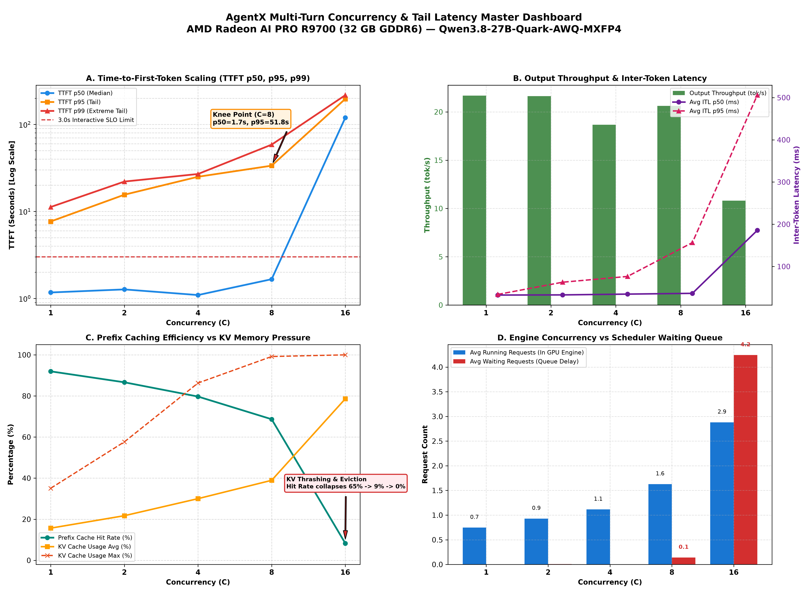

# Multi-Turn Agentic Serving Dynamics on AMD Radeon™ AI PRO R9700

### Empirical Tail Latency, Prefix Eviction, and Concurrency Collapse Under Real-World Claude Code Traces

**Hardware Under Test:** Single AMD Radeon™ AI PRO R9700 (32 GB GDDR6, 256-bit, PCIe Gen 5.0 x16, `gfx1201`)  
**Software Stack:** ROCm 7.14, PyTorch 2.11.0+rocm7.14, vLLM `0.27.1` (`local/vllm-mxfp4:gfx1201`)  
**Model:** `Qwen3.8-27B-Quark-AWQ-MXFP4` (W4A8 FP8-WMMA GEMM, FP8 KV-Cache)  
**Engine Settings:** `--max-model-len 65536 --max-num-seqs 4 --max-num-batched-tokens 4096 --gpu-memory-utilization 0.88 --attention-backend ROCM_AITER_UNIFIED_ATTN`  
**Workload Dataset:** `semianalysis_cc_traces_weka_062126` (real-world multi-turn Claude Code agent traces)  
**Execution Harness:** [`scripts/run_agentx_tail_sweep.py`](/scripts/run_agentx_tail_sweep.py), [`scripts/analyze_agentx_tail_sweep.py`](/scripts/analyze_agentx_tail_sweep.py), [`scripts/plot_agentx_tail_sweep.py`](/scripts/plot_agentx_tail_sweep.py)
**Published Raw Data:** [`reports/results/agentx/`](/reports/results/agentx/) (`analysis.json`, `request_samples.csv`, `manifest.json`, `report.md`)

---

## 1. Executive Summary: The Agentic Serving Dilemma

Synthetic benchmarks using fixed $(S, O)$ prompt pairs (e.g. 1,024:64 or 8,192:64) measure isolated compute and memory roofs, but fail to capture the defining characteristics of modern **coding agents**:
1. **Extreme Context Expansion:** Context lengths grow monotonically from a few thousand tokens to 65k+ tokens across iterative tool execution turns.
2. **Heavy Prefix Reusability:** Consecutive turns in the same session share large common prefixes (system prompt, repository context, previous tool outputs).
3. **Bursty Asynchronous Arrivals:** Multiple independent client sessions submit tool-call results unpredictably, competing for scheduler slots and KV cache blocks.

To establish report-grade operational bounds for agentic serving, we executed a bounded 1-hour load-spread concurrency sweep ($C \in \{1, 2, 4, 8, 16, 32\}$) on a dedicated 32 GB R9700 running Qwen3.8-27B MXFP4 with a 65,536-token context window.

```
       HEALTHY AGENTIC SERVING (C=1 to 4)                CATASTROPHIC KV THRASHING (C >= 16)
┌──────────────────────────────────────────────┐   ┌──────────────────────────────────────────────┐
│  • Prefix Cache Hit Rate: 83% - 93%          │   │  • Prefix Cache Hit Rate Collapses to 0%     │
│  • KV Memory Pressure: 17% - 30%             │   │  • KV Memory Saturation: >80% (Thrashing)    │
│  • TTFT p50: 1.15s - 1.61s (Interactive)     │   │  • TTFT p50: 125s - 332s (2 to 5.5 MINUTES!) │
│  • Scheduler Waiting Queue: ZERO             │   │  • Scheduler Queue: 4.3 - 13.7 Waiting Reqs  │
│  • Output Throughput: 15.6 - 17.0 tok/s      │   │  • Output Throughput Drops 59% (to 7.0 tok/s)│
└──────────────────────────────────────────────┘   └──────────────────────────────────────────────┘
```

The data reveals three stark operational regimes:
* **Interactive Regime ($C = 1 \dots 4$):** Prefix caching operates efficiently (83–93% hit rate), TTFT p50 remains well within the interactive zone (1.15–1.61 s), and zero requests queue in the scheduler.
* **The Tail-Latency Knee ($C = 8$):** Output throughput peaks at **17.2 tok/s**, creating a dangerous illusion of capacity. In reality, p95 TTFT degrades to **51.8 seconds**, p95 ITL surges to **391 ms**, and **363 discrete >1s token pauses** occur.
* **Catastrophic Eviction Cliff ($C \ge 16$):** As concurrent long sessions exceed the 32 GB VRAM capacity, the prefix cache thrashes and collapses from 65.3% down to **9.1% at C=16** and **0.0% at C=32**. Forced full prompt recomputations swamp the engine, scheduler queues blow out to 13.7 waiting requests, TTFT p50 explodes to **5.5 minutes** (331.9 s), and output throughput collapses by 59%.

---

## 2. Empirical Sweep Scorecard

The table below summarizes the measured order statistics across 15-minute profiling windows per concurrency cell.

| Concurrency ($C$) | Requests | Sessions Finished | Tail Res. | TTFT p50 | TTFT p95 | TTFT p99 | E2E p50 | E2E p95 | ITL p50 | ITL p95 | >1s Gaps / Intervals | Prefix Hit Rate | Avg KV Cache | Avg Running | Avg Waiting | Output Tok/s |
|---:|---:|---:|---:|---:|---:|---:|---:|---:|---:|---:|---:|---:|---:|---:|---:|---:|
| **C=1** | 32 | 1 | 3.12% | 1,234 ms | 4,876 ms | 5,274 ms | 23.3 s | 57.7 s | 52.9 ms | 54.7 ms | 1 / 14,341 | **93.17%** | 17.1% | 0.8 | 0.0 | 15.6 |
| **C=2** | 39 | 2 | 2.56% | 1,614 ms | 15,071 ms | 15,958 ms | 17.8 s | 56.0 s | 53.3 ms | 76.7 ms | 32 / 15,352 | **85.61%** | 25.0% | 1.1 | 0.0 | 17.0 |
| **C=4** | 50 | 2 | 2.00% | 1,154 ms | 23,223 ms | 24,008 ms | 11.2 s | 58.1 s | 57.5 ms | 63.4 ms | 24 / 14,925 | **83.08%** | 30.1% | 1.2 | 0.0 | 16.5 |
| **C=8** *(Knee)* | 53 | 1 | 1.89% | 1,736 ms | **51,832 ms** | 54,611 ms | 26.7 s | 109.0 s | 59.3 ms | **390.6 ms** | **363** / 15,869 | **65.32%** | 51.3% | 2.1 | 0.2 | **17.2** |
| **C=16** *(Cliff)*| 32 | 0 | 3.12% | **125,267 ms**| **213,886 ms**| 227,159 ms | 178.3 s | 278.9 s | **200.2 ms**| **439.1 ms** | **795** / 9,145 | **9.05%** | **80.5%** | 2.9 | **4.3** | **9.4** |
| **C=32** *(Thrash)*| 32 | 0 | 3.12% | **331,942 ms**| **436,376 ms**| 465,584 ms | 373.5 s | 576.0 s | **212.9 ms**| **730.6 ms** | **731** / 6,812 | **0.00%** | **75.3%** | 2.6 | **13.7** | **7.0** |

> [!NOTE]
> Tail resolution represents the empirical minimum resolvable quantile ($1/N$). At $N \approx 32\dots 53$ requests per 15-minute budget, p99 values are observed order statistics rather than asymptotic population estimates.

---

## 3. Publication-Grade Visualizations

Two publication-quality figures illustrate the shift from healthy operation to thrashing breakdown on the Radeon AI PRO R9700. They are drawn from the complete campaign in `reports/results/agentx/` and published under `reports/figures/agentx/r9700/`, with the same files at `reports/figures/agentx/`:

### Figure 1: TTFT Empirical Distributions & CDFs
[](../reports/figures/agentx/01_agentx_ttft_histogram.png)
* **Panel A (Log-Histogram):** Illustrates the clear separation between the sub-3-second interactive zone ($C=1\dots 4$) and the heavy right-tail queueing distribution that emerges at $C=8$ and dominates at $C=16$ and $C=32$.
* **Panel B (Empirical CDF):** Demonstrates that at $C \le 4$, over 60–70% of requests complete prefill within 2 seconds. By $C=16$, 0% of requests meet the 3.0s interactive SLO, with the entire distribution displaced past 100 seconds.

### Figure 2: Concurrency & Tail Latency Master Dashboard
[](../reports/figures/agentx/02_agentx_master_dashboard.png)
* **Panel A (TTFT Scaling):** Highlights the knee point at $C=8$ where median TTFT remains stable (1.7s) while tail TTFT jumps exponentially to 51.8s.
* **Panel B (Throughput vs ITL):** Shows aggregate output token throughput peaking at $C=8$ (17.2 tok/s) before collapsing to 9.4 tok/s ($C=16$) and 7.0 tok/s ($C=32$), while average ITL degrades from 53 ms to 213 ms.
* **Panel C (Prefix Cache vs KV Pressure):** Captures the direct causal mechanism: prefix cache hit rate falls from 93.2% to 0% as average KV cache utilization breaches 80%.
* **Panel D (Scheduler Queue Dynamics):** Shows the transition from GPU-bound execution (waiting queue = 0 at $C \le 4$) to severe scheduler starvation (waiting queue = 4.3 at $C=16$, 13.7 at $C=32$).

An 8 Oct follow-up on the same R9700 MXFP4 recipe finished C1–C16 and stopped at `campaign_timeout` before C32. Its scorecard is [reports/results/experiments/active_20261008_004947/agentx/20261008_021252/report.md](../reports/results/experiments/active_20261008_004947/agentx/20261008_021252/report.md). C8 TTFT p95 is 33.6 s and the prefix hit rate is 68.7%, against 51.8 s and 65.3% in the complete campaign above. Those plots are [reports/figures/agentx/20261008/](../reports/figures/agentx/20261008/).

---

## 4. Deep-Dive: Anatomy of the Concurrency Cliff

### 4.1 Why the Knee at $C=8$ Deceives Traditional Monitoring
In standard production dashboards monitoring only **average output tokens/second**, $C=8$ appears to be the optimal operating point:
* Throughput reaches its all-time high: **17.2 output tok/s**.
* Median TTFT is just **1,736 ms** (under the 3.0s SLO).
* Median ITL is **59.3 ms** (close to nominal decode speed).

However, examination of the tail exposes severe degradation:
1. **p95 TTFT breaches the SLO by 17×** (51.8 seconds).
2. **p95 ITL degrades by 7×** (390.6 ms vs nominal ~55 ms).
3. **363 inter-token stalls exceed 1.0 second**, causing frequent visible freezes during streaming code generation.
4. **Prefix cache hit rate slips from 83% to 65%**, signaling that the 32 GB memory pool is starting to evict reusable context.

### 4.2 The Eviction Cascade at $C \ge 16$
At $C=16$ and $C=32$, the memory working set of multiple 65k sessions exceeds available VRAM:
1. **Prefix Cache Obliteration:** Because vLLM’s BlockAllocator must free memory for active decode sequences, inactive session prefixes are evicted. The hit rate plummets to **9.05% at C=16** and **0.00% at C=32**.
2. **Forced Cold Recomputations:** Without cached prefix blocks, incoming turns must process entire prompt histories (10k–50k tokens) from scratch.
3. **Prefill Head-of-Line Blocking:** Because prefill compute requirements jump by an order of magnitude, the engine spends almost all its time executing dense GEMMs for new turns, blocking active decode iterations.
4. **Scheduler Queue Explosion:** With `--max-num-seqs 4`, only 4 sequences can be scheduled concurrently. When prompt prefill takes tens of seconds, waiting requests queue up. At $C=32$, an average of **13.7 requests sit idle in the waiting queue**, resulting in a median wait of **5.5 minutes (331.9 s)** before receiving a single token.
5. **Output Throughput Collapse:** Total system throughput drops from 17.2 tok/s down to 7.0 tok/s—a **59.3% efficiency collapse** caused by prompt recomputation overhead.

---

## 5. Architectural Implications for Disaggregation (PDD)

The AgentX results provide compelling real-world evidence for the architectural thesis of **Prefill/Decode Disaggregation (P/D)** and **Cache-Affine Routing**:

### 1. Collocated Serving Cannot Survive Multi-Turn Agentic Scale Alone
In a single-card or uncoordinated multi-card deployment, traffic shape variation (a sudden arrival of long multi-turn agent turns) triggers an immediate eviction cascade. Once prefix caching collapses, the collocated engine enters a death spiral of recomputation and queueing.

### 2. The Case for Dedicated Decode Pools
In a P/D architecture (e.g. 1P:1D or 1P:7D):
* **Decode streams are insulated from prefill recomputation:** Even if prefill workers queue, the decode worker continues generating tokens at its memory-bandwidth roofline (~34 tok/s on R9700, ~72 tok/s on MI350P) without experiencing 1.5-second stalls or 390 ms ITL jitter.
* **Separation of Memory Pressure:** Decode GPUs only store KV blocks for currently active generating sequences, protecting them from eviction caused by massive incoming prompt ingestion.

### 3. The Critical Role of Cache-Affine Dispatch
For Data Parallel (DP) baselines, round-robin dispatch across replicas is catastrophic for multi-turn workflows: it scatters sequential turns of the same session across different cards, destroying prefix cache reuse. Implementing **session-sticky, cache-affine routing** is an essential first mitigation before crediting P/D with gains that smart dispatch could achieve.

---

## 6. How to Reproduce

All raw traces, manifests, and tooling are version-controlled in the repository:

```bash
# 1. Inspect published machine-readable analysis
cat reports/results/agentx/analysis.json | jq .summary

# 2. Inspect request-level sample records
head -n 20 reports/results/agentx/request_samples.csv

# 3. Regenerate publication-quality figures
/home/amd/workspace/coder/.venv/bin/python scripts/plot_agentx_tail_sweep.py

# 4. Run a fresh bounded sweep against a live vLLM endpoint (requires vLLM running on :8000)
python3 scripts/run_agentx_tail_sweep.py \
  --url http://127.0.0.1:8000 \
  --concurrency 1 2 4 8 16 32 \
  --duration-seconds 900 \
  --campaign-seconds 5400 \
  --output-root _results/agentx_tail_sweep
```
