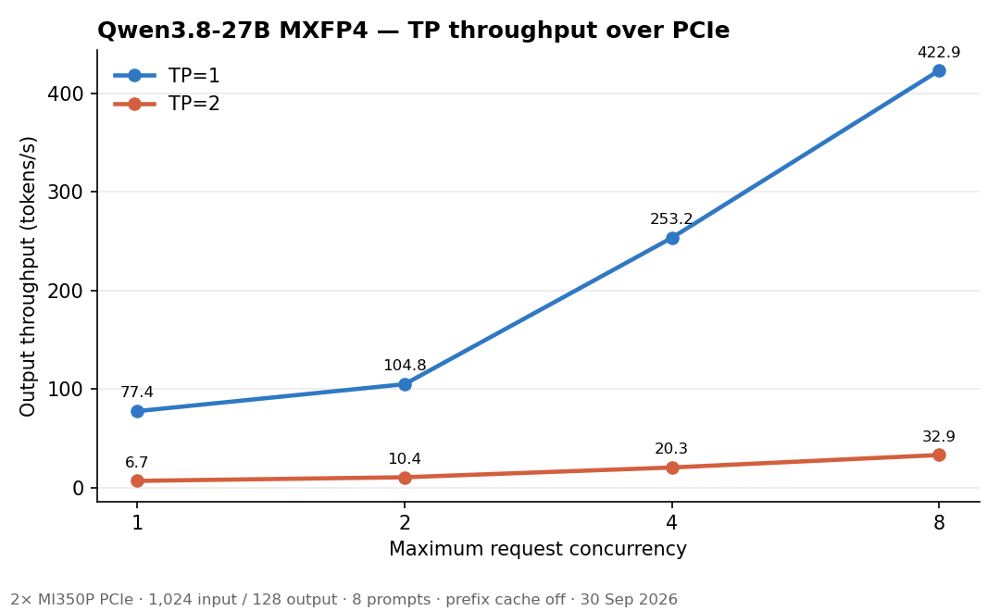
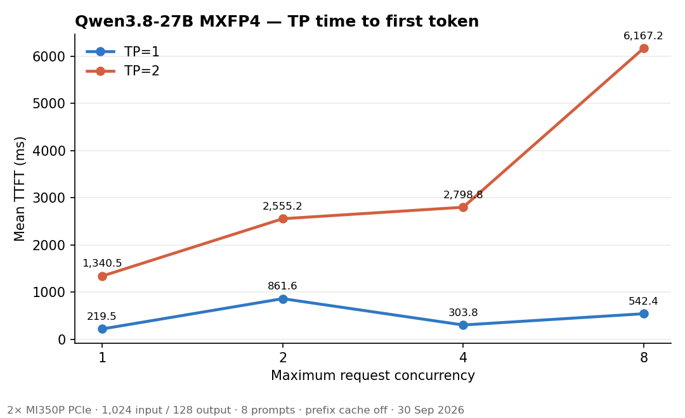

# Tensor parallelism over PCIe on two MI350P cards

Measured 30 September 2026 on the dual-socket MI350P PCIe host. This is a
functional TP=2 result, but it is **not a performance-qualified deployment**.

## Configuration

- Model: `Qwen3.8-27B-Quark-AWQ-MXFP4-sharded`, served as `awq`
- Runtime: vLLM 0.30.0, ROCm 7.14, RCCL 2.30.4
- Workload: 1,024 input tokens, 128 output tokens, 8 prompts, prefix cache off
- Concurrency: 1, 2, 4, and 8
- TP=1: GPU 0
- TP=2: GPUs 0 and 1, on different NUMA nodes and PCI domains
- Both arms: 32 GiB KV cache, 16K maximum model length, identical batching
- Performance runs: `NCCL_DEBUG=WARN`; the separate transport run used
  `NCCL_DEBUG=INFO` to prove the physical path

## Result

| Concurrency | TP=1 output tok/s | TP=2 output tok/s | TP=2 / TP=1 | TP=1 mean TTFT | TP=2 mean TTFT |
|---:|---:|---:|---:|---:|---:|
| 1 | 77.44 | 6.70 | 0.087× | 219.5 ms | 1,340.5 ms |
| 2 | 104.75 | 10.36 | 0.099× | 861.6 ms | 2,555.2 ms |
| 4 | 253.22 | 20.26 | 0.080× | 303.8 ms | 2,798.8 ms |
| 8 | 422.88 | 32.94 | 0.078× | 542.4 ms | 6,167.2 ms |





The combined figure is [`figures/tp/tp-compare.png`](figures/tp/tp-compare.png).
Its published inputs are
[`figures/tp/tp-compare.json`](figures/tp/tp-compare.json). Regenerate all
three plots with:

```bash
python3 scripts/generate_tp_compare_plots.py
```

## Transport verification

vLLM created two local workers with `world_size=2` and TP ranks 0 and 1.
RCCL initialized 16 collective channels and 16 P2P channels. Every channel in
both directions used `P2P/IPC` between `0000:8b:00.0` and `0001:c7:00.0`;
there was no SHM payload fallback. RCCL selected RING/LL for a 4-byte
all-reduce and RING/SIMPLE with all 16 channels for large all-reduces.

The launch now sets `HSA_FORCE_FINE_GRAIN_PCIE=1`,
`HSA_NO_SCRATCH_RECLAIM=1`, `NCCL_P2P_DISABLE=0`, and
`NCCL_IB_DISABLE=1`. It sets only `HIP_VISIBLE_DEVICES`, leaving
`ROCR_VISIBLE_DEVICES` and `HSA_OVERRIDE_GFX_VERSION` unset.

## Link type

`rocm-smi` on this host reports the GPU0–GPU1 link as **PCIE**, **3 hops**,
weight **72**. GPU 0 is NUMA node 0 and GPU 1 is NUMA node 1. There is no
XGMI link between the pair. RCCL `P2P/IPC` is the collective transport
selected on that PCIe link. The transport record and the link type still
leave the 10–13× throughput gap unallocated.

## Where the time went in the unprofiled runs

At concurrency 1 the clients produced the same 8,192 input tokens and 1,024
output tokens. Mean TPOT was **11.28 ms** on TP=1 and **139.87 ms** on TP=2
(12.4×). Mean TTFT was **219.5 ms** and **1,340.5 ms** (6.1×). The
throughput ratio is therefore a decode-heavy regression with a smaller
prefill regression, which an aggregate tok/s figure alone does not show.

## Root cause: unresolved

Four hypotheses stay open. A PCIe or RCCL tuning claim is accepted only
after that change’s contribution to this 10–13× gap is quantified on the
same unprofiled workload. A faster collective microbenchmark, or a log line
that names `P2P/IPC`, does not by itself meet that bar.

| Hypothesis | What has to be measured | What would make it the next change |
|---|---|---|
| RCCL collectives | AllReduce call count, payload sizes, and GPU-kernel time on one steady-state decode step, per rank | Collective time on the critical path is a material share of the extra decode time |
| vLLM custom AllReduce | Which backend runs each call. The paired unprofiled run below moved mean TPOT from 158.12 ms to 140.99 ms when the backend was `PYNCCL` only | A later change to that path moves unprofiled TPOT by more than this 17 ms slice |
| MXFP4 compute | Per-rank GEMM, dequant, and packing kernel names, counts, and durations versus TP=1 | Those kernels slow down, or multiply, enough to explain the step |
| Scheduling and synchronization | Idle gaps between kernels, and which rank arrives late | The wait, rather than the collective or the GEMM, is the long part of the step |

Concurrent GPU work overlaps, so these times are a critical-path attribution.
They are not four percentages that should be added together.

## How the decode window was profiled

The trace that produced the tables below was started with the workers, not
attached later. `scripts/enginecore_rocprof_exec.sh` is the multiprocessing
executable. It leaves resource-tracker processes on plain Python and launches
each `--multiprocessing-fork` worker under `rocprofv3` with `--kernel-trace`,
`--hip-runtime-trace`, `--memory-copy-trace`, and, when the gate file is set,
`--rccl-trace`. `scripts/rocprof_attach_sitecustomize.py` calls
`roctxProfilerPause` at worker start, resumes while
`ENGINECORE_ROCPROF_GATE_FILE` exists, and pauses again when that file is
removed. On TP=2 the same wrapper is installed for the workers EngineCore
spawns, so both GPU processes are traced. `--process-sync` is left off for
that gated run; with it set, the ranks do not exit together and the CSV is
dropped when the container stops.

`scripts/profile_tp_matched_decode.sh` is the host procedure. It serves with
the same flags as the unprofiled gate, waits until `gate.log` reports
`paused status=`, touches the gate file, runs two 1,024/128 prompts at
concurrency 1, removes the gate file, and sends `SIGTERM` to the `rocprofv3`
PIDs recorded in `spawn.log`. Both workers must flush
`decode-<pid>_kernel_trace.csv` before the container is stopped.

```bash
scripts/profile_tp_matched_decode.sh 1 confirm   # unprofiled 8-prompt gate
scripts/profile_tp_matched_decode.sh 2 confirm
scripts/profile_tp_matched_decode.sh 1 trace
scripts/profile_tp_matched_decode.sh 2 trace
python3 scripts/attribute_tp_decode_trace.py _results/tp_profile_mi350p/tp2/trace
python3 scripts/attribute_custom_ar_skew.py _results/tp_profile_mi350p/tp2/trace
```

`rocprofv3 --pid` does not see these workers in this image: there is no
`rocp-bg-attach` thread to attach to. That is why the procedure above wraps
the worker at spawn.

The unprofiled repeat is the performance gate. The traced tok/s is slower
and is only an attribution of that traced timeline.

## Unprofiled repeat

Same flags as the table above, concurrency 1, eight prompts. The gap is
still present.

| Metric | What vLLM bench records | TP=1 | TP=2 | TP=2 / TP=1 |
|---|---|---:|---:|---:|
| Output throughput | 1,024 generated tokens ÷ benchmark wall clock. At concurrency 1 that wall clock is the sum of the eight request latencies, including each TTFT | 73.72 tok/s | 6.02 tok/s | 12.2× slower |
| Mean TPOT | Mean over requests of (end-to-end latency − TTFT) / (output tokens − 1). The first token is excluded | 11.62 ms | 151.81 ms | 13.1× |
| Mean TTFT | Mean time to the first output token | 260.7 ms | 1,989.7 ms | 7.6× |

These ratios are separate. Output throughput is not the reciprocal of mean
TPOT. `1 / 11.62 ms` is 86.1 decode tok/s after the first token, while the
benchmark records 73.72 tok/s because each request’s TTFT sits in the same
wall clock. The same split on TP=2 is `1 / 151.81 ms` = 6.59 tok/s against
a recorded 6.02 tok/s. TTFT grew less than TPOT, so the throughput ratio
(12.2×) is smaller than the TPOT ratio (13.1×). The performance gate for
later A/B runs is the unprofiled mean TPOT, 151.81 ms on this TP=2 repeat.

## Traced decode step

The step boundary is `_topk_topp_kernel`, once per generated token. The
table is the median of the central half of those intervals. Category times
are sums of on-device kernel duration. On these traces the sums match the
step wall clock, so a single rank’s kernels are not overlapping each other.
The two ranks do overlap, so their category times are not added together.

Tracing stretched the step. TP=1’s traced median is 13.3 ms against an
unprofiled TPOT of 11.6 ms. TP=2’s traced median is 232 ms against an
unprofiled TPOT of 152 ms. The split below describes the traced step.

| Steady decode step | TP=1 | TP=2 domain 0 | TP=2 domain 1 |
|---|---:|---:|---:|
| Steps in the median band | 129 | 129 | 129 |
| Wall clock | 13.31 ms | 231.7 ms | 233.0 ms |
| `vllm::cross_device_reduce_1stage` | 0 | 219.9 ms, 129 calls | 51.3 ms, 129 calls |
| RCCL device kernel | 0 | 0.04 ms, 1 call | 0.02 ms, 1 call |
| MXFP4 GEMM and quant | 7.96 ms, 912 calls | 5.81 ms, 848 calls | 113.8 ms, 848 calls |
| Attention and GDN | 2.59 ms, 128 calls | 2.46 ms, 128 calls | 2.84 ms, 128 calls |
| Other kernels | 2.70 ms, 482 calls | 2.34 ms, 484 calls | 57.9 ms, 484 calls |
| Device copies | 0.04 ms | 0.04 ms | 0.10 ms |

Over the whole TP=2 window the RCCL API recorded 258 `ncclAllReduce` calls
and 256 `ncclAllGather` calls. Their API durations average 45 µs and 58 µs.
The API trace has no payload size. One RCCL device kernel per decoded token,
at a few tens of microseconds, is the RCCL share of the steady step.

Domain 0’s 129 custom-allreduce launches are the long part of its step.
Of the launches that lasted 20–150 ms, the median one is 99.9% overlapped
by a single kernel on domain 1. That peer kernel is usually an MXFP4 GEMM,
MXFP4 quant, MXFP4 reduction, or a Triton elementwise kernel, and sometimes
the peer’s own custom allreduce. Call counts match TP=1. The duration of
those individual launches is what grew.

One traced step on domain 0 is three custom-allreduce kernels of 51 ms,
103 ms, and 50 ms, with the MXFP4 work in the remaining few milliseconds.
The same wall-clock interval on domain 1 is a handful of MXFP4 and Triton
kernels of about 51 ms each.

### Arrival skew versus synchronized reduction

`scripts/attribute_custom_ar_skew.py` pairs the two workers’ custom
all-reduce launches by end time. Worker pid 416 ran on PCI domain 0 and is
the early arriver in these traces; pid 417 ran on PCI domain 1. Of 32,766
launches on each side, 32,692 pairs finish within 5 ms of each other. The
median gap between those end times is 0.8 µs, so the pair is the same
collective: both ranks leave the end barrier together.

Two intervals are measured on each pair. Skew is domain 1’s start minus
domain 0’s start. The synchronized portion is the time from the later start
until both launches have ended. That second number still includes the end
barrier and the duplicated reduction; profiler overhead means it is not a
PCIe transfer time.

| Traced interval | Launches or tokens | Median skew | Median synchronized time |
|---|---:|---:|---:|
| Every paired launch | 32,692 | 0.031 ms | 0.007 ms |
| Launches whose domain-0 duration is at least 1 ms | 1,716 | 50.3 ms | 0.007 ms |
| Those with skew between 20 and 150 ms | 902 | 51.3 ms | 0.007 ms |
| One decode token, sum of its launches | 233 tokens, median wall 234 ms | 212.0 ms | 3.9 ms |

Most launches are a few tens of microseconds. The token time comes from
about a handful of launches per token that wait ~51 ms. Across a token the
synchronized portion is 3.9 ms against 212 ms of arrival skew, on a 234 ms
traced step. After the late rank enters, the typical 20–150 ms sample
finishes in 7 µs.

Of those 902 waits, the domain-1 kernel with the largest overlap is MXFP4
for 497, a Triton elementwise kernel for 295, and an attention kernel for
75. The kernel that ends immediately before domain 1 enters the all-reduce
is often a short MXFP4 epilogue. The long kernel is the one that occupies
the wait, not always the one that is the last to finish. The longest waits
in this band, about 102–105 ms, are two of those ~51 ms kernels back to
back; one covering kernel accounts for about half of that sample.

## PyTorch profiler window

vLLM 0.30 does not read `VLLM_TORCH_PROFILER_DIR`. The same serve command
takes `--profiler-config`, and `/start_profile` plus `/stop_profile` bracket
the request. `scripts/profile_tp_torch.sh` uses that path: stack traces off,
gzip on, one warmup request, then one 1,024-token prompt with 16 generated
tokens. `delay_iterations=1` and `max_iterations=8` keep the chrome trace to
the prefill step plus a handful of decode steps. Open the
`*.pt.trace.json.gz` files directly in Perfetto.

The GPU annotations separate the phases. The decode rows below drop the
fastest and slowest of the seven generation steps. The profiler stretches
TP=2 more than TP=1, so these walls are not a new performance gate.

| Phase | TP=1 | TP=2 rank 0 | TP=2 rank 1 |
|---|---:|---:|---:|
| Prefill wall, 1,024 tokens | 347 ms | 2,828 ms | 2,819 ms |
| Prefill RCCL device kernels | 0 | 2,459 ms, 129 calls | 1,749 ms, 129 calls |
| Prefill custom all-reduce | 0 | 0 | 0 |
| Decode wall | 12.35 ms | 326 ms | 326 ms |
| Decode custom all-reduce | 0 | 316 ms, 129 calls | 54 ms, 129 calls |
| Decode RCCL device kernels | 0 | 0 | 0 |
| Decode MXFP4 | 8.05 ms, 912 calls | 5.85 ms, 848 calls | 163 ms, 848 calls |

The 316 ms and the 54 ms are not two sides of one step. The 326 ms wall and
the 316 ms rank-0 sum are the generation step at annotation start gap 0.04 ms.
On that same step rank 1’s 129 launches sum to 1.35 ms. The 54 ms figure is
the median rank-1 sum across the five steps left after dropping the fastest
and slowest walls. On the steps that reach about 54 ms, one launch accounts
for about 50 ms and the other 128 launches account for about 1 ms.

### How much of the 316 ms is before rank 1 arrives

`scripts/attribute_ar_latency.py` measures the intervals below. Both chrome
traces carry `baseTimeNanoseconds = 1782967788000000000`. The seven decode
annotations start a median of 0.036 ms apart, so the clocks are comparable.
rocprof’s check is the paired end gap: median 0.8 µs across 32,692 launches.
Those pairs sit in the rocprof capture, whose timestamps run from
454565.653 s to 454657.486 s, a 91.83 s window over the two gated prompts.
That window is the rocprof capture. It is not the 326 ms PyTorch decode
step. The 326 ms step is the chrome-trace annotation whose wall is 325.66 ms.
Its clock check is the shared `baseTimeNanoseconds` and the 0.036 ms median
gap between the two ranks’ annotation starts.

For each launch, \(S\) and \(E\) are the kernel start and end, \(A=\max(S_0,S_1)\),
arrival skew is \(A-\min(S_0,S_1)\), the post-arrival interval is
\(\max(E_0,E_1)-A\), and end skew is \(\lvert E_0-E_1\rvert\). On the 326 ms
step those 129 pairs give:

| Component | p50 | p95 | max | Sum |
|---|---:|---:|---:|---:|
| Arrival skew | 0.028 ms | 2.52 ms | 51.4 ms | 314.7 ms |
| Post-arrival interval | 0.007 ms | 0.024 ms | 0.031 ms | 1.35 ms |
| End skew | 0.0007 ms | 0.012 ms | 0.024 ms | 0.34 ms |
| Rank 0 residency before rank 1 enters | | | | 314.7 ms |
| Rank 0 residency after both have entered | | | | 1.0 ms |

Rank 0’s 315.7 ms residency is 314.7 ms before rank 1’s kernel starts and
1.0 ms afterward. The six launches longer than 50 ms each finish 6–20 µs
after rank 1 enters. The kernel that fills the wait is a ~51 ms rank-1
MXFP4 or Triton kernel. The kernel that ends immediately before rank 1
enters is usually a 4 µs MXFP4 epilogue, so that epilogue is not the source
of the wait. End skew on this step stays under 0.03 ms, so rank 1 does not
lag again during the reduction.

Rank 0’s next kernel cannot start until the collective ends, and the two
ranks’ kernel times overlap. The 314.7 ms already overlaps rank 1’s MXFP4
and Triton work. Shortening the collective removes the post-arrival 1.0 ms
from this step. It does not remove the 314.7 ms unless rank 1 arrives earlier.

Five of the seven decode steps also contain one launch where both ranks are
already inside the kernel and stay there for about 50 ms. Those launches use
the same rocprof grid as the 7 µs launches: 1,024 blocks of 512 threads. The
dispatch trace cannot split that 50 ms into start-barrier delay, peer loads,
and the end barrier. It is one launch per such step, on top of the arrival
waits, and it is the residual that would need a device-side timestamp around
`barrier_at_start`, `packed_reduce`, and `barrier_at_end`. The 316 ms step
does not contain one.

Prefill stays a separate row. Its 2,459 ms and 1,749 ms are RCCL device
kernels on the 1,024-token annotation. The decode observation that a typical
post-arrival interval is 7 µs does not describe that prefill.

## What this decides

On the custom-allreduce decode trace, RCCL device time does not account for
the per-token regression. The prefill regression is a different row: in the
PyTorch trace the RCCL kernels are most of the 2.8 s prefill annotation. A
PCIe or RCCL tuning claim still has to name which phase it moves, on an
unprofiled run.

Decode time sits in `vllm::cross_device_reduce_1stage` on one rank and in
stretched MXFP4 and Triton kernels on the other. Those are two views of the
same wait. Adding them together double-counts the step.

The ROCm start barrier stores the flag with system scope and polls it with
device scope, using relaxed ordering, while `packed_reduce` then issues
ordinary loads of the peer input. That is a potential cross-device
synchronization defect. It needs a litmus test and maintainer review. It is
not, by itself, an explanation of the TP=2 regression. A poll changed to a
system-scope acquire is a complete fix only if the publishing side releases
and the input-buffer writes are ordered with that signal. The unprofiled
A/B below does not isolate that protocol from the rest of the custom path.

## Unprofiled custom all-reduce versus RCCL

Same concurrency-1 workload, eight 1,024/128 prompts, CUDA graphs left on,
MXFP4 path unchanged, GPUs left in visible order `0,1`. The custom arm is a
fresh process, so its TPOT is compared with the arm beside it. The earlier
151.81 ms figure stays the published gate; this pair is the A/B.

The first `--disable-custom-all-reduce` start selected `PYNCCL` and then
`VllmWorker-1` exited with `SIGSEGV` (`-11`) inside `THCPEvent_record` during
torch.compile. The retry below is the run that reached the benchmark.

| Arm | All-reduce dispatch | Output tok/s | Mean TPOT | Mean TTFT | Failed requests |
|---|---|---:|---:|---:|---:|
| Custom, this pair | `CUSTOM`, then `PYNCCL` | 5.88 | 158.12 ms | 1,700 ms | 0 |
| `--disable-custom-all-reduce` | `PYNCCL` only | 6.44 | 140.99 ms | 1,977 ms | 0 |

Both arms generated 1,024 tokens. This benchmark does not compare token ids
between arms. Output throughput is 9.5% higher on the RCCL arm (6.44 / 5.88).
Mean TPOT is 17.1 ms lower (158.12 → 140.99), which is larger than the
6.3 ms spread between this custom arm and the 151.81 ms gate. Mean TTFT moved
the other way and sits next to the gate’s 1,989.7 ms, so TTFT is not the
decision signal.

Against the published gate, mean TPOT moves from 151.81 ms to 140.99 ms,
a 10.82 ms drop, about 7.1%. That improvement is real on this workload. It
is not a measurement that custom all-reduce costs 10.82 ms per token.
Changing the backend can also change scheduling and when each rank arrives.
On the 326 ms trace, deleting the ~1 ms post-arrival interval leaves the
314.7 ms wait in place. That wait shrinks only if rank 1 reaches the kernel
sooner.

140.99 ms is still 12.1× the TP=1 gate of 11.62 ms. The same-session custom
arm was 158.12 ms, so the within-pair drop is 17.1 ms; that pair and the
151.81 ms gate stay separate populations. The 54 ms rank-1 sum is a third
population, a median across other steps, and is not the partner of the
314.7 ms figure. The occasional ~50 ms launch after both ranks have entered,
on the same 1,024×512 grid as the ~7 µs launches, stays a separate
intermittent stall. It does not explain the 314.7 ms arrival skew.
`QUICK_REDUCE`, `AITER_CUSTOM`, and symmetric memory stay unused.

```bash
scripts/profile_tp_matched_decode.sh 2 confirm custom
scripts/profile_tp_matched_decode.sh 2 confirm nccl
scripts/profile_tp_matched_decode.sh 2 trace nccl
```

The startup log for the measured RCCL arm records
`disable_custom_all_reduce=True` and
`Using ['PYNCCL'] all-reduce backends`. The gated trace of two prompts on
that same flag, which is attribution only, has no
`cross_device_reduce` launch. The steady decode step, again the central
half of `_topk_topp_kernel` intervals, is about 130 `ncclDevKernel_Generic`
launches. Worker pid 415 ran those kernels on PCI domain 0. Worker pid 416
ran them on PCI domain 1.

| Traced decode step, RCCL only | Domain 0 | Domain 1 |
|---|---:|---:|
| Wall clock | 225.0 ms | 224.5 ms |
| RCCL device kernel | 214.0 ms, 130 calls | 4.7 ms, 130 calls |
| Custom all-reduce | 0 | 0 |
| MXFP4 GEMM and quant | 5.9 ms, 848 calls | 64.2 ms, 848 calls |
| Attention and GDN | 2.5 ms, 128 calls | 2.8 ms, 128 calls |
| Other kernels | 2.4 ms, 484 calls | 59.4 ms, 484 calls |

Domain 0’s kernel durations add up to the step wall. The median domain-1
step contains 184 ms of kernels against a 224 ms wall, so about 40 ms of
that step is not inside a domain-1 kernel. The profiled mean
TPOT on this two-prompt trace was 294 ms. It is not a replacement for the
140.99 ms unprofiled result. The shape matches the custom-allreduce trace:
the early GPU’s collective launch is the wait, and the late GPU’s time is
MXFP4 and other kernels, now on the RCCL path as well.

JSON and the server log are under
`_results/tp_profile_mi350p/tp2/tp2_unprofiled_c1_repeat.json` and
`_results/tp_profile_mi350p/tp2_nccl/`.

## Decision

RCCL fallback passes functionality and modestly improves C1 TPOT, but fails
the performance gate. The primary unresolved cause is rank-1 pre-collective
kernel stretching. Occasional post-arrival custom-kernel stalls are tracked
separately.

The gate comparison is 151.81 ms to 140.99 ms. The 326 ms step’s split is
314.7 ms before rank 1 enters and 1.0 ms after both have entered. The 54 ms
rank-1 figure is a median over other steps. Those three numbers are not
subtracted from one another.

### Reversed GPU order, unprofiled

`HIP_VISIBLE_DEVICES=1,0` on the same C1 workload, custom all-reduce still
enabled. Mean TPOT is 165.29 ms, output throughput 5.57 tok/s, mean TTFT
1,994 ms, 1,024 tokens, 0 failed. That stays in the same band as the
151.81 ms gate and the 158.12 ms same-session custom arm. Reversing order
does not clear the regression. This run has no per-rank kernel times, so it
does not say whether the ~51 ms MXFP4/Triton stretch moved.

The map below is the one to use for that question. Model load moved with
the card: `0001:c7:00.0` took 49.5 s as rank 0, and `0000:8b:00.0` took
22.0 s as rank 1. On the original `0,1` order the same card, then rank 1,
took about 46–55 s while `0000:8b:00.0` took about 19–22 s. Load time is
not the decode diagnosis. It is the comparison that followed the BDF.

| PCI BDF | NUMA | rocm-smi index | HIP visible index | vLLM rank | Model load |
|---|---:|---:|---:|---:|---:|
| `0001:c7:00.0` | 1 | 1 | 0 | 0 | 49.5 s |
| `0000:8b:00.0` | 0 | 0 | 1 | 1 | 22.0 s |

### Reversed-rank trace

`HIP_VISIBLE_DEVICES=1,0`, custom all-reduce still on, two profiled
prompts. This trace is attribution only. Its mean TPOT is 270.80 ms.

| PCI BDF | HIP visible | vLLM rank | pid | Steady MXFP4 | Steady other | Steady custom all-reduce |
|---|---:|---:|---:|---:|---:|---:|
| `0001:c7:00.0` | 0 | 0 | 415 | 111.0 ms | 55.1 ms | 1.7 ms |
| `0000:8b:00.0` | 1 | 1 | 416 | 5.9 ms | 1.7 ms | 210.5 ms |

Call counts match across the two ranks. The long compute moved with
`0001:c7:00.0`, which is rank 0 in this order. The collective wait moved
to `0000:8b:00.0`. The stretch does not follow logical rank 1.

On `0001:c7:00.0`, 956 of 981 launches longer than 40 ms last 40–60 ms,
with p50 51.2 ms. The same kernel names have the same grids and a median
of about 4 µs on both GPUs. A one-block kernel, run on each GPU alone, keeps that split. No peer
and no RCCL are required. Reproduce it with:

```bash
bash scripts/single_gpu_launch_latency.sh 0 1
```

`amd-smi` index 0 is `0000:8b:00.0` and index 1 is `0001:c7:00.0`.
On 30 Sep, 20,000 launches gave p50 5.24 µs and max 204 µs on
`0000:8b:00.0` (0 launches in the 48–55 ms band). The same run on
`0001:c7:00.0` gave p50 5.64 µs, max 51.4 ms, and 40 launches in that band.

During the traced decode both GPUs sat near 2.2 GHz and about 46 °C when
busy. AER counters did not change. RAS correctable, uncorrectable, and
deferred counts are 0 on both cards, and neither has bad VRAM pages.
Forcing `power_dpm_force_performance_level=high` was rejected by the
driver. Setting `manual` did not remove the 48–55 ms band.

The TP=2 decode gap is this per-launch stall on `0001:c7:00.0`. The other
rank waits in the collective while that GPU is inside an otherwise
microsecond kernel.

What remains:

The stall is local to `0001:c7:00.0`. Sampled clocks, temperature, AER,
and RAS do not explain the fixed 51 ms. A one-GPU launch loop reproduces
it, so worker NUMA placement is not required. The open question is that
card's command processor, power firmware, or another device-side timer.
The occasional ~50 ms post-arrival collective is the same launch-time
penalty when both ranks are already inside the kernel.

Raw benchmark JSON and transport logs are under
`_results/tp_compare_mi350p/`. The rocprof repeat is under
`_results/tp_profile_mi350p/`. The PyTorch chrome traces are under
`_results/tp_torch_profile/`. TP=2 remains a capacity path.
