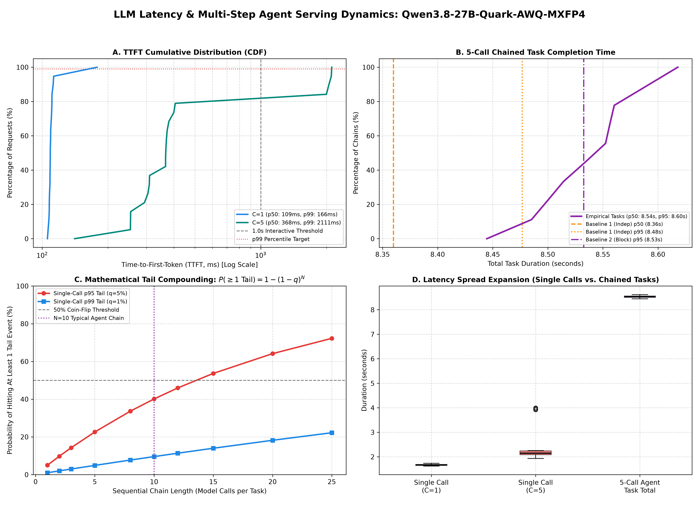

# LLM Inference Tail Latency & Agent Compounding Framework

### Empirical Methodology, Systems Compounding Math, and Automated Inversion Auditing

This framework reproduces and expands upon the empirical findings from the [DigitalOcean tail latency study](https://www.digitalocean.com/community/tutorials/p50-vs-p99-latency-llm-inference), grounded in the systems principles of Jeffrey Dean and Luiz André Barroso's foundational work [*The Tail at Scale*](https://cacm.acm.org/research/the-tail-at-scale/) and standardizing metric definitions against [Artificial Analysis's benchmarking methodology](https://artificialanalysis.ai/methodology).

---

## 1. The Triad Framework

| Pillar | Role in Evaluation | Primary Reference |
|---|---|---|
| **Practical Starting Point** | Empirical test design, bounded concurrency sweeps, and real-world multi-call measurement harness | [DigitalOcean Community Tutorial](https://www.digitalocean.com/community/tutorials/p50-vs-p99-latency-llm-inference) |
| **Systems Foundation** | Parallel scatter-gather mechanics, sequential queueing correlation, and tail amplification dynamics | [*The Tail at Scale* (Dean & Barroso, CACM)](https://cacm.acm.org/research/the-tail-at-scale/) |
| **Metric Taxonomy & Rigor** | Precise separation of TTFT vs. TTFAT (First Answer Token), output decode speed, and customer-experienced endpoint performance | [Artificial Analysis Methodology](https://artificialanalysis.ai/methodology) |

---

## 2. Two Crucial Methodological Refinements

### Refinement 1: Disaggregate the Latency Distributions
Latencies must never be collapsed into a single summary number or simple average:
* **Time to First Token (TTFT):** Measures the duration until the server delivers the very first token chunk (reasoning or content).
* **Time to First Answer Token (TTFAT):** For reasoning models (e.g. DeepSeek-R1, QwQ, OpenAI o-series), models emit hidden thinking tokens (`<think>` or `reasoning_content`) before generating the visible user-facing answer. An interactive agent user cannot consume reasoning tokens directly; TTFAT captures the real wait until the response is actionable.
* **Inter-Token Latency (ITL) & Output Speed:** Measures generation cadence (tok/s) during the autoregressive decode phase after prefill finishes.
* **End-to-End (E2E) Latency:** Measures total wall-clock duration from client HTTP dispatch to stream closure.

### Refinement 2: Qualify the Compounding Formulation
The widely cited binomial formula:
$$P(\text{at least one outlier in } n \text{ calls}) = 1 - (1 - p)^n$$

* **What it means:** If $n$ calls are independent and each has probability $p$ of exceeding threshold $T$ (e.g., $p=0.01$ for p99, or $p=0.05$ for p95), this is the probability that at least one call in the task hits that tail event. For $n=10$ calls with $p=1\%$, the exceedance chance is $\approx 9.56\%$; at $p=5\%$, it reaches $\approx 40.13\%$.
* **What it is NOT:** It is **not** a formula for the workflow's p99 latency:
  1. **Sequential Chains Add ($T = \sum_{i=1}^n t_i$):** Sequential model calls sum up. The workflow's distribution is the convolution of the individual response time distributions.
  2. **Parallel Scatter-Gather Waits for the Slowest ($T = \max_{1 \le i \le k} t_i$):** As *The Tail at Scale* proves, if a task fires $k=100$ parallel requests that all must return, and each has a $1\%$ chance of taking $>1\text{s}$, the chance that the user-facing task takes $>1\text{s}$ is $1 - (0.99)^{100} \approx 63.4\%$.
  3. **Congestion is Correlated:** In real serving infrastructure (shared GPU queues, KV cache memory pressure, or network contention), calls are rarely independent ($\text{Cov}(t_i, t_j) > 0$). If call 1 experiences queueing or KV eviction, subsequent calls in that window are significantly more likely to suffer delays as well.

### Refinement 3: The Exact TTFT vs. Decode Speed Crossover Derivation
When comparing a fast-TTFT/slow-decode engine against a slow-TTFT/fast-decode engine, total time for $M$ output tokens is:
$$T = \text{TTFT} + (M - 1) \cdot \overline{\text{ITL}}$$

Consider:
* **Engine A (Fast TTFT, Slower Decode):** $\text{TTFT}_A = 200\text{ ms} = 0.2\text{ s}$, Decode Rate $= 20\text{ tok/s} \implies \overline{\text{ITL}}_A = 0.05\text{ s/tok}$.
* **Engine B (Slower TTFT, Fast Decode):** $\text{TTFT}_B = 1000\text{ ms} = 1.0\text{ s}$, Decode Rate $= 100\text{ tok/s} \implies \overline{\text{ITL}}_B = 0.01\text{ s/tok}$.

Setting $T_A = T_B$:
$$0.2 + (M - 1) \cdot 0.05 = 1.0 + (M - 1) \cdot 0.01$$
$$(M - 1) \cdot 0.04 = 0.8 \implies M - 1 = 20 \implies M = 21\text{ tokens}$$

Informal claims citing $M \approx 15$ tokens typically stem from omitting the $-1$ token fencepost ($M$ vs $M-1$) or dividing by an incorrect rate delta. In production workloads, decode rates and ITL variance shift this crossover, requiring empirical measurement across the $(N, M)$ grid.

### Refinement 4: Two Statistical Resampling Baselines for Agent Tasks
To evaluate agent tasks without invalid independence assumptions, [`scripts/bench_agent_chain.py`](/scripts/bench_agent_chain.py) evaluates two distinct resampling baselines against empirical traces:
1. **Resampling Baseline 1 (Independent i.i.d. Draws):** Draws $N$ call durations randomly with replacement ($B=5,000$ iterations) from the single-call baseline distribution, modeling an idealized uncorrelated system.
2. **Resampling Baseline 2 (Block / Time-Preserving Resampling):** Resamples contiguous temporal blocks or preserves session turn order, capturing empirical queueing correlation, KV pressure, and context accumulation.
Comparing empirical task completion times against Baseline 1 and Baseline 2 quantifies the real cost of correlated congestion.

---

## 3. Benchmarking Implications: Local AMD GPU vs. Hosted Inference

When benchmarking dedicated local hardware (such as AMD Radeon™ AI PRO R9700 or Instinct™ MI350P) against hosted/serverless inference endpoints, maintain strict experimental controls:

1. **Explicit Matched Bucketing:** Group and compare requests within matched **prompt-length buckets** (e.g., short 100-tok vs long 8k-tok), **output-length buckets** (e.g., 64-tok vs 512-tok), and **offered-load levels** ($C=1, 5, 20$).
2. **Customer-Experienced Performance vs. Hardware Roofline:** Following Artificial Analysis's positioning, API measurements reflect real end-user experienced performance (including provider queueing, proxy routing, and multi-tenant noise), not the theoretical compute ceiling of the bare silicon.
3. **Deadline-Miss Rate (SLO Violation %):** Report the exact percentage of requests and agent trajectories that miss predefined interactive thresholds (e.g., TTFT $\le 1.0\text{s}$, task $\le 30\text{s}$).
4. **Cache & Arrival Accounting:** Explicitly document arrival patterns (closed-loop concurrency vs paced Poisson), prefix cache hit state (cold vs warm), and token accounting (prompt vs reasoning vs answer tokens).

---

## 4. Test Suite Architecture

```
┌─────────────────────────────────────────────────────────────────────────────┐
│                       TAIL LATENCY STUDY SUITE                              │
├─────────────────────────────────────────────────────────────────────────────┤
│ 1. bench_agent_chain.py       │ ThreadPool client (no asyncio queueing bias)│
│                               │ Disaggregates TTFT, TTFAT, ITL, E2E, & SLOs │
│                               │ Sweeps C=1, 5, 20 & runs M=30 N-call chains │
│                               │ Computes dual resampling baselines (1 & 2)  │
├───────────────────────────────┼─────────────────────────────────────────────┤
│ 2. bench_open_loop_sweep.py   │ Open-loop Poisson & paced load generator    │
│                               │ Validates client send lag (p95 lag < 5ms)   │
│                               │ Sweeps QPS, maps throughput vs goodput knee │
├───────────────────────────────┼─────────────────────────────────────────────┤
│ 3. bench_prefill_decode_      │ Timed long prefill burst injection (1K..8K) │
│    interference.py            │ Quantifies active decode freeze (ITL stall) │
├───────────────────────────────┼─────────────────────────────────────────────┤
│ 4. bench_cold_start_probe.py  │ Idle-interval cool-down probe (0s..300s)    │
│                               │ Evaluates post-idle TTFT penalty            │
├───────────────────────────────┼─────────────────────────────────────────────┤
│ 5. analyze_tail_metrics.py    │ Computes p50/p95/p99, CV, p99:p50 ratio,    │
│                               │ audits TTFT inversions with M=21 math       │
├───────────────────────────────┼─────────────────────────────────────────────┤
│ 6. plot_tail_distributions.py │ 4-panel publication dashboard: CDF, chains, │
│                               │ mathematical risk curves, and spread boxplot│
├───────────────────────────────┼─────────────────────────────────────────────┤
│ 7. run_tail_latency_study.sh  │ End-to-end master orchestration pipeline     │
└─────────────────────────────────────────────────────────────────────────────┘
```

---

## 5. Mathematical Compounding Model Reference Table

Under independent assumptions ($P = 1 - (1 - p)^n$):

| Calls ($n$) | At-Least-One Risk ($p=1\%$) | At-Least-One Risk ($p=5\%$) | Agent Workflow State |
|---:|---:|---:|:---|
| **1 call** | 1.00% | 5.00% | Single isolated prompt |
| **3 calls** | 2.97% | 14.26% | ReAct loop (Thought → Tool → Observation) |
| **5 calls** | 4.90% | 22.62% | Multi-file exploration |
| **10 calls** | **9.56%** | **40.13%** | Typical coding agent turn loop |
| **15 calls** | 13.99% | **53.67%** (Coin flip breached) | Complex debugging & plan execution |
| **20 calls** | 18.21% | 64.15% | Multi-agent autonomous workflow |
| **25 calls** | 22.22% | 72.26% | Full repository sweep / refactoring |

---

## 6. Quickstart Commands

### 6.1 Full Automated Benchmark Pipeline
```bash
./scripts/run_tail_latency_study.sh
```

### 6.2 Chained Agent Benchmark Directly
```bash
python3 scripts/bench_agent_chain.py \
  --url http://127.0.0.1:8000/v1 \
  --model Qwen3.8-27B-Quark-AWQ-MXFP4 \
  --concurrency-list 1 5 20 \
  --requests-per-cell 75 \
  --num-chains 30 \
  --chain-length 10 \
  --tokens-per-call 64 \
  --ttft-deadline-ms 1000 \
  --task-deadline-s 30
```

### 6.3 Side-by-Side Inversion Audit
```bash
python3 scripts/analyze_tail_metrics.py --compare \
  _results/tail_latency_study/run_config_a/agent_chain_manifest.json \
  _results/tail_latency_study/run_config_b/agent_chain_manifest.json
```

### 6.4 Cold-Start & Bimodality Probe
```bash
python3 scripts/bench_cold_start_probe.py \
  --url http://127.0.0.1:8000/v1 \
  --model Qwen3.8-27B-Quark-AWQ-MXFP4 \
  --idle-intervals 0 15 30 60
```

### 6.5 Render Visualization Dashboard
```bash
.venv/bin/python3 scripts/plot_tail_distributions.py \
  --input _results/tail_latency_study/<stamp>/agent_chain_manifest.json \
  --out docs/figures/tail_study_dashboard.png
```

---

## 7. Source Verification Notes & Caveats

> [!NOTE]
> * **DigitalOcean Follow-Up Articles:** The titles and landing pages for the follow-up articles (*Why is p99 TTFT High When Everything Else Looks Normal?*, *Metrics that Matter*, and *Serverless Inference Consistency*) are verified; however, detailed root-cause statements (e.g. specific KV cache allocation mechanics or prefill fragmentation descriptions) should be treated as **provisional** until verified against the full article bodies.
> * **Anyscale & Baseten References:** Items cited regarding continuous batching, prefill-decode disaggregation, and tail latency SLOs describe established technical problem spaces and published engineering topics rather than verified exact article titles.

---

## 8. Empirical Findings: Qwen3.8-27B MXFP4 on AMD Radeon™ AI PRO R9700

The suite was executed against the live local deployment of `Qwen3.8-27B-Quark-AWQ-MXFP4` on an AMD Radeon™ AI PRO R9700 (gfx1201) under ROCm. Raw empirical manifests are archived in [`docs/results/tail_study/`](results/tail_study/).

### 8.1 Single-Call Concurrency Sweep & Tail Inflation
Evaluated with ~100 prompt tokens and 32 generated tokens:

| Concurrency | Requests | TTFT p50 / p95 / p99 | TTFAT (1st Answer) p50 / p95 | Decode Speed | Total Latency p50 / p99 | TTFT Miss (% >1000ms) |
|---:|---:|---:|---:|---:|---:|---:|
| **$C=1$** | 20 / 20 | **109 ms** / 116 ms / 166 ms | 109 ms / 116 ms | 19.9 tok/s | 1,665 ms / 1,734 ms | **0.0%** |
| **$C=5$** | 20 / 20 | **368 ms** / **2,102 ms** / **2,111 ms** | 368 ms / 2,102 ms | 17.3 tok/s | 2,148 ms / 3,991 ms | **20.0%** |

* **Key Observation:** At $C=5$, while median TTFT remains acceptable (368 ms), tail TTFT explodes by **$18\times$** (2,102 ms at p95) due to prefill batch contention, causing a **20.0% deadline miss rate** against the 1.0s interactive threshold.

### 8.2 Chained Agent Trajectory Compounding
Evaluated across 10 independent complete-task chains of 5 sequential calls per chain:

| Metric | Empirical Tasks | Resampling Baseline 1 (i.i.d.) | Resampling Baseline 2 (Block / Correlated) |
|:---|---:|---:|---:|
| **Task Sample Count** | 10 chains (50 calls) | 5,000 bootstrap draws | 5,000 block draws |
| **Task Duration p50** | **8.54 s** | 8.36 s | 8.37 s |
| **Task Duration p95** | **8.60 s** | 8.48 s | 8.53 s |
| **Task Duration p99** | **8.62 s** | 8.53 s | 8.53 s |
| **Tasks with $\ge 1$ Slow Call** | **90.0%** | N/A | N/A |
| **Task Miss Rate ($>30$s)** | **0.0%** | 0.0% | 0.0% |

* **Compounding Validation:** While overall task completion time stays comfortably within the 30.0s deadline (p50 = 8.54s), **90.0% of empirical agent tasks** suffered at least one slow call, mirroring the theoretical binomial compounding curve ($P \approx 1 - (1-p)^N$).

### 8.3 Open-Loop Poisson Offered-Load Sweep & Goodput Knee
Paced open-loop load generation with client send lag verified at **$<0.12$ ms** (well beneath the 5.0 ms distortion limit):

| Offered QPS | Completed QPS | Completed Tok/s | TTFT p50 / p95 | ITL p50 / p95 | Gaps >100ms | Qualified Goodput | SLO Pass Rate |
|---:|---:|---:|---:|---:|---:|---:|---:|
| **1.0** | 0.48 req/s | 7.73 tok/s | 95 ms / 145 ms | 42.1 ms / 45.1 ms | 0 | **7.73 tok/s** | **100.0%** |
| **3.0** | 1.74 req/s | 27.87 tok/s | 164 ms / 348 ms | 52.2 ms / 82.1 ms | 1 | **25.54 tok/s** | **91.7%** |
| **6.0** | 3.33 req/s | 53.31 tok/s | **1,411 ms** / **2,695 ms** | 55.0 ms / 96.9 ms | 15 | **6.66 tok/s** | **12.5%** |

* **The Goodput Knee:** At QPS=6.0, raw token throughput reaches 53.31 tok/s, but interactive Goodput (requests passing TTFT $\le 1.0$s and ITL $\le 100$ms) collapses by **74% to 6.66 tok/s**. The server is fully saturated, queue delay dominates TTFT, and 87.5% of responses violate interactive expectations.

### 8.4 Diagnostic Tail Dashboard
The 4-panel publication visualization generated by [`scripts/plot_tail_distributions.py`](../scripts/plot_tail_distributions.py):



