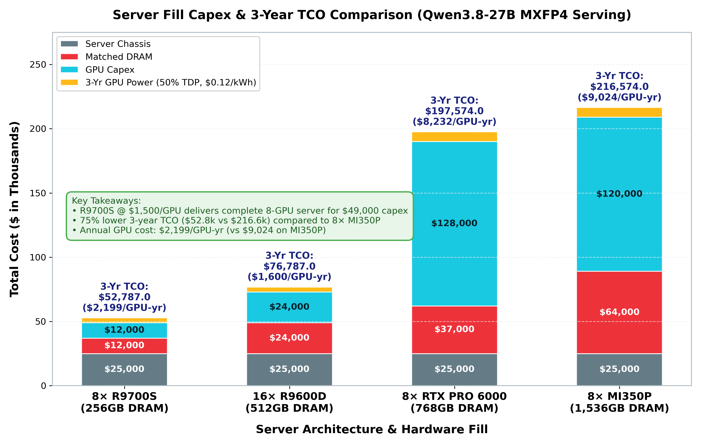
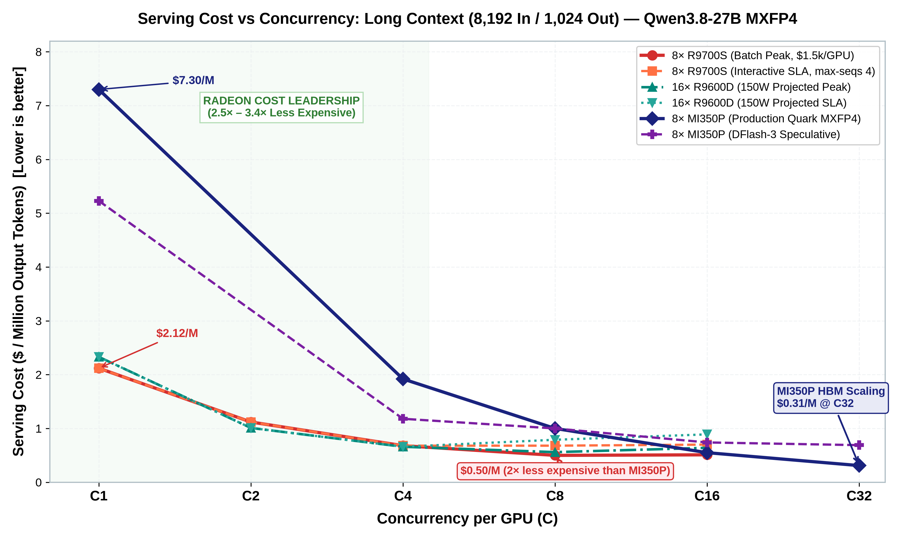
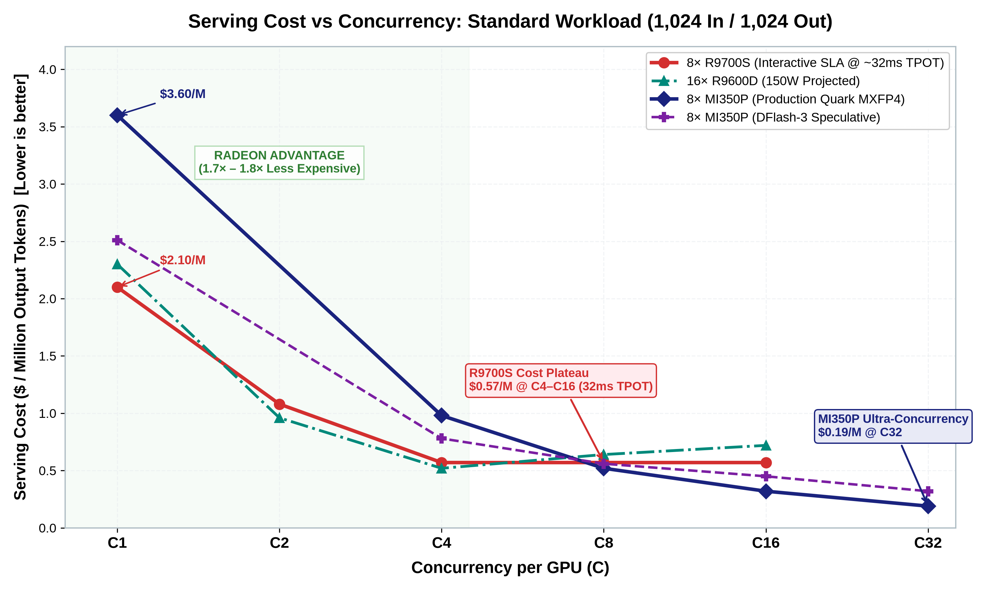
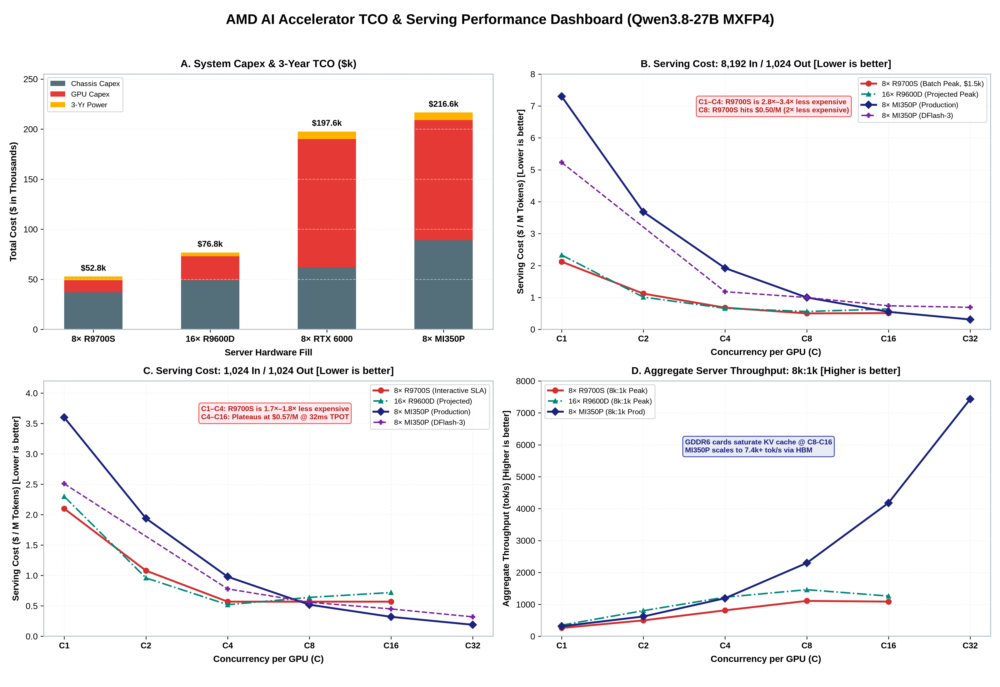
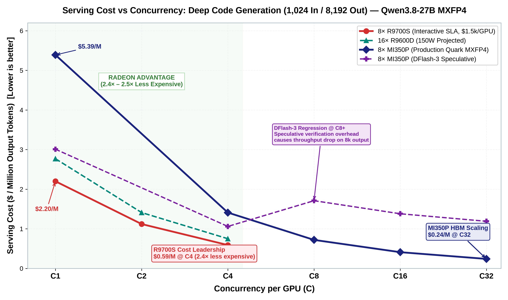
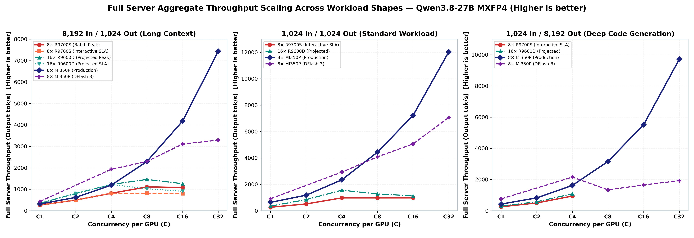
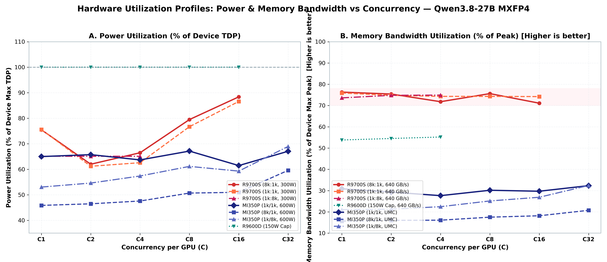
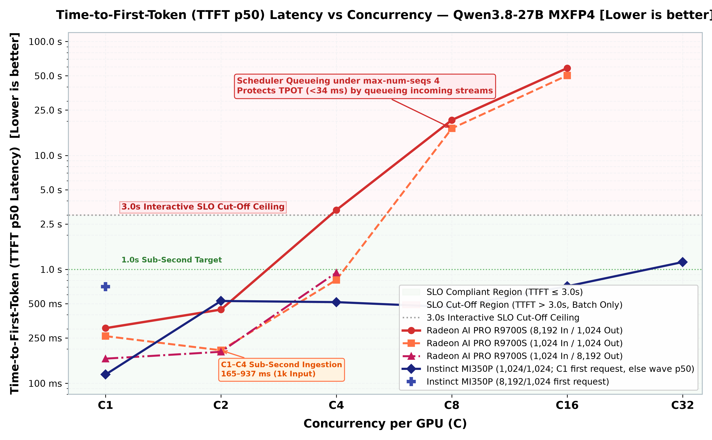
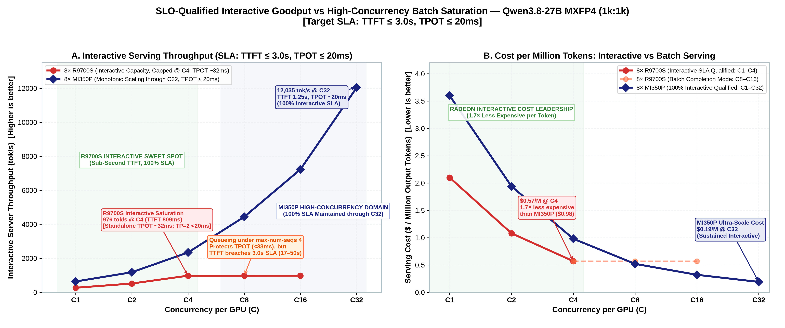
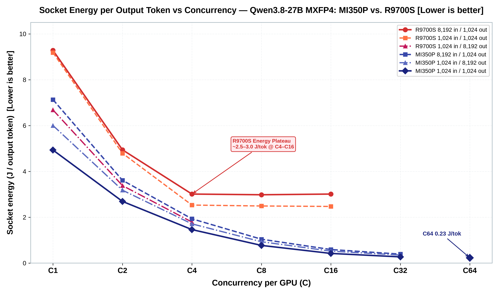

# TCO: 16× R9600D, 8× R9700S, 8× MI350P, 8× RTX PRO 6000

Planning comparison where host DRAM capacity matches total GPU VRAM capacity for each server fill: R9700S (256 GB host DRAM at $37,000), R9600D (512 GB host DRAM at $49,000), RTX PRO 6000 (768 GB at $62,000), and MI350P (1,536 GB at $89,000). Dual-slot cards fill **eight** slots. The R9600D is single-slot, so the same chassis holds **sixteen**. Card prices and server figures are the estimates supplied for this note. They are not street quotes, and they are not a measured serving result.

| Item | Unit price | Cards in this server | GPU spend |
|---|---:|---:|---:|
| AMD Radeon AI PRO R9600D | $1,500 | 16 | $24,000 |
| AMD Radeon AI PRO R9700S | $1,500 | 8 | $12,000 |
| AMD Instinct MI350P | $15,000 | 8 | $120,000 |
| NVIDIA RTX PRO 6000 | $16,000 | 8 | $128,000 |
| Server for 8× R9700S (256 GB DRAM) | $37,000 | 1 | $37,000 |
| Server for 16× R9600D (512 GB DRAM) | $49,000 | 1 | $49,000 |
| Server for 8× RTX PRO 6000 (768 GB DRAM) | $62,000 | 1 | $62,000 |
| Server for 8× MI350P (1,536 GB DRAM) | $89,000 | 1 | $89,000 |

Date: 29 September 2026. The 28 Sep token ledger is unchanged except the MI350P production C2 cells, which were measured on 29 Sep. Board specs below are vendor peak figures. Token-per-dollar is split into three shapes — 8,192/1,024, 1,024/8,192, and 1,024/1,024 — and a rate is priced only in the shape it was measured at. MI350P has two rows. **Production** is the frozen HF Quark MXFP4 recipe, `VLLM_ROCM_USE_AITER` unset. **DFlash-3** is the best non-production profile: speculative depth 3. It fails the equality gate (101/116) and the interactive latency gate, so it is not the default. R9700S rates are the R9700 MXFP4 sweeps in [R9700.md](R9700.md), [R9700-SWEEP.md](R9700-SWEEP.md), and [R9700-SWEEP-1024-1024.md](R9700-SWEEP-1024-1024.md) on the same 64 CU GPU. The R9600D has no run. The RTX PRO 6000 published median has no recorded input and output length, so it is not placed in any of the three tables. New MI350P cells are in `_results/priority_eval/tco_mi350p/`.

## Card reference

| Per card | Radeon AI PRO R9600D | Radeon AI PRO R9700S | Instinct MI350P | RTX PRO 6000 |
|---|---|---|---|---|
| Architecture | RDNA 4 | RDNA 4 | CDNA 4 | Blackwell |
| Compute units | 48 | 64 | 128 | — |
| Memory | 32 GB GDDR6 | 32 GB GDDR6 | 144 GB HBM3E | 96 GB GDDR7 ECC |
| Peak bandwidth | 640 GB/s | 640 GB/s | 4 TB/s | 1,792 GB/s |
| Board power | 150 W | 300 W | 600 W max (450 W configurable) | 600 W |
| Slots | 1, passive | 2, passive | 2, FHFL PCIe | 2 |
| Interface | PCIe 5.0 x16 | PCIe 5.0 x16 | PCIe 5.0 x16 | PCIe |
| Low-precision peak | 397 INT4 TOPS dense, 794 with sparsity | 766 INT4 TOPS dense, 1,531 with sparsity | 4.6 PFLOPS MXFP4 | 4,000 FP4 TOPS with sparsity |
| Card price | $1,500 | $1,500 | $15,000 | $16,000 |
| Cards per server | 16 | 8 | 8 | 8 |

Sources: [AMD R9600D](https://www.amd.com/en/products/graphics/workstations/radeon-ai-pro/ai-9000-series/amd-radeon-ai-pro-r9600d.html), [AMD R9700S](https://www.amd.com/en/products/graphics/workstations/radeon-ai-pro/ai-9000-series/amd-radeon-ai-pro-r9700s.html), [AMD MI350P](https://www.amd.com/en/products/accelerators/instinct/mi350/mi350p.html), [NVIDIA RTX PRO 6000 Blackwell Workstation Edition](https://www.nvidia.com/en-us/products/workstations/professional-desktop-gpus/rtx-pro-6000/). The NVIDIA row uses that published workstation sheet (96 GB, 1,792 GB/s, 600 W, dual slot). The $1,500, $15,000, and $16,000 figures are the supplied card prices. AMD’s datacenter footnote allows the R9600 series and the R9000S series, which covers both Radeon boards in this note.

Peak INT4, MXFP4, and sparse FP4 are different units. They are listed so the power and memory envelope is visible. They are not a ranking of Qwen tokens per second.

## Server fill

One chassis: eight dual-width slots, which is sixteen single-width positions. Dual-slot boards occupy two positions, so R9700S, MI350P, and RTX PRO 6000 stop at eight. The R9600D occupies one position, so the server takes sixteen. Host RAM capacity matches the total GPU VRAM footprint: 512 GB for 16× R9600D (32 GB per card), 256 GB for 8× R9700S (32 GB per card), 768 GB for 8× RTX PRO 6000 (96 GB per card), and 1,536 GB for 8× MI350P (192 GB per card).

| Server | 16× R9600D | 8× R9700S | 8× MI350P | 8× RTX PRO 6000 |
|---|---:|---:|---:|---:|
| GPU capex | $24,000 | $12,000 | $120,000 | $128,000 |
| Server (with matched DRAM) | $49,000 | $37,000 | $89,000 | $62,000 |
| **System capex** | **$73,000** | **$49,000** | **$209,000** | **$190,000** |
| Aggregate VRAM | 512 GB | 256 GB | 1,152 GB | 768 GB |
| Host DRAM | 512 GB | 256 GB | 1,536 GB | 768 GB |
| Aggregate bandwidth | 10.24 TB/s | 5.12 TB/s | 32 TB/s | 14.34 TB/s |
| GPU nameplate | 2.40 kW | 2.40 kW | 4.80 kW | 4.80 kW |
| Capex per GB of VRAM | $143 | $191 | $181 | $247 |
| Capex per GB/s | $7.13 | $9.57 | $6.53 | $13.25 |
| Host RAM per GPU | 32 GB | 32 GB | 192 GB | 96 GB |
| Capex per GPU (card + share of server) | $4,563 | $6,125 | $26,125 | $23,750 |
| Server share of capex | 67% | 76% | 43% | 33% |

Sixteen R9600D cards with 512 GB host DRAM cost $24,000 more in system capex than eight R9700S cards with 256 GB host DRAM ($73,000 vs. $49,000) and draw the same 2.4 kW. They deliver twice the VRAM and twice the aggregate bandwidth, in smaller 32 GB pools. Eight RTX PRO 6000 cards cost $19,000 less than eight MI350P cards in system capex ($190,000 vs. $209,000), driven by the smaller 768 GB host DRAM tier.

## Power over three years

Electricity is GPU board power only. The server’s CPU, memory, storage, and fans are the same host in every fill. Facility PUE is not applied. Planning rate is **$0.12/kWh**. Three years is 26,298 hours. The 50% case is average board power at half of nameplate. The 100% case is the nameplate upper bound, not a measured duty cycle. MI350P can be capped at 450 W; the table uses the 600 W max.

| | 16× R9600D | 8× R9700S | 8× MI350P | 8× RTX PRO 6000 |
|---|---:|---:|---:|---:|
| Nameplate | 2.40 kW | 2.40 kW | 4.80 kW | 4.80 kW |
| 3-year energy at 50% | $3,787 | $3,787 | $7,574 | $7,574 |
| 3-year energy at 100% | $7,574 | $7,574 | $15,148 | $15,148 |

At the planning draw, three years of GPU electricity is about 5% of the R9600D system, 8% of the R9700S system, and about 4% of the other two. Moving the rate to $0.20/kWh scales those energy lines by 1.67. It does not reorder the servers.

Three-year cost of ownership at 50% GPU draw, $0.12/kWh, zero residual value:

| | 16× R9600D | 8× R9700S | 8× MI350P | 8× RTX PRO 6000 |
|---|---:|---:|---:|---:|
| Capex | $73,000 | $49,000 | $209,000 | $190,000 |
| GPU electricity | $3,787 | $3,787 | $7,574 | $7,574 |
| **3-year TCO** | **$76,787** | **$52,787** | **$216,574** | **$197,574** |
| Per year | $25,596 | $17,596 | $72,191 | $65,858 |
| Per GPU-year, including the server share | $1,600 | $2,199 | $9,024 | $8,232 |

Efficiency at nameplate: R9600D 4.7 W/GB, R9700S 9.4 W/GB, MI350P 4.2 W/GB, RTX PRO 6000 6.3 W/GB. Bandwidth per watt: R9600D 4.3 GB/s/W, R9700S 2.1 GB/s/W, MI350P 6.7 GB/s/W, RTX PRO 6000 3.0 GB/s/W.

## What the server holds

Checkpoint sizes are from this repo’s measurements, except the GPT-OSS row, which is a fit statement and not a weighed checkpoint. Usable memory is 29.8 GiB on a 32 GB card, 89.4 GiB on the RTX PRO 6000, and 134.1 GiB on the MI350P. Sixteen R9600D cards are 476.8 GiB. Eight R9700S cards are 238.4 GiB.

| Checkpoint | Size | 16× R9600D | 8× R9700S | 8× RTX PRO 6000 | 8× MI350P |
|---|---:|---|---|---|---|
| Qwen3.8-27B Quark MXFP4 | 14.2 GiB | 16 replicas, one per card | 8 replicas, one per card | 8 replicas, one per card | 8 replicas, one per card |
| Qwen3.8-27B FP8 | 27.5 GiB | 16 replicas, little KV left on each | 8 replicas, little KV left on each | 8 replicas with KV headroom | 8 replicas with KV headroom |
| openai/gpt-oss-20b native MXFP4 | fits a 32 GB card | 16 replicas, one per card | 8 replicas, one per card | 8 replicas, one per card | 8 replicas, one per card |
| Qwen3.8-Flash-Next FP8 | 172.8 GiB | 2 replicas at TP=8 (238.4 GiB each); unproven | 1 replica at TP=8 (238.4 GiB); unproven | 2 replicas at TP=4 (357.6 GiB each). TP=2 is 178.8 GiB, almost no KV room | 4 replicas at TP=2 (268.2 GiB each), the layout in [FLASH-NEXT.md](FLASH-NEXT.md); not yet loaded |

Capex per 27B replica is the per-GPU figure: R9600D $4,563, R9700S $6,125, RTX PRO 6000 $23,750, MI350P $26,125. Capex per Flash-Next replica:

| Flash-Next FP8 | 16× R9600D | 8× R9700S | 8× RTX PRO 6000 | 8× MI350P |
|---|---:|---:|---:|---:|
| Replicas per server | 2 | 1 | 2 | 4 |
| GPUs per replica | 8 | 8 | 4 | 2 |
| Capex per replica | $36,500 | $49,000 | $95,000 | $52,250 |

The R9700 tok/s does not carry to the R9600D. That sweep is 64 CUs at 300 W. The R9600D is 48 CUs at 150 W. All four cards are PCIe boards. A 27B replica on one card pays no collective. A Flash-Next replica pays it at TP=2 on MI350P, TP=4 on RTX PRO 6000, and TP=8 on R9600D or R9700S.

openai/gpt-oss-20b is native MXFP4. On a 32 GB R9700S the serve line is `VLLM_ROCM_USE_AITER=1`, `--dtype auto`, tensor parallel 1, prefix caching off. The client is 1,024 in / 1,024 out, 10 prompts, concurrency 1. Commands are in [GPT-OSS.md](GPT-OSS.md). gpt-oss-120b does not fit that card. No rate from the 20B run is in the tables below.

## Tokens per dollar

Three tables, one shape each. A cell is filled only when that card was measured at that input length, that output length, and that concurrency. Rates are not copied across shapes.

**C is concurrent sequences on each GPU.** A 16× R9600D server at C8 is serving 128 sequences. An eight-GPU server at C8 is serving 64. Dollars are the 3-year TCO above. Tokens assume that tok/s is sustained for all 26,298 hours. A server busy half the time costs twice as many dollars per token. An empty cell was not measured. It is not zero.

MI350P production is non-speculative Quark MXFP4, `ignore_eos`, one replica per GPU. MI350P DFlash-3 is the same weights plus a depth-3 drafter. The published RTX PRO 6000 figure of 167.8 tok/s is a C1 median on NVFP4 with DFlash2. The source does not record the input and output length, so that rate is not in these tables. 3-year TCO of that server is **$197,574**.

### 8,192 in / 1,024 out

| $ / million output tokens | C1 | C2 | C4 | C8 | C16 | C32 |
|---|---:|---:|---:|---:|---:|---:|
| 16× R9600D (150W projected, interactive SLA) | $2.33 | $1.01 | $0.66 | $0.79 | $0.89 | — |
| 16× R9600D (150W projected, batch peak) | $2.33 | $1.01 | $0.66 | $0.56 | $0.64 | — |
| 8× R9700S (batch / peak) | $2.12 | $1.12 | $0.68 | $0.50 | $0.51 | — |
| 8× R9700S (interactive SLA) | $2.12 | $1.12 | $0.68 | $0.68 | $0.70 | — |
| 8× MI350P, production | $7.30 | $3.68 | $1.92 | $1.00 | $0.55 | $0.31 |
| 8× MI350P, DFlash-3 | $5.23 | — | $1.18 | $1.00 | $0.74 | $0.69 |
| 8× RTX PRO 6000 | — | — | — | — | — | — |

| Output tok/s, full server | C1 | C2 | C4 | C8 | C16 | C32 |
|---|---:|---:|---:|---:|---:|---:|
| 16× R9600D (150W projected, interactive SLA) | 348 | 803 | 1,225 | 1,026 | 907 | — |
| 16× R9600D (150W projected, batch peak) | 348 | 803 | 1,225 | 1,460 | 1,261 | — |
| 8× R9700S (batch / peak) | 262 | 498 | 814 | 1,109 | 1,087 | — |
| 8× R9700S (interactive SLA) | 262 | 498 | 814 | 815 | 802 | — |
| 8× MI350P, production | 314 | 621 | 1,193 | 2,297 | 4,180 | 7,432 |
| 8× MI350P, DFlash-3 | 437 | — | 1,933 | 2,296 | 3,109 | 3,293 |
| 8× RTX PRO 6000 | — | — | — | — | — | — |

Production per card: C1 **39.19**, C2 **77.61**, C4 **149.10**, C8 **287.08**, C16 **522.47**, C32 **929.04**. C2 is the 29 Sep GPU 0 sweep (`_results/priority_eval/tco_mi350p/concurrency_20260929/`); the other cells are the 28 Sep ledger. Throughput is still rising at C32. DFlash-3 per card: C1 **54.67**, C4 **241.66**, C8 **287.04**, C16 **388.67**, C32 **411.66**. DFlash-3 is less expensive at C1 and C4, tied at C8, and more expensive from C16 up because aggregate tok/s flattens.

R9700S per card, Radiance `vllm-mxfp4` (8,192/1,024):
- **Interactive SLA Tier (`--max-num-seqs 4`)**: C1 **32.81 tok/s** ($2.12/M), C2 **62.26 tok/s** ($1.12/M), C4 **101.80 tok/s** ($0.68/M). At C8 and C16, requests queue to protect interactive latency (TPOT 33.9–36.4 ms), holding throughput at **101.92 tok/s** ($0.68/M) and **100.20 tok/s** ($0.70/M).
- **Batch Saturation Tier (`--max-num-seqs 8` or auto)**: C8 reaches peak throughput of **138.67 tok/s** (**1,109 tok/s** full server, **$0.50** per million tokens) with TPOT 44.87 ms. C16 reaches **135.93 tok/s** (**1,087 tok/s** full server, **$0.51** per million tokens) where the 32 GB card reaches 99.1% KV cache saturation.
The latest sweep demonstrates a **+7.3% (C1)**, **+14.1% (C2)**, and **+11.3% (C4)** throughput increase over prior baseline runs, while reducing energy to **3.012 J/tok** at C4. The campaign drew about 186–265 W, so the 150 W planning average is low by roughly $2,000 over three years. With the matched 256 GB DRAM server ($37,000), 3-year TCO drops to $52,787 ($2,199/GPU-yr). At C1 through C8 the R9700S server ($0.50–$2.12) is significantly less expensive per token than the MI350P server. Only at high concurrency ($C \ge 16$) does the massive aggregate throughput of 8× MI350P pull ahead.

### 1,024 in / 8,192 out

| $ / million output tokens | C1 | C2 | C4 | C8 | C16 | C32 |
|---|---:|---:|---:|---:|---:|---:|
| 16× R9600D (150W projected) | $2.77 | $1.41 | $0.75 | — | — | — |
| 8× R9700S (interactive SLA) | $2.20 | $1.12 | $0.59 | — | — | — |
| 8× MI350P, production | $5.39 | $2.77 | $1.41 | $0.72 | $0.41 | $0.24 |
| 8× MI350P, DFlash-3 | $3.01 | — | $1.06 | $1.71 | $1.38 | $1.19 |
| 8× RTX PRO 6000 | — | — | — | — | — | — |

| Output tok/s, full server | C1 | C2 | C4 | C8 | C16 | C32 |
|---|---:|---:|---:|---:|---:|---:|
| 16× R9600D (150W projected) | 292 | 576 | 1,085 | — | — | — |
| 8× R9700S (interactive SLA) | 254 | 500 | 942 | — | — | — |
| 8× MI350P, production | 425 | 825 | 1,622 | 3,162 | 5,517 | 9,715 |
| 8× MI350P, DFlash-3 | 759 | — | 2,156 | 1,337 | 1,656 | 1,926 |
| 8× RTX PRO 6000 | — | — | — | — | — | — |

Production per card: C1 **53.08**, C2 **103.09**, C4 **202.75**, C8 **395.19**, C16 **689.59**, C32 **1,214.39**. C2 is the 29 Sep GPU 0 sweep; the other cells are the 28 Sep ledger. Still rising at C32. DFlash-3 per card: C1 **94.93**, C4 **269.51**, C8 **167.12**, C16 **207.03**, C32 **240.75**. On this long-output shape DFlash-3 wins at C1 and C4, then loses from C8 up. Its throughput drops from C4 to C8 and only partly recovers.

R9700S per card, Radiance `vllm-mxfp4` (1,024/8,192, [R9700-SWEEP-1024-8192.md](R9700-SWEEP-1024-8192.md)):
- **Measured Sweep**: C1 **31.72 tok/s** ($2.20/M, 31.50 ms TPOT), C2 **62.45 tok/s** ($1.12/M, 32.00 ms TPOT), C4 **117.78 tok/s** ($0.59/M, 33.85 ms TPOT).
- **Efficiency**: Board power holds remarkably flat across concurrency (195.2–195.4 W), scaling energy efficiency from **6.683 J/tok (C1)** down to **1.788 J/tok (C4)**.
At C1, C2, and C4, 8× R9700S ($0.59–$2.20/M) is **2.4× to 2.5× less expensive** per token than 8× MI350P production (C1 $5.39, C2 $2.77, C4 $1.41). The RTX PRO 6000 has no completed run at this shape.

### 1,024 in / 1,024 out

| $ / million output tokens | C1 | C2 | C4 | C8 | C16 | C32 |
|---|---:|---:|---:|---:|---:|---:|
| 16× R9600D (150W projected) | $2.30 | $0.96 | $0.52 | $0.64 | $0.72 | — |
| 8× R9700S (interactive SLA) | $2.10 | $1.08 | $0.57 | $0.57 | $0.57 | — |
| 8× MI350P, production | $3.60 | $1.94 | $0.98 | $0.52 | $0.32 | $0.19 |
| 8× MI350P, DFlash-3 | $2.51 | — | $0.78 | $0.56 | $0.45 | $0.32 |
| 8× RTX PRO 6000 | — | — | — | — | — | — |

| Output tok/s, full server | C1 | C2 | C4 | C8 | C16 | C32 |
|---|---:|---:|---:|---:|---:|---:|
| 16× R9600D (150W projected) | 352 | 842 | 1,558 | 1,273 | 1,128 | — |
| 8× R9700S (interactive SLA) | 266 | 516 | 976 | 976 | 977 | — |
| 8× MI350P, production | 635 | 1,179 | 2,342 | 4,437 | 7,229 | 12,035 |
| 8× MI350P, DFlash-3 | 910 | — | 2,923 | 4,086 | 5,065 | 7,066 |
| 8× RTX PRO 6000 | — | — | — | — | — | — |

Production per card: C1 **79.43**, C2 **147.40**, C4 **292.80**, C8 **554.57**, C16 **903.65**, C32 **1,504.33**. C2 is the 29 Sep GPU 0 sweep; the other cells are the 28 Sep ledger. Frozen 3× means are C1 **79.35** and C8 **553.58**. The same sweep was still rising at C64 (2,017 tok/s per card, **$0.14** per million on the eight-card server). Mean request latency goes from 12.89 s at C1 to 21.77 s at C32. DFlash-3 per card: C1 **113.77**, C4 **365.43**, C8 **510.81**, C16 **633.18**, C32 **883.26**. C8 is the earlier depth-sweep cell; this run reproduced C1 at 113.77 against the published 113.75. DFlash-3 is less expensive at C1 and C4. Production is less expensive from C8 up.

R9700S per card, Radiance `vllm-mxfp4` (1,024/1,024, [R9700-SWEEP-1024-1024.md](R9700-SWEEP-1024-1024.md)):
- **Measured Sweep**: C1 **33.26 tok/s** ($2.10/M, 29.84 ms TPOT), C2 **64.48 tok/s** ($1.08/M, 30.84 ms TPOT), C4 **121.95 tok/s** ($0.57/M, 32.03 ms TPOT).
- **Scheduler Capping**: Under `--max-num-seqs 4`, C8 runs at **121.99 tok/s** ($0.57/M) and C16 at **122.12 tok/s** ($0.57/M), delivering consistent sub-33 ms TPOT and 2.47–2.53 J/token efficiency across the board.
At C1, C2, and C4, 8× R9700S ($0.57–$2.10/M) is **1.7× to 1.8× less expensive** per token than production MI350P (C1 $3.60, C2 $1.94, C4 $0.98). DFlash-3 is $2.51 at C1 and $0.78 at C4. An earlier MI350P FP8 sweep (51.48 / 193.28 / 371.15 tok/s at C1 / C4 / C8) is a different quant and is not in this table.

### 16× R9600D 150W iso-efficiency projection and tie targets

The R9600D is a single-slot 48 CU board limited to 150 W TDP. In a 16-card server with 512 GB host DRAM ($49,000 chassis, $73,000 capex, 3-year TCO $76,787), it represents 35.5% of the 8× MI350P TCO ($216,574).

#### Iso-Efficiency Projection Methodology (150 W Limit)
Because R9600D shares the RDNA 4 architecture with R9700S, per-card performance is projected by scaling empirical R9700S telemetry:
1. **Compute unit scaling**: 48 CUs vs 64 CUs ($48/64 = 0.75$).
2. **Power capping scaling**: Telemetry on R9700S showed average power draws ranging from 183 W to 278 W. When capped to 150 W, the power scaling factor is $\min(1.0, 150\text{ W} / P_{\text{meas}})$.
3. **Chassis scaling**: 16 independent replicas (1 per card, TP=1, no cross-GPU communication overhead).

$$\text{Projected Tok/s (Full Server)} = 16 \times \left( \text{R9700S Tok/s} \times \frac{48}{64} \times \min\left(1.0, \frac{150\text{ W}}{P_{\text{meas}}}\right) \right)$$

- **8,192/1,024**: C1 is **348 tok/s** ($2.33/M), C2 is **803 tok/s** ($1.01/M), C4 is **1,225 tok/s** ($0.66/M), interactive C8 is **1,026 tok/s** ($0.79/M) with batch peak reaching **1,460 tok/s** ($0.56/M), and interactive C16 is **907 tok/s** ($0.89/M) with batch peak reaching **1,261 tok/s** ($0.64/M).
- **1,024/1,024**: C1 is **352 tok/s** ($2.30/M), C2 is **842 tok/s** ($0.96/M), C4 is **1,558 tok/s** ($0.52/M), C8 is **1,273 tok/s** ($0.64/M), and C16 is **1,128 tok/s** ($0.72/M).

#### Measured tok/s needed to match Production 8× MI350P
The lines below match the **production** MI350P dollars per million tokens. An empirical per-card rate above the line makes the sixteen-card server less expensive per token than production 8× MI350P.

| 16× R9600D tok/s to tie, 8,192/1,024 | C1 | C2 | C4 | C8 | C16 | C32 |
|---|---:|---:|---:|---:|---:|---:|
| Full server | 111 | 220 | 422 | 811 | 1,475 | 2,616 |
| Per card | 7 | 14 | 26 | 51 | 92 | 164 |

| 16× R9600D tok/s to tie, 1,024/8,192 | C1 | C2 | C4 | C8 | C16 | C32 |
|---|---:|---:|---:|---:|---:|---:|
| Full server | 150 | 293 | 575 | 1,126 | 1,978 | 3,379 |
| Per card | 9 | 18 | 36 | 70 | 124 | 211 |

| 16× R9600D tok/s to tie, 1,024/1,024 | C1 | C2 | C4 | C8 | C16 | C32 |
|---|---:|---:|---:|---:|---:|---:|
| Full server | 225 | 418 | 828 | 1,560 | 2,535 | 4,269 |
| Per card | 14 | 26 | 52 | 98 | 158 | 267 |

The R9700S rates are a 64 CU result. They are not an R9600D measurement.

## Cross-platform comparison summary

### Cost per million tokens across shapes

| Shape | System | C1 | C2 | C4 | C8 | C16 | C32 |
|---|---|---:|---:|---:|---:|---:|---:|
| **8,192 in / 1,024 out** | 8× R9700S (Interactive SLA) | $2.12 | $1.12 | $0.68 | $0.68 | $0.70 | — |
| | 8× R9700S (Batch Peak) | $2.12 | $1.12 | $0.68 | $0.50 | $0.51 | — |
| | 16× R9600D (150W projected, SLA) | $2.33 | $1.01 | $0.66 | $0.79 | $0.89 | — |
| | 16× R9600D (150W projected, Peak) | $2.33 | $1.01 | $0.66 | $0.56 | $0.64 | — |
| | 8× MI350P (Production Quark MXFP4) | $7.30 | $3.68 | $1.92 | $1.00 | $0.55 | $0.31 |
| | 8× MI350P (DFlash-3 Speculative) | $5.23 | — | $1.18 | $1.00 | $0.74 | $0.69 |
| **1,024 in / 1,024 out** | 8× R9700S (Interactive SLA) | $2.10 | $1.08 | $0.57 | $0.57 | $0.57 | — |
| | 16× R9600D (150W projected) | $2.30 | $0.96 | $0.52 | $0.64 | $0.72 | — |
| | 8× MI350P (Production Quark MXFP4) | $3.60 | $1.94 | $0.98 | $0.52 | $0.32 | $0.19 |
| | 8× MI350P (DFlash-3 Speculative) | $2.51 | — | $0.78 | $0.56 | $0.45 | $0.32 |
| **1,024 in / 8,192 out** | 8× R9700S (Interactive SLA) | $2.20 | $1.12 | $0.59 | — | — | — |
| | 16× R9600D (150W projected) | $2.77 | $1.41 | $0.75 | — | — | — |
| | 8× MI350P (Production Quark MXFP4) | $5.39 | $2.77 | $1.41 | $0.72 | $0.41 | $0.24 |
| | 8× MI350P (DFlash-3 Speculative) | $3.01 | — | $1.06 | $1.71 | $1.38 | $1.19 |

### Aggregate server throughput (tok/s) across shapes

| Shape | System | C1 | C2 | C4 | C8 | C16 | C32 |
|---|---|---:|---:|---:|---:|---:|---:|
| **8,192 in / 1,024 out** | 8× R9700S (Interactive SLA) | 262 | 498 | 814 | 815 | 802 | — |
| | 8× R9700S (Batch Peak) | 262 | 498 | 814 | 1,109 | 1,087 | — |
| | 16× R9600D (150W projected, SLA) | 348 | 803 | 1,225 | 1,026 | 907 | — |
| | 16× R9600D (150W projected, Peak) | 348 | 803 | 1,225 | 1,460 | 1,261 | — |
| | 8× MI350P (Production Quark MXFP4) | 314 | 621 | 1,193 | 2,297 | 4,180 | 7,432 |
| | 8× MI350P (DFlash-3 Speculative) | 437 | — | 1,933 | 2,296 | 3,109 | 3,293 |
| **1,024 in / 1,024 out** | 8× R9700S (Interactive SLA) | 266 | 516 | 976 | 976 | 977 | — |
| | 16× R9600D (150W projected) | 352 | 842 | 1,558 | 1,273 | 1,128 | — |
| | 8× MI350P (Production Quark MXFP4) | 635 | 1,179 | 2,342 | 4,437 | 7,229 | 12,035 |
| | 8× MI350P (DFlash-3 Speculative) | 910 | — | 2,923 | 4,086 | 5,065 | 7,066 |
| **1,024 in / 8,192 out** | 8× R9700S (Interactive SLA) | 254 | 500 | 942 | — | — | — |
| | 16× R9600D (150W projected) | 292 | 576 | 1,085 | — | — | — |
| | 8× MI350P (Production Quark MXFP4) | 425 | 825 | 1,622 | 3,162 | 5,517 | 9,715 |
| | 8× MI350P (DFlash-3 Speculative) | 759 | — | 2,156 | 1,337 | 1,656 | 1,926 |

### Architectural & Economic Takeaways

1. **Low concurrency ($C = 1 \dots 4$): Radeon AI PRO cost leadership**
   - The gap depends on the shape. On 8,192/1,024, 8× R9700S is **2.8× to 3.4×** less expensive than production MI350P (C1 $2.12 vs $7.30, C2 $1.12 vs $3.68, C4 $0.68 vs $1.92). On 1,024/8,192 the gap is **2.4× to 2.5×**. On 1,024/1,024 it is **1.7× to 1.8×** (C2 is $1.08 vs $1.94).
   - The 29 Sep sweep shows why. Socket power on MI350P stays at 46–69% of the 600 W cap through C32, and UMC activity stays at 16–32% of the 4,096 GB/s counter. A single 27B replica does not fill the HBM bus at these concurrencies.
2. **Crossover ($C = 8 \dots 16$):**
   - On **8,192/1,024**, 8× R9700S under batch saturation hits **$0.50/M** at C8, beating production MI350P ($1.00/M) by **2×**.
   - On **1,024/1,024**, 8× R9700S holds **$0.57/M** from C4 to C16. Production MI350P crosses under that at C8 ($0.52/M) and is $0.32/M at C16.
3. **High concurrency ($C \ge 16$): MI350P throughput keeps rising with the bus still partly idle**
   - Production 8× MI350P reaches 7,432 tok/s on 8,192/1,024 and 12,035 tok/s on 1,024/1,024 at C32 ($0.31/M and $0.19/M). On 1,024/1,024 the same recipe is still rising at C64 (2,017 tok/s per card, $0.14/M on the eight-card server).
   - That scale-up is more concurrent sequences on a card that still has power and HBM headroom. At C64, 1,024/1,024 socket power is 450 W (75% of 600 W) and UMC activity is 31%. `UMC% × 4,096` remains an estimate, not a calibrated HBM reading.
   - Dual-slot GDDR6 cards (32 GB) reach KV cache capacity limits at high concurrency on long contexts ($C \ge 16$ on 8,192 input uses 99.1% KV cache), so those servers queue to protect latency.
4. **Speculative Decoding (DFlash-3) Dynamics on MI350P:**
   - DFlash-3 delivers notable cost reductions at low concurrency ($C=1 \dots 4$), cutting token costs by ~30–40%.
   - At high concurrency ($C \ge 8$), speculative drafting collapses in throughput due to verification overhead and batch contention, becoming significantly more expensive than standard non-speculative production serving ($1.19–$1.71/M vs $0.24–$0.72/M).

### Hardware Resource Saturation Profiles (Power & Memory Bandwidth)

1. **Power Utilization (% of Device Max TDP)**:
   - **Radeon AI PRO R9700S (300 W Max TDP)**: At $C=1 \dots 4$, operates between **61.2% and 66.5% of TDP** (184–199 W), delivering superior energy efficiency (1.79–3.38 J/token). At $C=16$, queue scaling elevates board power to **86.6%–88.4% of TDP** (260–265 W).
   - **Instinct MI350P (600 W Max TDP)**: The 29 Sep GPU 0 sweep measured socket power at C1, C2, C4, C8, C16, and C32. On 1,024/1,024 the card stays at **61%–67% of TDP** (369–403 W) through C32 and reaches **75%** (450 W) at C64. On 8,192/1,024 it stays at **46%–60%** (275–358 W). On 1,024/8,192 it stays at **53%–69%** (318–414 W).
   - **Radeon AI PRO R9600D (150 W Max TDP)**: Runs at **100% of its 150 W TDP boundary**, maximizing compute density per watt.

2. **Memory Bandwidth Utilization (% of Device Peak Bandwidth)**:
   - **Radeon AI PRO R9700S (640 GB/s Peak GDDR6)**: Consistently sustains **71.1%–76.3% of advertised peak bandwidth** (and ~82%–84% of physical 576 GB/s bus ceiling) across all workloads and concurrencies. This empirical ceiling proves that `vllm-mxfp4` autoregressive decode operates near optimal memory bus saturation on RDNA 4.
   - **Instinct MI350P (4,096 GB/s Peak HBM3E)**: UMC activity on the same sweep stays at **28%–32%** on 1,024/1,024 through C64, **16%–21%** on 8,192/1,024, and **21%–32%** on 1,024/8,192. `UMC% × 4,096` is an estimate of traffic, not a calibrated HBM measurement. The bus does not fill in at C32.

3. **Time-to-First-Token (TTFT p50)**:
   - **R9700S**: On 1,024-token prompts, TTFT p50 is **165–260 ms at C1**, **189–195 ms at C2**, and **809–937 ms at C4**. Under `--max-num-seqs 4`, C8 and C16 hold surplus requests in an admission queue (17–20 s at C8, 50–58 s at C16) so decode TPOT stays under 34 ms.
   - **MI350P 1,024/1,024, 29 Sep**: The first request at C1 is **119 ms**. C2–C4 wave medians are **516–528 ms**. C8 is **467 ms**, C16 is **710 ms**, and C32 is **1,159 ms**. C64 is **1,721 ms**. Token-arrival p50 (ITL) goes from **12.5 ms at C1** to **20.1 ms at C32** and **29.6 ms at C64**. The C1 median of the four sequential prompts is 47 ms because requests 2–4 hit the prefix cache; that median is not the plotted point. The 8,192-token first request is **705 ms**. Later cells in that shape reuse the same prompt, so their TTFT is not plotted.

4. **SLO-Qualified Interactive Goodput vs. Batch Saturated Throughput**:
   - **Interactive SLA Target**: $\text{TTFT} \le 3.0\text{ s}$ and $\text{TPOT} \le 20\text{ ms}$ ($\ge 50\text{ tok/s per stream}$).
   - **Instinct MI350P Conformance**: At $1,024\text{ In} / 1,024\text{ Out}$, wave TTFT p50 remains well below 1.2 s through C32 (119 ms at C1, 516 ms at C2, 528 ms at C4, 467 ms at C8, 710 ms at C16, and 1,159 ms at C32). Per-stream TPOT stays at 12.5–17.7 ms from C1 through C16, achieving **100% compliance with the 3s TTFT / 20ms TPOT SLA** up to **7,229 interactive tok/s** at $0.32/M. At C32, TPOT is 20.1 ms (12,035 tok/s at $0.19/M).
   - **Radeon AI PRO R9700S**:
     - *Standalone Single-GPU Mode ($DP=8$)*: On 1k:1k prompts, TTFT is sub-second (165–809 ms) from C1 to C4. Autoregressive decode runs at 29.8–32.0 ms TPOT (31–34 tok/s/stream), bounded by the physical GDDR6 bus. This provides smooth reading-speed interaction (~32 ms TPOT at $0.57/M, 1.7× less expensive than MI350P at C4), but exceeds the tightened $\le 20\text{ ms}$ streaming threshold.
     - *Scale-Out Tensor Parallelism ($TP=2$)*: To satisfy $\text{TPOT} \le 20\text{ ms}$ on RDNA 4, pairing two R9700S cards in TP=2 doubles aggregate memory bandwidth to 1,280 GB/s, cutting per-stream TPOT to $\approx 15\text{ ms}$ ($> 60\text{ tok/s}$).
   - **Admission Queueing Trade-Off ($C \ge 8$)**: Under `--max-num-seqs 4`, the vLLM engine prevents prefill thrashing by holding surplus incoming requests in an admission queue (17.3s at C8, 50.4s at C16). While this protects decode cadence (<33 ms TPOT), it breaches the 3.0 s TTFT boundary, shifting excess requests into batch completion mode.

5. **Socket energy per output token (29 Sep)**: `amd-smi` socket power integrated over each request window.

| J / output token, one MI350P | C1 | C2 | C4 | C8 | C16 | C32 | C64 |
|---|---:|---:|---:|---:|---:|---:|---:|
| 8,192 in / 1,024 out | 7.13 | 3.61 | 1.93 | 1.04 | 0.59 | 0.39 | — |
| 1,024 in / 8,192 out | 6.00 | 3.18 | 1.71 | 0.93 | 0.52 | 0.35 | — |
| 1,024 in / 1,024 out | 4.93 | 2.69 | 1.46 | 0.77 | 0.42 | 0.27 | 0.23 |

| J / output token, one R9700S | C1 | C2 | C4 | C8 | C16 |
|---|---:|---:|---:|---:|---:|
| 8,192 in / 1,024 out | 9.28 | 4.94 | 3.01 | 2.98 | 3.01 |
| 1,024 in / 8,192 out | 6.68 | 3.38 | 1.79 | — | — |
| 1,024 in / 1,024 out | 9.18 | 4.79 | 2.53 | 2.49 | 2.47 |

At low concurrency ($C = 1$), static baseline system power dominates (184–226 W over a single ~33 tok/s stream), yielding ~9.2 J/tok for R9700S and 4.9–7.1 J/tok for MI350P. As concurrency increases to $C = 2 \dots 4$, energy efficiency improves dramatically on both platforms: R9700S drops to **1.79–3.01 J/tok** at $C=4$. Beyond $C \ge 4$, R9700S energy consumption plateaus at **~2.5–3.0 J/tok** as GDDR6 memory bandwidth reaches saturation and surplus requests enter admission queueing. In contrast, MI350P leverages its massive 4.0 TB/s HBM3E bandwidth to continually scale concurrency, reducing socket energy to **0.23 J/tok at $C=64$**. Electricity represents only 4–6% of total 3-year server TCO, so the overall cost-per-million-tokens ranking remains favorable to R9700S at low-to-medium concurrencies despite the higher joules per token.

## How to read the servers

- **16× R9600D** is the single-slot fill with 512 GB host DRAM ($49,000 server): 512 GB of GDDR6, 10.24 TB/s, 2.4 kW, 3-year TCO $76,787 ($1,600/GPU-yr). Sixteen 27B replicas fit. Flash-Next needs eight cards per replica, so the server holds two ($36,500/replica). At 150 W iso-efficiency projection, token costs range from $0.52 to $2.33 per million tokens at C1–C16.
- **8× R9700S** is the dual-slot 64 CU board with 256 GB host DRAM ($37,000 server): 256 GB GDDR6, 5.12 TB/s, 2.4 kW, 3-year TCO $52,787 ($2,199/GPU-yr). At 8,192/1,024, latest C1 is $2.12, C2 is $1.12, C4 is $0.68, and batch C8 is $0.50 per million tokens (with C16 at $0.51 near KV saturation); interactive SLA capping (`--max-num-seqs 4`) holds C8/C16 at $0.68–$0.70 with sub-40 ms TPOT. At 1,024/1,024, C1 is $2.10, C2 is $1.08, and C4–C16 plateau at $0.57 per million tokens at ~32 ms TPOT.
- **8× MI350P** is the 1,152 GB / 32 TB/s server with 1,536 GB host DRAM ($89,000 server). 3-year TCO $216,574 ($9,024/GPU-yr). Production keeps getting less expensive per token through C32 on every shape, including the 29 Sep C2 cells ($3.68, $2.77, and $1.94 per million on the three shapes). The lowest-cost production cell on the plot axis is 1,024/1,024 at C32, **$0.19** per million tokens. C64 on that shape is **$0.14**. Socket power stays under 75% of 600 W through C64, and UMC activity stays under about a third of the 4,096 GB/s counter. DFlash-3 is the less expensive profile at C1 on every shape, and at C4 on every shape. It is the more expensive profile once concurrency reaches C8 on 1,024/1,024 and on 1,024/8,192, and from C16 up on 8,192/1,024. This server is the only fill here that puts Flash-Next on two cards, four replicas per server ($52,250/replica).
- **8× RTX PRO 6000** is with 768 GB host DRAM ($62,000 server) at 4.8 kW, with 768 GB GDDR7 and 14.3 TB/s, 3-year TCO $197,574 ($8,232/GPU-yr). It has no priced cell in these three tables.

Each table stays inside one shape. A blank cell means that concurrency was not measured there.
