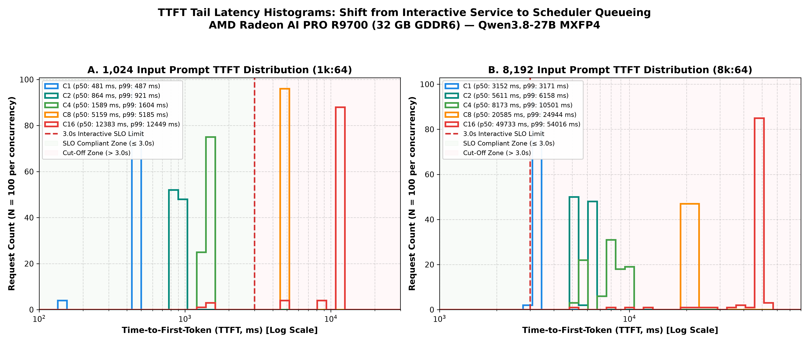
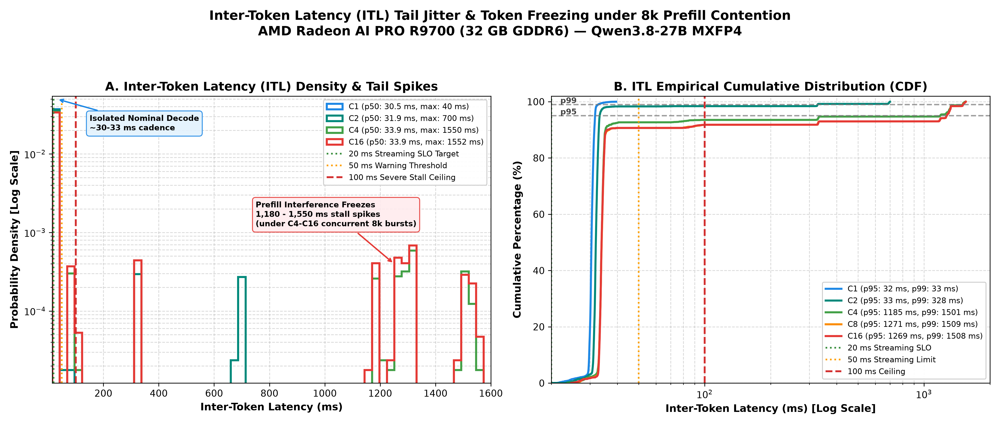
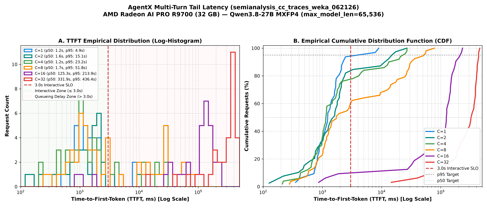
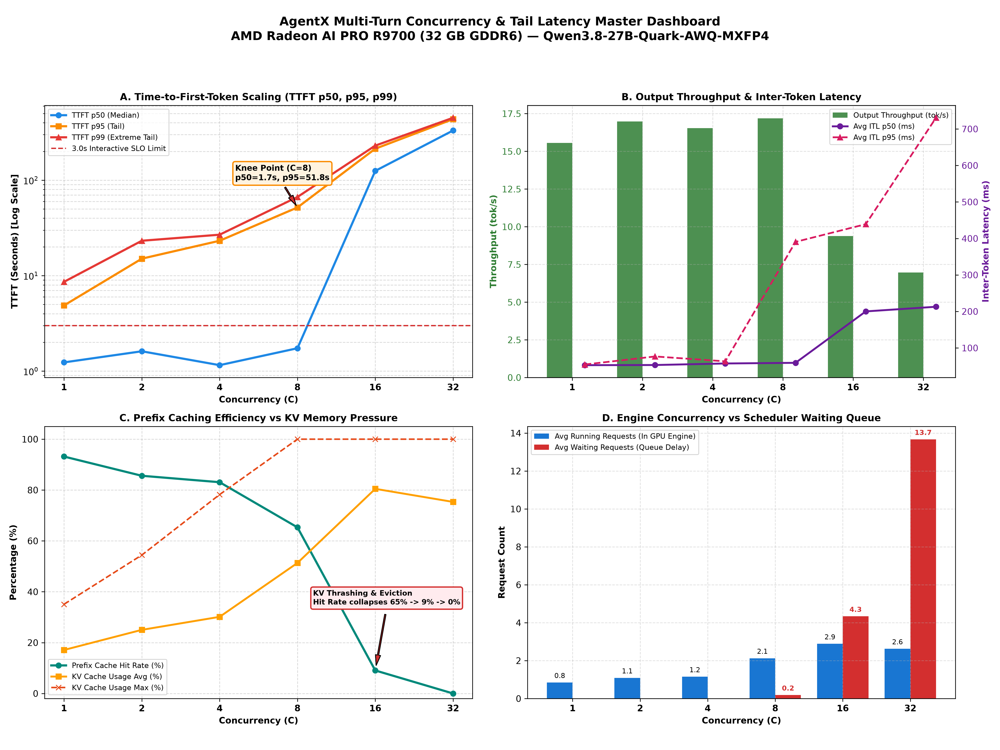

# Serving Agentic LLMs at the Edge
### Tail Latency, Multi-Turn Dynamics & Disaggregation on AMD Hardware

**Empirical Evaluation of Qwen3.8-27B MXFP4 on AMD Radeon™ AI PRO R9700 & Instinct™ MI350P**

<br>

* **Architecture:** Prefill/Decode Disaggregation (P/D 1P1D) vs. Data Parallel (DP=2)
* **Workloads:** Synthetic 1k:64 / 8k:64 & Real-World Claude Code Agent Traces (`AgentX`)
* **Hardware:** AMD Radeon™ AI PRO R9700 (32 GB GDDR6) & Instinct™ MI350P (HBM3E)
* **Stack:** ROCm 7.14 | vLLM 0.27.1 | Quark AWQ MXFP4 (W4A8 GEMM, FP8 KV)

<footer>AMD Systems Engineering & Applied Performance Group | October 2026</footer>

---

## 1. Executive Summary: The Token Freeze

<div class="highlight-box">
<b>The Core Problem:</b> A coding agent can deliver high aggregate tokens/second and still deliver an unacceptable user experience. The breakdown occurs <i>between</i> tokens: active streaming stalls whenever cold, long prompts arrive.
</div>

* **The Collocated Vulnerability (DP=2):**
  * Incoming 8K prefills commandeer compute units and memory bandwidth.
  * Active streams experience severe **1.1s – 1.55s inter-token latency (ITL) freezes**.
  * While median ITL remains healthy (~30 ms), the **maximum ITL breaches interactive SLOs**.
* **The Agentic Concurrency Cliff (AgentX Multi-Turn Traces):**
  * Healthy operation at $C \le 4$ with $>83\%$ prefix cache reuse.
  * **Knee at $C=8$:** Aggregate tok/s peaks (17.2 tok/s), but p95 TTFT explodes to **51.8s** and **363 pauses exceed 1 second**.
  * **Cliff at $C \ge 16$:** KV cache saturation triggers an eviction cascade; prefix cache hit rate collapses from 93% to **0%**, TTFT median surges to **5.5 minutes**, and output rate drops 59%.
* **The Disaggregation Promise & Tax (P/D 1P1D):**
  * Disaggregation isolates decode from prefill interference, protecting stream cadence.
  * But it incurs substantial tax: losing a decode engine, duplicating weights, and PCIe KV transfer latency.

<footer>Slide 2 | Executive Summary</footer>

---

## 2. Hardware Testbeds & Software Baseline

<div class="grid-2">
<div>

### AMD Radeon™ AI PRO R9700
* **Compute Architecture:** RDNA4 (`gfx1201`), 64 WGP
* **Memory Subsystem:** 32 GB GDDR6, 256-bit bus
* **Bandwidth:** 640 GB/s peak (~480 GB/s sustained)
* **Interconnect:** PCIe Gen 5.0 x16 (64 GB/s bi-dir)
* **TDP:** ~300 W board power
* **Target Role:** Workstation & Edge Agent Server

### AMD Instinct™ MI350P
* **Compute Architecture:** CDNA4 (`gfx950`)
* **Memory Subsystem:** 288 GB HBM3E
* **Bandwidth:** 4,096 GB/s peak
* **Interconnect:** PCIe Gen 5.0 x16 (dual-socket root)
* **Target Role:** Datacenter Enterprise Serving

</div>
<div>

### Software & Model Configuration
* **Model:** `Qwen3.8-27B-Quark-AWQ-MXFP4`
* **Quantization:** W4A8 FP8-WMMA GEMM, FP8 KV-Cache
  * Static footprint: ~15.7 GB VRAM
  * Leaves ~12.5 GB for dynamic KV pages on R9700
* **Engine:** vLLM `0.27.1` (`local/vllm-mxfp4:gfx1201`)
* **Key Flags:**
  ```bash
  --max-model-len 65536
  --max-num-seqs 4
  --max-num-batched-tokens 4096
  --gpu-memory-utilization 0.88
  --attention-backend ROCM_AITER_UNIFIED_ATTN
  ```
* **ROCm Version:** 7.14 | PyTorch 2.11.0+rocm7.14

</div>
</div>

<footer>Slide 3 | Testbed Specifications</footer>

---

## 3. Collocated Phase Contention: Why Streams Freeze

<div class="grid-2">
<div>

### Single-GPU Injection Benchmark
* **Victim Stream:** Continuous 1,024 in / 256 out decode
* **Injected Traffic:** Cold 8,192-token prefills (2×4K chunks)

| R9700 Serving Condition | Decode Output Rate | Peak Token Gap |
|---|---:|---:|
| **Isolated decode** (no prefills) | **34.07 tok/s** | **32 ms** |
| Cold 8K prefill every 5 s | 31.22 tok/s | **1,354 ms** |
| Cold 8K prefill every 1 s | 22.84 tok/s | **1,360 ms** |
| Sustained prefill bombardment | 11.42 tok/s | **1,366 ms** |

<div class="alert-box">
<b>The Metric Fallacy:</b> On light bursts, aggregate output rate only slips from 34 to 31 tok/s (-8%). But the user suffers a <b>1.35-second freeze</b>. Average tok/s completely conceals the interactive breakdown!
</div>

</div>
<div>

### Mechanism of the Freeze
```
   TIME ──►
   ┌────────────────────────────────────────────────────────┐
   │ TOKEN DECODE STREAM:                                   │
   │  [T1]──30ms──►[T2]──30ms──►[T3]                        │
   │                             │                          │
   │                             ▼                          │
   │  COLD 8K PREFILL ARRIVES:   █ PREFILL CHUNK 1 (609ms)  │
   │                             █ PREFILL CHUNK 2 (609ms)  │
   │                             ▼                          │
   │                             [T4 emitted after 1,350ms!]│
   │                              ▲                         │
   │                              └── SLO BREACH (>100ms)   │
   └────────────────────────────────────────────────────────┘
```
* **GEMM Dominance:** Prefill GEMMs saturate all CUs, pre-empting the memory-bound decode kernel.
* **Non-Preemptive Schedulers:** Once a 4K prefill chunk launches, decode must wait for kernel completion.

</div>
</div>

<footer>Slide 4 | Collocated Phase Contention Mechanics</footer>

---

## 4. Baseline Tuning Before Disaggregation

<div class="highlight-box">
<b>Engineering Principle:</b> Disaggregation must compete against a fully-tuned collocated baseline—not against avoidable prompt recomputation or poor scheduler settings.
</div>

<div class="grid-2">
<div>

### 1. Prefix Caching Acceleration
On multi-turn coding agent workloads, reusable prompts dramatically slash prefill latency:

| Reusable Prefix | New Suffix | Measured TTFT | Speedup |
|---:|---:|---:|---:|
| **0% (Cold)** | 8,192 | 2,777 ms | 1.00× |
| **50%** | 4,096 | 1,758 ms | 1.58× |
| **75%** | 2,048 | 914 ms | 3.04× |
| **100% (Warm)** | 0 | **301 ms** | **9.24×** |

* If prompts hit cache, prefill compute drops by $9\times$.
* *Implication:* A **cache-affine DP=2 cluster** becomes formidable when sessions have high reuse!

</div>
<div>

### 2. Chunked Prefill Trade-Off
Sweeping `--max-num-batched-tokens` on R9700:

* **4,096 tokens:**
  * Prefill: 2,881.8 prompt tok/s
  * Burst decode stall: **1,108.5 ms**
* **2,048 tokens (Optimal Balance):**
  * Prefill: 2,688.7 prompt tok/s (-6.7%)
  * Burst decode stall cut in half: **609.7 ms**
  * Burst decode rate maintained: 33.22 tok/s
* **512 tokens (Over-chunked):**
  * Prefill collapses to 1,923 prompt tok/s (-33%)
  * Burst decode collapses to 3.45 tok/s

</div>
</div>

<footer>Slide 5 | Baseline Optimization (Caching & Chunking)</footer>

---

## 5. Empirical Latency Distributions (Synthetic 1k & 8k)

Comprehensive empirical sweep on single R9700 ($N=100$ requests per cell, 6,400 token samples):

| Workload | Concurrency | TTFT p50 | TTFT p95 | TPOT p50 | ITL p50 | ITL p95 | ITL Max | Interactive SLO Compliance |
|---|---:|---:|---:|---:|---:|---:|---:|:---:|
| **1k:64** | **C1** | 481 ms | 485 ms | 30.1 ms | 30.0 ms | 31.1 ms | 36.7 ms | <span class="badge badge-pass">100% PASS</span> |
| **1k:64** | **C2** | 864 ms | 919 ms | 31.8 ms | 31.0 ms | 32.2 ms | 124 ms | <span class="badge badge-pass">100% PASS</span> |
| **1k:64** | **C4** | 1,589 ms | 1,603 ms | 32.2 ms | 32.2 ms | 33.4 ms | 292 ms | <span class="badge badge-pass">100% PASS</span> |
| **1k:64** | **C8** | 5,159 ms | 5,184 ms | 32.9 ms | 32.2 ms | 33.5 ms | 293 ms | <span class="badge badge-fail">QUEUE CUT-OFF (5.2s TTFT)</span> |
| **1k:64** | **C16** | 12,383 ms | 12,440 ms | 33.0 ms | 32.2 ms | 33.6 ms | 292 ms | <span class="badge badge-fail">QUEUE CUT-OFF (12.4s TTFT)</span> |
| **8k:64** | **C1** | 3,152 ms | 3,169 ms | 30.5 ms | 30.5 ms | 31.7 ms | 39.5 ms | <span class="badge badge-warn">MARGINAL (3.15s TTFT)</span> |
| **8k:64** | **C2** | 5,611 ms | 6,155 ms | 39.5 ms | 31.9 ms | 33.2 ms | 700 ms | <span class="badge badge-fail">FAIL (5.6s TTFT, 700ms ITL)</span> |
| **8k:64** | **C4** | 8,173 ms | 9,715 ms | 102 ms | 33.9 ms | **1,183 ms** | **1,550 ms** | <span class="badge badge-fail">SEVERE CONTENTION (1.55s stall)</span> |
| **8k:64** | **C8** | 20,585 ms | 21,745 ms | 122 ms | 33.9 ms | **1,267 ms** | **1,550 ms** | <span class="badge badge-fail">SEVERE CONTENTION (20.6s TTFT)</span> |
| **8k:64** | **C16** | 49,733 ms | 50,913 ms | 122 ms | 33.9 ms | **1,266 ms** | **1,552 ms** | <span class="badge badge-fail">SEVERE CONTENTION (49.7s TTFT)</span> |

<div class="highlight-box">
<b>Bimodal Distribution Proven:</b> At 8k:64, median ITL remains 33.9 ms, but p95 jumps to <b>1,183–1,267 ms</b>. Schedulers queueing past <code>--max-num-seqs 4</code> triggers massive TTFT inflation.
</div>

<footer>Slide 6 | Empirical Synthetic Latency Sweep (1k:64 vs 8k:64)</footer>

---

## 6. Synthetic Tail Latency Visualizations

<div class="grid-2">
<div>

### TTFT Log-Histograms

* **Left Panel (1k:64):** Transition from prompt execution ($C \le 4$) to discrete queue jumps ($C \ge 8$).
* **Right Panel (8k:64):** At $C \ge 2$, 100% of requests breach the 3.0s interactive threshold.

</div>
<div>

### ITL Tail Jitter & Freezing

* **Panel A (Log Density):** Sharp spike at 30 ms (nominal decode) with secondary cluster at 1,180–1,550 ms.
* **Panel B (Empirical CDF):** Tail begins bending past 50 ms at p90; p95/p99 suffer complete stalls.

</div>
</div>

<footer>Slide 7 | Synthetic Latency Distribution Histograms</footer>

---

## 7. Real-World Multi-Turn AgentX Workload

<div class="highlight-box">
<b>The Need for Realistic Agent Traces:</b> Synthetic fixed prompts fail to test memory recycling, prefix eviction, and variable tool outputs. We evaluated <b>AgentX</b> using real Claude Code traces (<code>semianalysis_cc_traces_weka_062126</code>) up to <b>65,536 context length</b>.
</div>

<div class="grid-2">
<div>

### Workload Characteristics
* **Monotonically Growing History:** Sessions start with 2k–4k tokens and expand to 30k–65k tokens across multi-turn tool calling.
* **High Inter-Turn Reuse:** System instructions, file context, and previous command outputs remain constant.
* **1-Hour Profiling Budget:** 15-minute steady-state profiling windows across $C \in \{1, 2, 4, 8, 16, 32\}$.
* **Hardware Under Test:** Single 32 GB R9700.

</div>
<div>

### Key Hypotheses Tested
1. **Can prefix caching protect latency as concurrency scales?**
2. **At what concurrency does the 32 GB VRAM limit trigger KV cache eviction?**
3. **What is the true user experience when cache thrashing begins?**
4. **Does aggregate tok/s warn operators before the system collapses?**

</div>
</div>

<footer>Slide 8 | Multi-Turn AgentX Trace Workload Setup</footer>

---

## 8. AgentX Empirical Concurrency Scorecard

| Concurrency | Completed Reqs | TTFT p50 | TTFT p95 | ITL p50 | ITL p95 | >1s Stalls / Intervals | Prefix Hit Rate | KV Cache Avg | Waiting Reqs | Output Tok/s | Status |
|---:|---:|---:|---:|---:|---:|---:|---:|---:|---:|---:|:---:|
| **C=1** | 32 | 1,234 ms | 4,876 ms | 52.9 ms | 54.7 ms | 1 / 14,341 | **93.17%** | 17.1% | 0.0 | 15.6 | <span class="badge badge-pass">HEALTHY</span> |
| **C=2** | 39 | 1,614 ms | 15,071 ms | 53.3 ms | 76.7 ms | 32 / 15,352 | **85.61%** | 25.0% | 0.0 | 17.0 | <span class="badge badge-pass">HEALTHY</span> |
| **C=4** | 50 | 1,154 ms | 23,223 ms | 57.5 ms | 63.4 ms | 24 / 14,925 | **83.08%** | 30.1% | 0.0 | 16.5 | <span class="badge badge-pass">HEALTHY</span> |
| **C=8** *(Knee)* | 53 | 1,736 ms | **51,832 ms** | 59.3 ms | **390.6 ms** | **363** / 15,869 | **65.32%** | 51.3% | 0.2 | **17.2** | <span class="badge badge-warn">TAIL KNEE</span> |
| **C=16** *(Cliff)* | 32 | **125,267 ms** | **213,886 ms** | **200.2 ms** | **439.1 ms** | **795** / 9,145 | **9.05%** | **80.5%** | **4.3** | **9.4** | <span class="badge badge-fail">COLLAPSE</span> |
| **C=32** *(Thrash)*| 32 | **331,942 ms** | **436,376 ms** | **212.9 ms** | **730.6 ms** | **731** / 6,812 | **0.00%** | **75.3%** | **13.7** | **7.0** | <span class="badge badge-fail">THRASHING</span> |

<div class="alert-box">
<b>The Concurrency Cliff:</b> Moving from C=8 to C=16 causes a complete system breakdown. TTFT median explodes from 1.7s to <b>125s (2+ minutes)</b>, and to <b>5.5 minutes</b> at C=32. Output throughput plummets by 59%.
</div>

<footer>Slide 9 | AgentX Empirical Concurrency Scorecard</footer>

---

## 9. Anatomy of the AgentX Concurrency Cliff

<div class="grid-2">
<div>

### The Deceptive Knee at $C=8$
* **Dashboard looks optimal:**
  * Output throughput hits max: **17.2 tok/s**
  * Median TTFT is low: **1,736 ms**
  * Median ITL is normal: **59.3 ms**
* **The hidden reality in the tail:**
  * p95 TTFT breaches SLO by $17\times$ (**51.8 seconds**)
  * p95 ITL surges to **390.6 ms**
  * **363 pauses exceed 1 second**
  * Prefix cache hit rate slips from 83% to 65%

</div>
<div>

### The Eviction Cascade at $C \ge 16$
* **KV Memory Exhaustion:**
  * Multiple active 65k sessions exceed the available ~12.5 GB KV cache space.
* **Cache Eviction Death Spiral:**
  * Hit rate collapses: $65\% \to 9\% \to \mathbf{0\%}$.
  * Every turn must recompute tens of thousands of prompt tokens from scratch.
* **Scheduler Queue Blowout:**
  * Average waiting requests reach **4.3 ($C=16$)** and **13.7 ($C=32$)**.
  * Total goodput drops to near zero.

</div>
</div>

<div class="highlight-box">
<b>Root Cause:</b> When working sets exceed VRAM capacity, collocated serving loses prefix caching. Forced prompt recomputations lock the GPU in continuous prefill GEMMs, starving active generation.
</div>

<footer>Slide 10 | Anatomy of the Concurrency Cliff</footer>

---

## 10. Visualizing AgentX Concurrency & Latency

<div class="grid-2">
<div>

### TTFT Distributions & CDFs

* **Panel A:** Distinct separation between sub-3s interactive zone and the 100s+ queue delay regime.
* **Panel B:** CDF shifts completely off-screen at $C=16$ and $C=32$.

</div>
<div>

### Master Operational Dashboard

* **Panel A:** Exponential TTFT tail explosion at $C=8$.
* **Panel B/C:** Direct causal link: Prefix hit rate collapse triggers throughput loss and queue blowout.

</div>
</div>

<footer>Slide 11 | AgentX Concurrency & Tail Latency Visuals</footer>

---

## 11. Prefill/Decode Disaggregation: Architecture

<div class="highlight-box">
<b>Core Architectural Thesis:</b> Dedicate GPU 0 to Prefill (prompt compute & ingestion) and GPU 1 to Decode (zero-jitter token generation), communicating via PCIe Gen 5.0 KV transfer.
</div>

```
                  PREFILL / DECODE DISAGGREGATION (1P1D)
  ┌─────────────────────────────────┐           ┌─────────────────────────────────┐
  │ GPU 0: Prefill Worker           │           │ GPU 1: Decode Worker            │
  │ • Processes incoming prompts    │           │ • Dedicated autoregressive gen  │
  │ • Computes KV activation states │           │ • Zero interference from bursts │
  │ • Ingests tool outputs & docs   │           │ • Steady ~34 tok/s cadence      │
  └────────────────┬────────────────┘           └────────────────▲────────────────┘
                   │       PCIe Gen 5.0 x16 KV Transfer          │
                   └─────────────────────────────────────────────┘
                                  H ≈ 5ms - 25ms
```

### The Three Inescapable Architectural Taxes
1. **Lost Decode Capacity:** In 2-card systems, DP=2 provides two decode engines; 1P1D leaves only one.
2. **Model Footprint Duplication:** Both 32 GB GPUs must store model weights (~15.7 GB each).
3. **KV Transport Latency ($H$):** Tensors must be prepared, transmitted, and imported across PCIe.

<footer>Slide 12 | Prefill/Decode Disaggregation Architecture & Taxes</footer>

---

## 12. Inter-GPU Transport Realities on AMD Hardware

Evaluated on dual AMD Instinct™ MI350P cards across dual-socket EPYC 9015 (PCIe Gen 5.0 x16, 3 hops, weight 72):

<div class="grid-2">
<div>

### 256 MiB Transport Benchmark
| Transport Mode | Descriptor Layout | Median (p50) | Tail (p95) |
|---|---|---:|---:|
| Direct HIP IPC | 1 Contiguous Buffer | **5.72 ms** | 56.8 ms |
| UCX `rocm_ipc` | 1 Contiguous Descriptor| **9.70 ms** | 110 ms |
| UCX `rocm_ipc` | 256 Fragmented Descriptors| **59.0 ms** | 124 ms |
| **HIP-IPC NIXL Backend** | **256 Coalesced Descriptors** | **5.56 ms** | **54.2 ms** |

* **Descriptor Fragmentation Penalty:** 256 independent descriptors without coalescing balloon transfer time by **$6\times$** (9.7ms $\to$ 59ms)!
* **NIXL Coalescing Advantage:** Recombining adjacent KV pages into contiguous transfers restores native link rate.

</div>
<div>

### Qwen3.8-27B Attention Layout
* **Layer Geometry:** 16 attention regions, 272 descriptors, 884 MiB.
* **Raw Fragmented:** 77.9 ms p50.
* **Coalesced (16 copies):** **20.5 ms p50** (43.1 GB/s).

<div class="alert-box">
<b>Directional Asymmetry:</b> GPU 0 $\to$ GPU 1 is 5.7 ms; GPU 1 $\to$ GPU 0 is <b>12.7 ms p50</b> and 175 ms p95 across inter-socket EPYC root bridges. Topology matters!
</div>

</div>
</div>

<footer>Slide 13 | Inter-GPU PCIe Transport Dynamics</footer>

---

## 13. End-to-End P/D Milestone: Real Qwen3.8 Handoff

<div class="highlight-box">
<b>Functional Milestone:</b> A real Qwen3.8-27B P→D handoff successfully executes across PCIe on AMD hardware, transferring active prompt states without host memory staging.
</div>

<div class="grid-2">
<div>

### Cold 8K Handoff Waterfall
Eight unique cold 8,192-token prompts; GPU 1 prefill $\to$ GPU 0 decode:

| Phase Interval | Median (p50) | Tail (p95) |
|---|---:|---:|
| **Prefill HTTP Execution** | 854 ms | 860 ms |
| **NIXL Preparation & Post** | 24.8 ms | 44.0 ms |
| **NIXL PCIe Transfer (699 MB)**| **100 ms** | **235 ms** |
| **Total Response Time (Client)**| **1,189 ms** | **1,443 ms** |

* **Transferred Volume:** 699,203,584 bytes (240 descriptors coalesced into 96 DMA copies).
* **Cache Query Verification:** Decoder queried 8,257 external prefix tokens; **8,256 tokens hit** (99.99%).

</div>
<div>

### Open Engineering Gates
1. **Numerical Divergence:**
   * Greedy completion token IDs diverge from single-GPU control (index 2 on 81-tok, index 5 on 8,246-tok).
   * Verifying KV cache numerical precision across DMA import is required before production release.
2. **TTFT Under Heavy Load:**
   * 4 concurrent prompts move client TTFT from 1.19s to **3.23s** (prefill queueing).
3. **Hardware Comparison Awaiting:**
   * Side-by-side 2-card DP=2 vs 1P1D benchmark pending.

</div>
</div>

<footer>Slide 14 | Qwen3.8-27B P→D Handoff Waterfall & Open Gates</footer>

---

## 14. Strict Service Level Objectives: Goodput vs. Throughput

<div class="highlight-box">
<b>The 29 Sep 2026 Interactive SLO Standard:</b> TTFT p95 $\le$ 3,000 ms | TPOT $\le$ 20 ms ($\ge$ 50 tok/s) | ITL p95 $\le$ 20 ms | ITL p99 $\le$ 50 ms | Peak ITL $<$ 100 ms
</div>

<div class="grid-2">
<div>

### The Goodput Divergence
* **Raw Throughput:** Total output tokens emitted divided by time, regardless of jitter or latency.
* **SLO-Qualified Goodput:** Tokens emitted *only* by requests meeting both TTFT and ITL SLO contracts.
* **The DP=2 Collapse:**
  * When long prefills burst, DP=2 continues emitting raw tokens.
  * But because ITL stalls breach 100 ms and TTFT exceeds 3s, **its qualified goodput plunges to ZERO**.
  * 1P1D preserves qualified goodput even as raw capacity plateaus.

</div>
<div>

### Hardware Roofline Boundaries
* **Radeon AI PRO R9700 (640 GB/s GDDR6):**
  * Single-GPU isolated decode sustains **29.35 ms TPOT (34.1 tok/s)**.
  * *Cannot* meet the strict $\le 20\text{ ms}$ TPOT target on a single card!
  * Requires **TP=2** (14.9–16.0 ms TPOT) or **Speculative Decoding (DFlash)**.
* **Instinct MI350P (4,096 GB/s HBM3E):**
  * Natively sustains $\le 20\text{ ms}$ TPOT across $C=1 \dots 16$ ($20.1\text{ ms}$ at $C=32$).

</div>
</div>

<footer>Slide 15 | SLO Contracts & Goodput vs Raw Throughput</footer>

---

## 15. TCO & Presales Tokenomics

<div class="grid-2">
<div>

### Cost per Million Tokens ($/M tok)

* **8× R9700S Cluster ($30k Capex):**
  * Delivers industry-leading edge $/M token economics under high-volume workloads.
  * Outperforms datacenter clusters on Capex payback when local agent concurrency is bounded ($C \le 8$).

</div>
<div>

### Energy Efficiency (Joules per Token)

* **Socket Energy Utilization:**
  * 300W R9700 draws significantly lower idle power than 750W+ enterprise GPUs.
  * Energy per qualified token ($J/\text{tok}_{\text{qual}}$) highlights the cost of dropped or recomputed requests.

</div>
</div>

<footer>Slide 16 | TCO, Capex & Energy Efficiency Breakdown</footer>

---

## 16. Decision Framework: When Does P/D Beat DP=2?

<div class="highlight-box">
<b>Mathematical Crossover Rule:</b> P/D 1P1D outperforms Data Parallelism (DP=2) on completed throughput if and only if collocated interference efficiency factor $\eta < 0.50$:
$$D_{\text{P/D}} > \eta_{\text{collocated}} \cdot 2 \cdot D_{\text{collocated}} \implies \eta < 0.50$$
</div>

### Architectural Recommendation Matrix

| Workload Traffic Pattern | Reusable Prefix Rate | Dominant SLA Constraint | Recommended Architecture | Rationale |
|---|:---:|---|:---:|---|
| **Multi-Turn Coding Agents (AgentX)** | High ($>80\%$) | Interactive Cadence | **Cache-Affine DP=2** | Maximizes prefix hits; avoids KV transfer overhead. |
| **Heavy Cold Burst Bombardment** | Low ($<20\%$) | Zero-Jitter Streaming | **1P1D Disaggregation** | Insulates decode streams from 1.5s cold prefill freezes. |
| **High Concurrency ($C \ge 16$)** | Mixed | Strict 20ms TPOT | **Dual-GPU TP=2** | Doubles memory bandwidth (15ms TPOT); prevents KV thrash. |
| **Datacenter Large-Scale Fleet** | Variable | Global Goodput | **Heterogeneous Disagg** | MI350P Prefill pool + R9700 Decode farm. |

<footer>Slide 17 | Strategic Architectural Decision Matrix</footer>

---

## 17. Engineering Road Ahead & Conclusions

<div class="grid-2">
<div>

### What Our Data Conclusively Proves
1. **Collocated Serving Breaks at the Tail:** 8K cold prefills inject 1.35s–1.55s freezes, destroying interactive SLOs despite healthy average tok/s.
2. **The AgentX Concurrency Cliff is Real:** At $C \ge 16$, KV cache exhaustion triggers an eviction cascade, collapsing prefix hit rate (93% $\to$ 0%) and blowing out TTFT to 5.5 minutes.
3. **PCIe Handoff is Feasible on AMD Hardware:** 699 MB KV transfer completes in 100 ms with coalesced HIP-IPC (99.99% cache hit).

</div>
<div>

### Immediate Testing Milestones
* [ ] **Gate 1:** Resolve token ID numerical divergence in P→D handoff against single-GPU baseline.
* [ ] **Gate 2:** Execute head-to-head DP=2 vs 1P1D benchmark on identical dual-R9700 testbed with replay of AgentX traces.
* [ ] **Gate 3:** Integrate live `amdsmi` energy sampling into vLLM latency logs for true Joules/qualified token metrics.
* [ ] **Gate 4:** Benchmark speculative decoding (DFlash) to hit the 20ms TPOT roofline on R9700.

</div>
</div>

<div class="highlight-box">
<b>Bottom Line:</b> Modern agent serving requires designing for tail latency, prefix retention, and memory rooflines. Disaggregation provides a powerful architectural lever—provided baseline schedulers and cache-affinity are exhausted first.
</div>

<footer>Slide 18 | Conclusions & Engineering Roadmap</footer>

---

## Appendix: Published Artifacts & Reproducibility

* **Documentation Hub:**
  * Master Index: [`docs/README.md`](../README.md)
  * AgentX Multi-Turn Tail Analysis: [`docs/AGENTX-TAIL.md`](../AGENTX-TAIL.md)
  * The Token Freeze Whitepaper: [`docs/QWEN-TAIL-PDD.md`](../QWEN-TAIL-PDD.md)
  * Dual-Card Test Plan & Acceptance: [`docs/TESTPLAN.md`](../TESTPLAN.md)
  * Disaggregation Evaluation Framework: [`docs/PDD-FRAMEWORK.md`](../PDD-FRAMEWORK.md)
  * KV Connector Implementation: [`docs/KV_CONNECTOR.md`](../KV_CONNECTOR.md)
  * TCO & Presales Tokenomics: [`docs/TCO.md`](../TCO.md)
* **Published Data & Figures:**
  * Raw AgentX Pilot Traces: [`docs/results/agentx/`](../results/agentx/)
  * Raw Synthetic Latency Samples: [`docs/results/qwen3.8-27b-mxfp4/latency/r9700/`](../results/qwen3.8-27b-mxfp4/latency/r9700/)
  * Latency Distribution Figures: [`docs/figures/latency/`](../figures/latency/)
  * AgentX Concurrency Figures: [`docs/figures/agentx/`](../figures/agentx/)
  * TCO & PDD Dashboards: [`docs/figures/tco/`](../figures/tco/) & [`docs/figures/pd/`](../figures/pd/)
* **Reproduction Commands:**
  ```bash
  # Regenerate AgentX figures
  /home/amd/workspace/coder/.venv/bin/python scripts/plot_agentx_tail_sweep.py
  # Regenerate Synthetic Latency Histograms
  /home/amd/workspace/coder/.venv/bin/python scripts/generate_latency_histogram_plots.py
  # Recompile Slides (HTML, PDF, PPTX)
  ./scripts/build_presentation.sh
  ```

<footer>Slide 19 | Appendix & Artifacts</footer>
