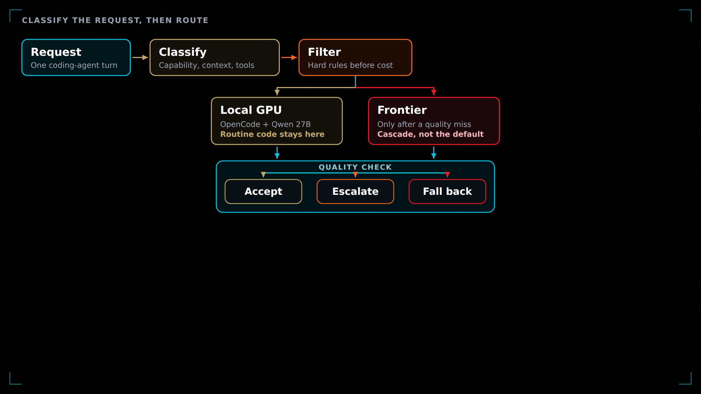
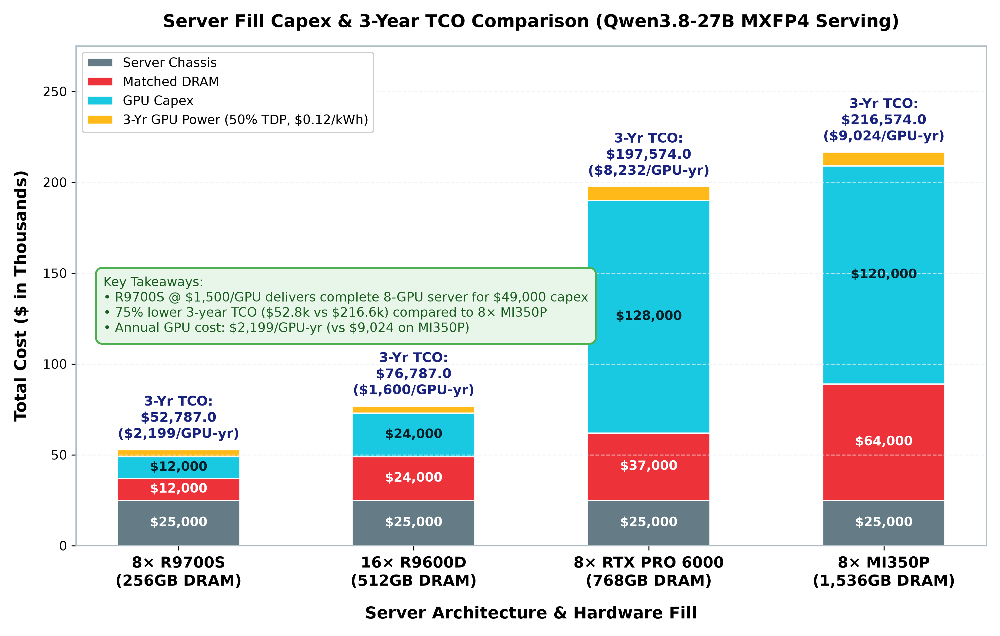
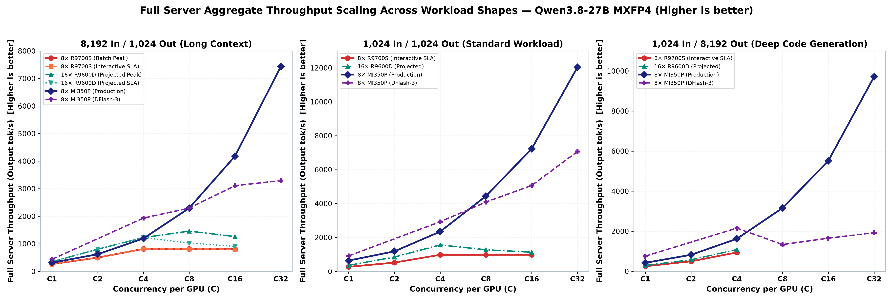
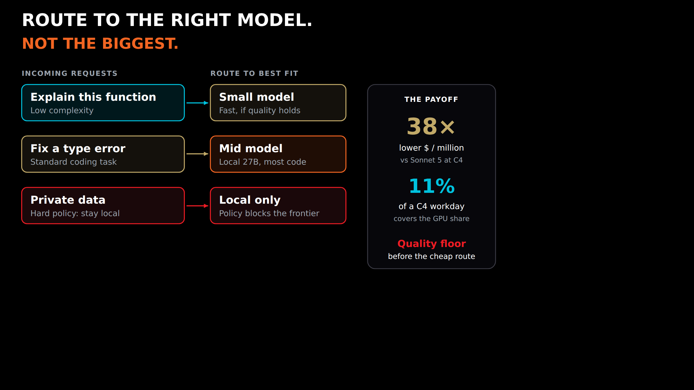

<style>
section {
    font-family: Arial, 'Nimbus Sans', 'Helvetica Neue', sans-serif;
    padding: 42px 54px 52px;
    font-size: 19px;
    background-color: #000000;
    background-image:
      url('./amd-logo-white.png'),
      linear-gradient(90deg, rgba(0,194,222,.13), rgba(0,194,222,0) 22%),
      linear-gradient(180deg, rgba(255,255,255,.035), rgba(255,255,255,0) 28%);
    background-repeat: no-repeat;
    background-position: calc(100% - 34px) calc(100% - 18px), 0 0, 0 0;
    background-size: 112px auto, 100% 100%, 100% 100%;
    color: #ffffff;
    letter-spacing: .01em;
  }
  section::before {
    content: "";
    position: absolute;
    top: 0;
    left: 0;
    width: 100%;
    height: 7px;
    background: linear-gradient(90deg, #00c2de 0 62%, #f26522 62% 82%, #ed1c24 82%);
  }
  section.lead {
    justify-content: flex-end;
    align-items: flex-start;
    text-align: left;
    padding: 0 46% 88px 58px;
    background-color: #000000;
    background-image:
      url('./amd-logo-white.png'),
      linear-gradient(90deg, rgba(0,0,0,.94) 0 34%, rgba(0,0,0,.55) 52%, rgba(0,0,0,.18) 100%),
      url('./title-background.jpg');
    background-repeat: no-repeat;
    background-position: calc(100% - 34px) calc(100% - 18px), center, center;
    background-size: 112px auto, cover, cover;
  }
  section.lead::before {
    display: none;
  }
  section.lead h1 {
    color: #00c2de;
    font-size: 44px;
    font-weight: 600;
    line-height: 1.05;
    margin: 0 0 22px;
    letter-spacing: 0;
  }
  section.lead h3,
  section.lead p,
  section.lead strong {
    color: #ffffff;
    font-size: 24px;
    font-weight: 500;
    line-height: 1.25;
    margin: 0;
  }
  h1 {
    color: #ffffff;
    font-size: 46px;
    line-height: 1.02;
    margin: 0 0 14px;
    font-weight: 700;
    letter-spacing: -.025em;
  }
  h2 {
    color: #ffffff;
    font-size: 29px;
    line-height: 1.08;
    margin: 0 0 17px;
    padding: 0 0 9px;
    border-bottom: 2px solid #00c2de;
    font-weight: 700;
    letter-spacing: -.015em;
  }
  h3 {
    color: #00c2de;
    font-size: 20px;
    margin: 0 0 7px;
    font-weight: 700;
    letter-spacing: .015em;
  }
  p, li {
    font-size: 17px;
    line-height: 1.35;
    color: #ffffff;
  }
  ul, ol {
    margin-top: 6px;
  }
  li::marker {
    color: #00c2de;
  }
  table {
    font-size: 13px;
    width: 100%;
    border-collapse: collapse;
    margin: 10px 0;
    border-top: 2px solid #00c2de;
  }
  section table th {
    background-color: #262626 !important;
    color: #ffffff;
    padding: 7px 10px;
    border: 1px solid #5e5e5e;
    text-align: left;
    font-weight: 700;
  }
  section table td,
  section table tbody tr:nth-child(odd) td,
  section table tbody tr:nth-child(even) td {
    padding: 5px 10px;
    border: 1px solid #454545;
    background-color: #101010 !important;
    color: #ffffff !important;
  }
  strong {
    color: #00c2de;
  }
  em {
    color: #ffffff;
    font-style: normal;
    font-weight: 700;
  }
  code {
    background-color: #262626;
    color: #00c2de;
    font-size: 14px;
    padding: 2px 5px;
  }
  .highlight-box {
    background: linear-gradient(90deg, rgba(0,194,222,.18), rgba(0,194,222,.035));
    border-left: 5px solid #00c2de;
    padding: 11px 16px;
    margin: 11px 0;
  }
  .alert-box {
    background: linear-gradient(90deg, rgba(237,28,36,.22), rgba(237,28,36,.04));
    border-left: 5px solid #ed1c24;
    padding: 11px 16px;
    margin: 11px 0;
  }
  .grid-2 {
    display: grid;
    grid-template-columns: 1fr 1fr;
    gap: 24px;
    align-items: start;
  }
  .badge {
    display: inline-block;
    padding: 3px 8px;
    font-size: 12px;
    font-weight: 700;
  }
  .badge-pass { background-color: #00c2de; color: #000000; }
  .badge-warn { background-color: #f26522; color: #ffffff; }
  .badge-fail { background-color: #ed1c24; color: #ffffff; }
  footer {
    font-size: 9px;
    color: #9d9fa2;
    left: 54px;
    right: 170px;
    bottom: 18px;
    letter-spacing: .04em;
    text-transform: uppercase;
  }
  section::after {
    color: #ffffff;
    font-size: 9px;
    left: 18px;
    right: auto;
    bottom: 18px;
    width: 24px;
    text-align: right;
  }
  section.figure img {
    display: block;
    max-height: 360px;
    max-width: 100%;
    width: auto;
    margin: 8px auto 0;
    background: #ffffff;
  }
  section.figure p {
    margin: 0;
    font-size: 16px;
  }
  section.split .grid-2 {
    grid-template-columns: 1.15fr 0.9fr;
    gap: 18px;
    align-items: center;
  }
  section.split img {
    display: block;
    width: 100%;
    max-height: 500px;
    margin: 0;
    background: #ffffff;
  }
  section.split table {
    font-size: 12px;
    margin: 0 0 8px;
  }
  section.split table th,
  section.split table td {
    padding: 4px 6px !important;
  }
  section.split li {
    font-size: 14px;
    line-height: 1.28;
    margin-bottom: 4px;
  }
  section.diagram {
    padding: 16px 28px 42px;
    justify-content: center;
  }
  section.diagram img {
    display: block;
    width: 100%;
    max-height: 640px;
    margin: 0;
    background: transparent;
  }
  section.flow .grid-2 {
    grid-template-columns: 1.05fr 0.95fr;
    gap: 18px;
    align-items: center;
  }
  section.flow img {
    display: block;
    width: 100%;
    margin: 0;
    background: transparent;
  }
  section.flow h3 {
    margin-top: 0;
  }
  section.flow li {
    font-size: 15px;
    line-height: 1.28;
    margin-bottom: 4px;
  }
</style>


<!-- _class: lead -->
<!-- _footer: "AMD Systems Engineering | October 2026" -->

# Offload the Coding Subscription

On-premises GPU serving for OpenCode<br>on AMD Radeon™ AI PRO and Instinct™

---

<!-- _footer: "Slide 2 | The subscription is a meter" -->

## The subscription is a meter

Commercial plans sell a seat, then bill the agent loop again once the included pool is gone. Enterprise often sells the seat as access only.

| Offering, annual list price | Seat / month | 3-year seat | After the included pool |
|---|---:|---:|---|
| GitHub Copilot Business | $19 | $684 | $0.01 per AI credit |
| Cursor Teams, standard | $40 | $1,440 | API price, plus $0.25 / M tokens |
| Claude Pro; Max from $100 | $20; $200 | $720; $7,200 | API rates |
| Claude Team, standard; premium | $20; $100 | $720; $3,600 | purchased extra capacity |
| Claude Enterprise | $20 | $720 | every token, at API rates |
| ChatGPT Business, standard; premium | $20; $100 | $720; $3,600 | workspace credits |
| ChatGPT Enterprise | custom | quote | credits or tokens |

Claude Sonnet 5 list rate, the meter on Claude Enterprise, is **$2 / $10** per million input / output tokens. Monthly billing is higher where a plan offers it: Claude Team and ChatGPT Business standard are **$25**, and premium is **$125**.

<div class="highlight-box">
October 2026 list prices from Claude, OpenAI, Cursor, and GitHub. Claude Enterprise starts at 20 seats. ChatGPT Business starts at 2. ChatGPT Enterprise is a sales quote. These are not measurements from this repository.
</div>

---

<!-- _class: flow -->
<!-- _footer: "Slide 3 | What moves on-premises" -->

## What moves onto the GPU

<div class="grid-2">
<div>



</div>
<div>

### Local path
* **OpenCode** edits files, runs tools, and stays on the workstation network.
* **vLLM on ROCm** serves Qwen3.8-27B, one replica per GPU.
* Prompts and repository context do not leave the building.
* After the hardware is paid for, another token does not generate another invoice.

### What the dollars mean
* The 29 Sep 2026 plan in `docs/TCO.md`. Card prices are supplied estimates.
* R9700S and MI350P rates are measured. R9600D rates are a 150 W projection.
* The local 27B model is the offload target, not a priced substitute for a frontier model.

</div>
</div>

---

<!-- _class: split -->
<!-- _footer: "Slide 4 | Buy the hardware once" -->

## Buy the hardware once

<div class="grid-2">
<div>



</div>
<div>

| | 8× R9700S | 8× MI350P | 2× R9700 |
|---|---:|---:|---:|
| Capex | $49,000 | $209,000 | $6,500 |
| 3-year power | $3,787 | $7,574 | in total |
| **3-year cost** | **$52,787** | **$216,574** | **$8,235** |
| Per year | $17,596 | $72,191 | $2,745 |

* DRAM matches the GPU memory. Power is the GPU board only, at **$0.12/kWh** and 50% of nameplate, for 26,298 hours.
* Facility power and residual value are excluded.
* Eight R9700S cards are the low capex fill. Electricity is a few percent of that bill.
* The MI350P server costs about four times as much over three years.
* The workstation is a different host: $6,500 capex and a 550 W planning draw.

</div>
</div>

---

<!-- _class: split -->
<!-- _footer: "Slide 5 | Price of a million output tokens" -->

## Price of a million output tokens

<div class="grid-2">
<div>


</div>
<div>

| Shape | Sonnet 5 | 8× R9700S | 8× MI350P |
|---|---:|---:|---:|
| 8,192 / 1,024 | $26.00 | $0.68 | $1.92 |
| 1,024 / 1,024 | $12.00 | $0.57 | $0.98 |
| 1,024 / 8,192 | $10.25 | $0.59 | $1.41 |

* Sonnet 5 list rate on the same input and output shape.
* On-premises prices are measured full-server throughput at concurrency 4, spread over every hour of three years.
* An 8×5 workday multiplies those on-premises prices by **4.2**. The R9700S 8,192/1,024 cell becomes **$2.87**, against $26.
* At batch C8 on that shape, eight R9700S cards reach **$0.50**. Production MI350P is still **$1.00**.

</div>
</div>

---

<!-- _footer: "Slide 6 | The card pays for the seats it replaces" -->

## The card pays for the seats it replaces

<div class="grid-2">
<div>

### Break-even against the API
One R9700S share is **$183 per month**. At the Sonnet 5 8,192/1,024 rate, that matches about **7 million** output tokens.

| R9700S, 8,192/1,024 | Workday month | API bill |
|---|---:|---:|
| C4, 102 tok/s | 63.5 million tokens | $1,651 |
| Hardware share |  | $183 |

The share is covered at about **11%** of that C4 workday. Tokens past that point are the reduction.

</div>
<div>

### Seats the invoice avoids
This is list price avoided, not a claim that the local 27B matches the hosted model.

| 3-year hardware | Max or Ultra | Cursor Teams |
|---|---:|---:|
| 2× R9700, $8,235 | 1 | 6 |
| 8× R9700S, $52,787 | 7 | 36 |
| 8× MI350P, $216,574 | 30 | 150 |

A $20 Pro seat is the wrong comparison. The reduction shows up on a high cap, or on API rates after the included pool is gone.

</div>
</div>

---

<!-- _class: figure -->
<!-- _footer: "Slide 7 | Where the larger GPU earns it" -->

## Where the larger GPU earns it

R9700S flattens once the 32 GB card protects latency. MI350P is still climbing at C32: **12,035 tok/s** and **$0.19** per million on 1,024/1,024, or **$0.80** on an 8×5 duty cycle.



---

<!-- _class: diagram -->
<!-- _footer: "Slide 8 | Route by requirements" -->



---

<!-- _footer: "Slide 9 | Which box to buy" -->

## Which box to buy

<div class="highlight-box">
<b>Workstation:</b> a few developers are on Max, Ultra, or API overage, and the repository has to stay inside the network. Three years of a dual R9700 is about one Max seat.
</div>

<div class="highlight-box">
<b>8× R9700S:</b> a team shares one interactive coding agent and per-GPU concurrency stays near C4 to C8. This is the lowest measured dollar per million tokens in that band.
</div>

<div class="highlight-box">
<b>8× MI350P:</b> the same server has to hold a larger model, or stay busy at high concurrency, where its token price keeps falling.
</div>

---

<!-- _footer: "Slide 10 | Sources" -->

## Sources

* On-premises capex, electricity, and token prices: [`docs/TCO.md`](../TCO.md), 29 September 2026.
* Figures: [`reports/figures/tco/`](../figures/tco/). Rebuild with `python3 scripts/generate_tco_plots.py`. Routing diagrams: [`reports/assets/`](../assets/).
* Dual-R9700 workstation annual cost: [`docs/PDD-FRAMEWORK.md`](../PDD-FRAMEWORK.md).
* Local agent path: OpenCode plus vLLM, described in the repository README. Per-request local versus frontier routing: `scripts/jev_gateway.py`.
* Routing method on slide 8: classify the request, apply hard policy and capability rules, then choose the least expensive model that still clears a quality floor. A cascade escalates a failed check. A fallback covers an outage. Method from the [LLM Routing Guide](https://promptessor.com/blog/llm-routing-guide), 14 September 2026. The 38× and 11% figures are from this deck.
* R9600D token prices in the TCO note are scaled from R9700S measurements. RTX PRO 6000 has no priced cell in these three shapes.
* List prices, October 2026: [Claude plans](https://claude.com/pricing), [Claude Team](https://support.claude.com/en/articles/9266767-what-is-the-team-plan), [Claude Enterprise](https://support.claude.com/en/articles/9797531-what-is-the-enterprise-plan), [ChatGPT Business and Enterprise](https://openai.com/business/pricing/), [Cursor plans](https://cursor.com/docs/account/pricing), [GitHub Copilot plans](https://docs.github.com/en/copilot/get-started/plans). Sonnet 5 at $2 / $10 per million input / output tokens is the published API rate used for the shape comparison.

```bash
./scripts/build_presentation.sh coder-tco
```
