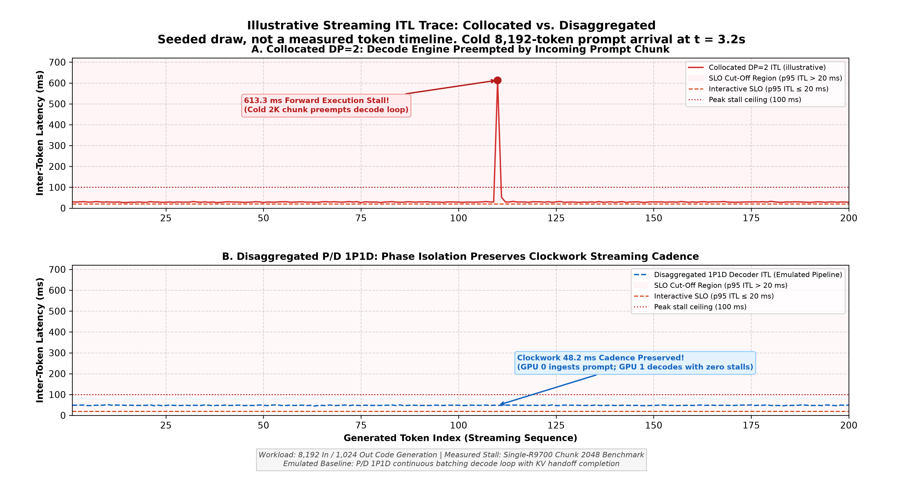
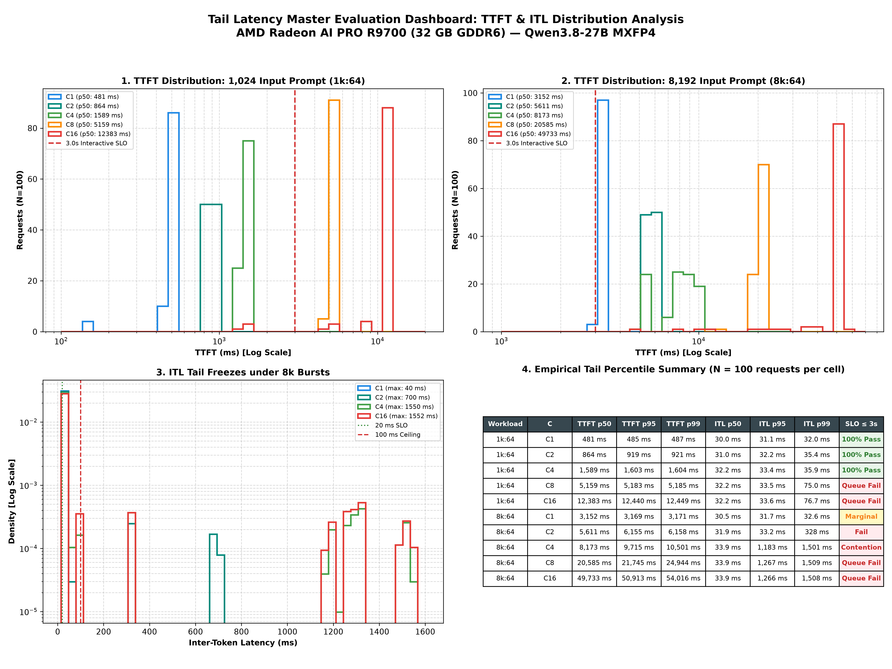
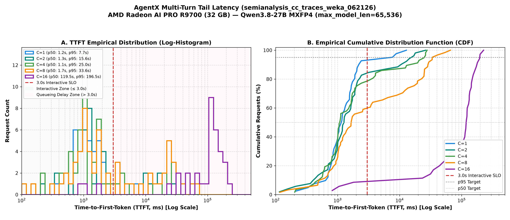
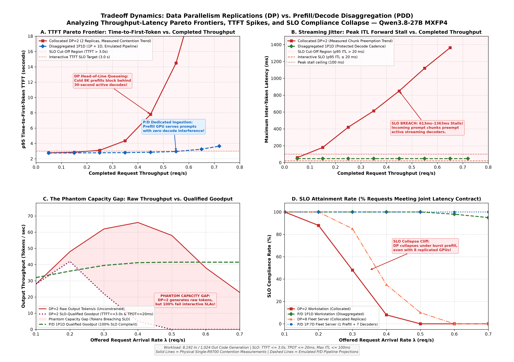
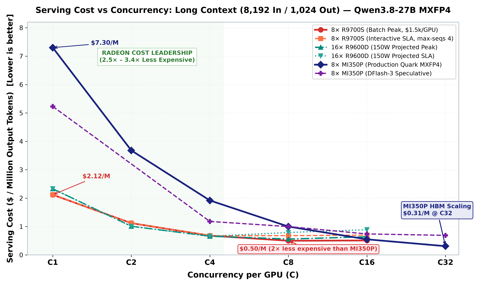
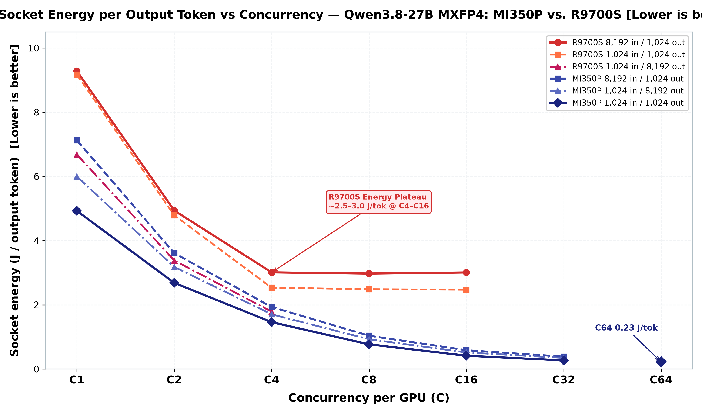

<style>
section {
    font-family: Arial, 'Nimbus Sans', 'Helvetica Neue', sans-serif;
    padding: 42px 54px 52px;
    font-size: 19px;
    background-color: #000000;
    background-image:
      url('./amd-logo-white.png'),
      linear-gradient(90deg, rgba(0,194,222,.13), rgba(0,194,222,0) 22%),
      linear-gradient(180deg, rgba(255,255,255,.035), rgba(255,255,255,0) 28%);
    background-repeat: no-repeat;
    background-position: calc(100% - 34px) calc(100% - 18px), 0 0, 0 0;
    background-size: 112px auto, 100% 100%, 100% 100%;
    color: #ffffff;
    letter-spacing: .01em;
  }
  section::before {
    content: "";
    position: absolute;
    top: 0;
    left: 0;
    width: 100%;
    height: 7px;
    background: linear-gradient(90deg, #00c2de 0 62%, #f26522 62% 82%, #ed1c24 82%);
  }
  section.lead {
    justify-content: flex-end;
    align-items: flex-start;
    text-align: left;
    padding: 0 46% 88px 58px;
    background-color: #000000;
    background-image:
      url('./amd-logo-white.png'),
      linear-gradient(90deg, rgba(0,0,0,.94) 0 34%, rgba(0,0,0,.55) 52%, rgba(0,0,0,.18) 100%),
      url('./title-background.jpg');
    background-repeat: no-repeat;
    background-position: calc(100% - 34px) calc(100% - 18px), center, center;
    background-size: 112px auto, cover, cover;
  }
  section.lead::before {
    display: none;
  }
  section.lead h1 {
    color: #00c2de;
    font-size: 44px;
    font-weight: 600;
    line-height: 1.05;
    margin: 0 0 22px;
    letter-spacing: 0;
  }
  section.lead h3,
  section.lead p,
  section.lead strong {
    color: #ffffff;
    font-size: 24px;
    font-weight: 500;
    line-height: 1.25;
    margin: 0;
  }
  h1 {
    color: #ffffff;
    font-size: 46px;
    line-height: 1.02;
    margin: 0 0 14px;
    font-weight: 700;
    letter-spacing: -.025em;
  }
  h2 {
    color: #ffffff;
    font-size: 29px;
    line-height: 1.08;
    margin: 0 0 17px;
    padding: 0 0 9px;
    border-bottom: 2px solid #00c2de;
    font-weight: 700;
    letter-spacing: -.015em;
  }
  h3 {
    color: #00c2de;
    font-size: 20px;
    margin: 0 0 7px;
    font-weight: 700;
    letter-spacing: .015em;
  }
  p, li {
    font-size: 17px;
    line-height: 1.35;
    color: #ffffff;
  }
  ul, ol {
    margin-top: 6px;
  }
  li::marker {
    color: #00c2de;
  }
  table {
    font-size: 13px;
    width: 100%;
    border-collapse: collapse;
    margin: 10px 0;
    border-top: 2px solid #00c2de;
  }
  section table th {
    background-color: #262626 !important;
    color: #ffffff;
    padding: 7px 10px;
    border: 1px solid #5e5e5e;
    text-align: left;
    font-weight: 700;
  }
  section table td,
  section table tbody tr:nth-child(odd) td,
  section table tbody tr:nth-child(even) td {
    padding: 5px 10px;
    border: 1px solid #454545;
    background-color: #101010 !important;
    color: #ffffff !important;
  }
  strong {
    color: #00c2de;
  }
  em {
    color: #ffffff;
    font-style: normal;
    font-weight: 700;
  }
  code {
    background-color: #262626;
    color: #00c2de;
    font-size: 14px;
    padding: 2px 5px;
  }
  .highlight-box {
    background: linear-gradient(90deg, rgba(0,194,222,.18), rgba(0,194,222,.035));
    border-left: 5px solid #00c2de;
    padding: 11px 16px;
    margin: 11px 0;
  }
  .alert-box {
    background: linear-gradient(90deg, rgba(237,28,36,.22), rgba(237,28,36,.04));
    border-left: 5px solid #ed1c24;
    padding: 11px 16px;
    margin: 11px 0;
  }
  .grid-2 {
    display: grid;
    grid-template-columns: 1fr 1fr;
    gap: 24px;
    align-items: start;
  }
  .badge {
    display: inline-block;
    padding: 3px 8px;
    font-size: 12px;
    font-weight: 700;
  }
  .badge-pass { background-color: #00c2de; color: #000000; }
  .badge-warn { background-color: #f26522; color: #ffffff; }
  .badge-fail { background-color: #ed1c24; color: #ffffff; }
  footer {
    font-size: 9px;
    color: #9d9fa2;
    left: 54px;
    right: 170px;
    bottom: 18px;
    letter-spacing: .04em;
    text-transform: uppercase;
  }
  section::after {
    color: #ffffff;
    font-size: 9px;
    left: 18px;
    right: auto;
    bottom: 18px;
    width: 24px;
    text-align: right;
}
</style>

<!-- _class: lead -->
<!-- _footer: "AMD Systems Engineering | October 2026" -->

# Serving Agentic LLMs<br>at the Edge

Tail latency, multi-turn dynamics, and disaggregation<br>on AMD Radeon™ AI PRO R9700 and Instinct™ MI350P

<!--
Speaker Notes:
Welcome everyone. Today we are presenting empirical results on serving agentic LLMs on AMD hardware.
Rather than asking standard benchmark questions like "What is the peak theoretical tokens per second?",
we evaluate the actual interactive experience of coding agents: what happens when cold prompts arrive during
active generation, how prefix caching degrades under multi-turn pressure, and whether prefill/decode
disaggregation truly delivers higher useful goodput on PCIe-connected GPUs.
-->

---

<!-- _footer: "Slide 2 | Executive Summary" -->

## 1. Executive Summary: The Token Freeze

<div class="highlight-box">
<b>The Core Problem:</b> A coding agent can deliver high aggregate tokens/second and still feel broken. The breakdown occurs <i>between</i> tokens: active streaming stalls whenever cold, long prompts arrive.
</div>

* **The Collocated Vulnerability (DP=2):**
  * Incoming 8K prefills commandeer compute units and memory bandwidth.
  * Active streams experience severe **1.1s – 1.55s inter-token latency (ITL) freezes**.
  * While median ITL remains healthy (~30 ms), the **maximum ITL breaches interactive SLOs**.
* **The Agentic Concurrency Cliff (AgentX Multi-Turn Traces):**
  * Healthy operation at $C \le 4$ with $>83\%$ prefix cache reuse on R9700.
  * **Knee at $C=8$:** Aggregate tok/s peaks (17.2 tok/s), but p95 TTFT explodes to **51.8s** and **363 pauses exceed 1 second**.
  * **Cliff at $C \ge 16$:** KV cache saturation triggers an eviction cascade; prefix cache hit rate collapses from 93% to **0%**, TTFT median surges to **5.5 minutes**, and output rate drops 59%.
* **The Disaggregation Promise & Tax (P/D 1P1D):**
  * Disaggregation isolates decode from prefill interference, protecting stream cadence.
  * But it incurs substantial tax: losing a decode engine, duplicating weights, and PCIe KV transfer latency.

<!--
Speaker Notes:
Key point to emphasize here: Average tokens per second is a deceptive vanity metric.
In a coding agent workflow, a user streaming code doesn't care if the GPU emits 30 tokens/sec on average
if it randomly pauses for 1.5 seconds right in the middle of writing a function.
Disaggregation is an architecture designed specifically to solve this tail latency problem.
-->

---

<!-- _footer: "Slide 3 | Testbed Specifications" -->

## 2. Hardware Testbeds & Software Baseline

<div class="grid-2">
<div>

### AMD Radeon™ AI PRO R9700
* **Compute Architecture:** RDNA4 (`gfx1201`), 64 WGP
* **Memory Subsystem:** 32 GB GDDR6, 256-bit bus
* **Bandwidth:** 640 GB/s peak (~480 GB/s sustained)
* **Interconnect:** PCIe Gen 5.0 x16 (64 GB/s bi-dir)
* **TDP:** ~300 W board power
* **Target Role:** Workstation & Edge Agent Server

### AMD Instinct™ MI350P
* **Compute Architecture:** CDNA4 (`gfx950`)
* **Memory Subsystem:** 288 GB HBM3E
* **Bandwidth:** 4,096 GB/s peak
* **Interconnect:** PCIe Gen 5.0 x16 (dual-socket root)
* **Target Role:** Datacenter Enterprise Serving

</div>
<div>

### Software & Model Configuration
* **Model:** `Qwen3.8-27B-Quark-AWQ-MXFP4`
* **Quantization:** W4A8 FP8-WMMA GEMM, FP8 KV-Cache
  * Static footprint: ~15.7 GB VRAM
  * Leaves ~12.5 GB for dynamic KV pages on R9700
  * Leaves ~250 GB for dynamic KV pages on MI350P
* **Engine:** vLLM `0.27.1` (`local/vllm-mxfp4:gfx1201`)
* **Key Flags:**
  ```bash
  --max-model-len 65536
  --max-num-seqs 4
  --max-num-batched-tokens 4096
  --gpu-memory-utilization 0.88
  --attention-backend ROCM_AITER_UNIFIED_ATTN
  ```
* **ROCm Version:** 7.14 | PyTorch 2.11.0+rocm7.14

</div>
</div>

<!--
Speaker Notes:
Notice the two distinct hardware classes:
The R9700 is an edge accelerator with 32 GB GDDR6 and 640 GB/s bandwidth.
The MI350P is a datacenter accelerator with 288 GB HBM3E and over 4 TB/s bandwidth.
Both run Qwen3.8-27B in native MXFP4 quantization with W4A8 GEMMs and FP8 KV cache.
On R9700, weights take 15.7 GB, leaving 12.5 GB for KV cache.
-->

---

<!-- _footer: "Slide 4 | Collocated Phase Contention Mechanics" -->

## 3. Collocated Phase Contention: Why Streams Freeze

<div class="grid-2">
<div>

### Single-GPU Injection Benchmark
* **Victim Stream:** Continuous 1,024 in / 256 out decode
* **Injected Traffic:** Cold 8,192-token prefills (2×4K chunks)

| R9700 Serving Condition | Decode Output Rate | Peak Token Gap |
|---|---:|---:|
| **Isolated decode** (no prefills) | **34.07 tok/s** | **32 ms** |
| Cold 8K prefill every 5 s | 31.22 tok/s | **1,354 ms** |
| Cold 8K prefill every 1 s | 22.84 tok/s | **1,360 ms** |
| Sustained prefill bombardment | 11.42 tok/s | **1,366 ms** |

<div class="alert-box">
<b>The Metric Fallacy:</b> On light bursts, aggregate output rate only slips from 34 to 31 tok/s (-8%). But the user suffers a <b>1.35-second freeze</b>. Average tok/s completely conceals the interactive breakdown!
</div>

</div>
<div>

### Measured Timeline Under Contention


* **Prefill GEMM Dominance:** Ingesting 4K tokens saturates all compute units for ~600 ms.
* **Non-Preemptive Schedulers:** Once a chunk launches, active decode tokens are locked out until completion.

</div>
</div>

<!--
Speaker Notes:
This slide contains the foundational empirical measurement of phase interference.
Look at the second row in the table: injecting one cold 8K prefill every 5 seconds only drops
the average token rate from 34 to 31 tokens/sec. On a standard dashboard, everything looks fine.
Yet the worst-case token gap spikes from 32 ms to 1,354 ms!
The right-hand plot shows the empirical timeline of these freeze events.
-->

---

<!-- _footer: "Slide 5 | Baseline Optimization (Caching & Chunking)" -->

## 4. Baseline Tuning Before Disaggregation

<div class="highlight-box">
<b>Engineering Principle:</b> Disaggregation must compete against a fully-tuned collocated baseline—not against avoidable prompt recomputation or poor scheduler settings.
</div>

<div class="grid-2">
<div>

### 1. Prefix Caching Acceleration
On multi-turn coding agent workloads, reusable prompts dramatically slash prefill latency:

| Reusable Prefix | New Suffix | Measured TTFT | Speedup |
|---:|---:|---:|---:|
| **0% (Cold)** | 8,192 | 2,777 ms | 1.00× |
| **50%** | 4,096 | 1,758 ms | 1.58× |
| **75%** | 2,048 | 914 ms | 3.04× |
| **100% (Warm)** | 0 | **301 ms** | **9.24×** |

* If prompts hit cache, prefill compute drops by $9\times$.
* *Implication:* A **cache-affine DP=2 cluster** becomes formidable when sessions have high reuse!

</div>
<div>

### 2. Chunked Prefill Trade-Off
Sweeping `--max-num-batched-tokens` on R9700:

* **4,096 tokens:**
  * Prefill: 2,881.8 prompt tok/s
  * Burst decode stall: **1,108.5 ms**
* **2,048 tokens (Optimal Balance):**
  * Prefill: 2,688.7 prompt tok/s (-6.7%)
  * Burst decode stall cut in half: **609.7 ms**
  * Burst decode rate maintained: 33.22 tok/s
* **512 tokens (Over-chunked):**
  * Prefill collapses to 1,923 prompt tok/s (-33%)
  * Burst decode collapses to 3.45 tok/s

</div>
</div>

<!--
Speaker Notes:
Before proposing complex architectural disaggregation, we must exhaust collocated tuning.
First: Prefix caching gives a 9x speedup on warm turns (301 ms vs 2.78 s).
Second: Chunked prefill at 2048 tokens halves the decode pause from 1.1s to 609 ms
while losing only 6.7% prompt throughput.
However, over-chunking (e.g. 512 tokens) is disastrous because small GEMMs fail to saturate the CUs.
-->

---

<!-- _footer: "Slide 6 | Empirical Synthetic Latency Sweep (1k:64 vs 8k:64)" -->

## 5. Empirical Latency Distributions (Synthetic 1k & 8k)

Comprehensive empirical sweep on single R9700 ($N=100$ requests per cell, 6,400 token samples):

| Workload | Concurrency | TTFT p50 | TTFT p95 | TPOT p50 | ITL p50 | ITL p95 | ITL Max | Interactive SLO Compliance |
|---|---:|---:|---:|---:|---:|---:|---:|:---:|
| **1k:64** | **C1** | 481 ms | 485 ms | 30.1 ms | 30.0 ms | 31.1 ms | 36.7 ms | <span class="badge badge-pass">100% PASS</span> |
| **1k:64** | **C2** | 864 ms | 919 ms | 31.8 ms | 31.0 ms | 32.2 ms | 124 ms | <span class="badge badge-pass">100% PASS</span> |
| **1k:64** | **C4** | 1,589 ms | 1,603 ms | 32.2 ms | 32.2 ms | 33.4 ms | 292 ms | <span class="badge badge-pass">100% PASS</span> |
| **1k:64** | **C8** | 5,159 ms | 5,184 ms | 32.9 ms | 32.2 ms | 33.5 ms | 293 ms | <span class="badge badge-fail">QUEUE CUT-OFF (5.2s TTFT)</span> |
| **1k:64** | **C16** | 12,383 ms | 12,440 ms | 33.0 ms | 32.2 ms | 33.6 ms | 292 ms | <span class="badge badge-fail">QUEUE CUT-OFF (12.4s TTFT)</span> |
| **8k:64** | **C1** | 3,152 ms | 3,169 ms | 30.5 ms | 30.5 ms | 31.7 ms | 39.5 ms | <span class="badge badge-warn">MARGINAL (3.15s TTFT)</span> |
| **8k:64** | **C2** | 5,611 ms | 6,155 ms | 39.5 ms | 31.9 ms | 33.2 ms | 700 ms | <span class="badge badge-fail">FAIL (5.6s TTFT, 700ms ITL)</span> |
| **8k:64** | **C4** | 8,173 ms | 9,715 ms | 102 ms | 33.9 ms | **1,183 ms** | **1,550 ms** | <span class="badge badge-fail">SEVERE CONTENTION (1.55s stall)</span> |
| **8k:64** | **C8** | 20,585 ms | 21,745 ms | 122 ms | 33.9 ms | **1,267 ms** | **1,550 ms** | <span class="badge badge-fail">SEVERE CONTENTION (20.6s TTFT)</span> |
| **8k:64** | **C16** | 49,733 ms | 50,913 ms | 122 ms | 33.9 ms | **1,266 ms** | **1,552 ms** | <span class="badge badge-fail">SEVERE CONTENTION (49.7s TTFT)</span> |

<div class="highlight-box">
<b>Bimodal Distribution Proven:</b> At 8k:64, median ITL remains 33.9 ms, but p95 jumps to <b>1,183–1,267 ms</b>. Schedulers queueing past <code>--max-num-seqs 4</code> triggers massive TTFT inflation.
</div>

<!--
Speaker Notes:
This table proves two vital statistical phenomena:
First: Look at TTFT from C4 to C8. TTFT jumps from 1.6s to 5.2s on 1k, and 8.2s to 20.6s on 8k.
Why? Because --max-num-seqs is set to 4. Any request past C=4 must wait in the vLLM scheduler queue.
Second: Look at ITL at 8k:64. Median ITL is 33.9 ms, but p95 is 1,267 ms.
This proves that decoding latency is bimodal: most tokens are fine, but periodic prefills inject huge freezes.
-->

---

<!-- _footer: "Slide 7 | Synthetic Latency Master Dashboard" -->

## 6. Synthetic Tail Latency Master Dashboard

<div style="text-align: center; margin-top: -6px;">
  
</div>

<div class="grid-2" style="margin-top: 6px;">
<div><b>Panels 1 & 2 (TTFT):</b> Sub-3s scaling at C ≤ 4; discrete queue jumps at C ≥ 8.</div>
<div><b>Panels 3 & 4 (ITL):</b> Nominal 30ms decode vs. 1.2s–1.55s freezes at p95/p99.</div>
</div>

<!--
Speaker Notes:
Here is the 4-panel master dashboard summarizing the synthetic sweep.
Panels 1 and 2 show TTFT on a log scale for 1k and 8k prompts. Notice the vertical red line at 3.0s,
which is our interactive SLO limit.
Panels 3 and 4 show the Inter-Token Latency density and CDF. In the CDF (Panel 4), notice how the
curves stay flat at 30 ms until the 90th percentile, and then suddenly bend sharply toward 1,500 ms.
-->

---

<!-- _footer: "Slide 8 | Multi-Turn AgentX Trace Workload Setup" -->

## 7. Real-World Multi-Turn AgentX Workload

<div class="highlight-box">
<b>The Need for Realistic Agent Traces:</b> Synthetic fixed prompts fail to test memory recycling, prefix eviction, and variable tool outputs. We evaluated <b>AgentX</b> using real Claude Code traces (<code>semianalysis_cc_traces_weka_062126</code>) up to <b>65,536 context length</b>.
</div>

<div class="grid-2">
<div>

### Workload Characteristics
* **Monotonically Growing History:** Sessions start with 2k–4k tokens and expand to 30k–65k tokens across multi-turn tool calling.
* **High Inter-Turn Reuse:** System instructions, file context, and previous command outputs remain constant.
* **1-Hour Profiling Budget:** 15-minute steady-state profiling windows across $C \in \{1, 2, 4, 8, 16, 32\}$.
* **Hardware Under Test:** Single 32 GB R9700.

</div>
<div>

### Key Hypotheses Tested
1. **Can prefix caching protect latency as concurrency scales?**
2. **At what concurrency does the 32 GB VRAM limit trigger KV cache eviction?**
3. **What is the true user experience when cache thrashing begins?**
4. **Does aggregate tok/s warn operators before the system collapses?**

</div>
</div>

<!--
Speaker Notes:
Moving from synthetic tests to real agentic workloads.
We ran the AgentX benchmark using real Claude Code traces.
These traces feature multi-turn conversations where the context starts small and expands up to 65k tokens.
Between turns, the agent runs shell commands, views files, and receives tool outputs.
This workload tests prefix caching and KV memory pressure under authentic, non-uniform traffic.
-->

---

<!-- _footer: "Slide 9 | AgentX Empirical Concurrency Scorecard" -->

## 8. AgentX Empirical Concurrency Scorecard

Measured order statistics on Radeon AI PRO R9700 (32 GB GDDR6) under Claude Code traces:

| Concurrency | Completed Reqs | TTFT p50 | TTFT p95 | ITL p50 | ITL p95 | >1s Stalls / Intervals | Prefix Hit Rate | KV Cache Avg | Waiting Reqs | Output Tok/s | Status |
|---:|---:|---:|---:|---:|---:|---:|---:|---:|---:|---:|:---:|
| **C=1** | 32 | 1,234 ms | 4,876 ms | 52.9 ms | 54.7 ms | 1 / 14,341 | **93.17%** | 17.1% | 0.0 | 15.6 | <span class="badge badge-pass">HEALTHY</span> |
| **C=2** | 39 | 1,614 ms | 15,071 ms | 53.3 ms | 76.7 ms | 32 / 15,352 | **85.61%** | 25.0% | 0.0 | 17.0 | <span class="badge badge-pass">HEALTHY</span> |
| **C=4** | 50 | 1,154 ms | 23,223 ms | 57.5 ms | 63.4 ms | 24 / 14,925 | **83.08%** | 30.1% | 0.0 | 16.5 | <span class="badge badge-pass">HEALTHY</span> |
| **C=8** *(Knee)* | 53 | 1,736 ms | **51,832 ms** | 59.3 ms | **390.6 ms** | **363** / 15,869 | **65.32%** | 51.3% | 0.2 | **17.2** | <span class="badge badge-warn">TAIL KNEE</span> |
| **C=16** *(Cliff)* | 32 | **125,267 ms** | **213,886 ms** | **200.2 ms** | **439.1 ms** | **795** / 9,145 | **9.05%** | **80.5%** | **4.3** | **9.4** | <span class="badge badge-fail">COLLAPSE</span> |
| **C=32** *(Thrash)*| 32 | **331,942 ms** | **436,376 ms** | **212.9 ms** | **730.6 ms** | **731** / 6,812 | **0.00%** | **75.3%** | **13.7** | **7.0** | <span class="badge badge-fail">THRASHING</span> |

<div class="alert-box">
<b>The Concurrency Cliff:</b> Moving from C=8 to C=16 causes a complete system breakdown. TTFT median explodes from 1.7s to <b>125s (2+ minutes)</b>, and to <b>5.5 minutes</b> at C=32. Output throughput plummets by 59%.
</div>

<!--
Speaker Notes:
This scorecard is one of the most critical exhibits in the presentation.
At C=1 to C=4, the system is healthy: prefix hit rate is 83-93%, and waiting queue is zero.
At C=8, output tok/s hits its highest value: 17.2 tok/s! But look closely:
p95 TTFT is 51.8 seconds, p95 ITL is 390 ms, and 363 token stalls exceed 1 second!
At C=16, the system falls off a cliff: TTFT explodes to 125 seconds median, and throughput drops to 9.4 tok/s.
-->

---

<!-- _footer: "Slide 10 | Anatomy of the Concurrency Cliff" -->

## 9. Anatomy of the AgentX Concurrency Cliff

<div class="grid-2">
<div>

### The Deceptive Knee at $C=8$
* **Dashboard looks optimal:**
  * Output throughput hits max: **17.2 tok/s**
  * Median TTFT is low: **1,736 ms**
  * Median ITL is normal: **59.3 ms**
* **The hidden reality in the tail:**
  * p95 TTFT breaches SLO by $17\times$ (**51.8 seconds**)
  * p95 ITL surges to **390.6 ms**
  * **363 pauses exceed 1 second**
  * Prefix cache hit rate slips from 83% to 65%

</div>
<div>

### The Eviction Cascade at $C \ge 16$
* **KV Memory Exhaustion:**
  * Multiple active 65k sessions exceed the available ~12.5 GB KV cache space.
* **Cache Eviction Death Spiral:**
  * Hit rate collapses: $65\% \to 9\% \to \mathbf{0\%}$.
  * Every turn must recompute tens of thousands of prompt tokens from scratch.
* **Scheduler Queue Blowout:**
  * Average waiting requests reach **4.3 ($C=16$)** and **13.7 ($C=32$)**.
  * Total goodput drops to near zero.

</div>
</div>

<div class="highlight-box">
<b>Root Cause:</b> When working sets exceed VRAM capacity, collocated serving loses prefix caching. Forced prompt recomputations lock the GPU in continuous prefill GEMMs, starving active generation.
</div>

<!--
Speaker Notes:
Why does this cliff happen?
It is an eviction death spiral:
When the KV cache fills up to 80%, vLLM must evict cached prefixes to make room for active decodes.
Once prefixes are evicted, every new turn has to be recomputed from token 0.
Recomputing 20k to 50k tokens takes tens of seconds of dense GEMM computation.
While that GEMM runs, decode is starved. Schedulers queue up. Everything collapses.
-->

---

<!-- _footer: "Slide 11 | AgentX Concurrency & Tail Latency Visuals" -->

## 10. Visualizing AgentX Concurrency & Latency (R9700 Edge)

<div class="grid-2">
<div>

### TTFT Distributions & CDFs

* **Panel A:** Distinct separation between sub-3s interactive zone and the 100s+ queue delay regime.
* **Panel B:** CDF shifts completely off-screen at $C=16$ and $C=32$.

</div>
<div>

### Master Operational Dashboard

* **Panel A:** Exponential TTFT tail explosion at $C=8$.
* **Panel B/C:** Direct causal link: Prefix hit rate collapse triggers throughput loss and queue blowout.

</div>
</div>

<!--
Speaker Notes:
Here are the empirical figures from the AgentX sweep.
On the left, the TTFT histogram clearly illustrates the bifurcation: C=1 to C=4 cluster neatly below 3 seconds.
At C=16 and C=32, the distribution shifts entirely to the far right, past 100 seconds.
On the right dashboard, look at Panel C: prefix hit rate collapses from 93% to 0%, exactly mirroring
the surge in waiting requests in Panel D.
-->

---

<!-- _footer: "Slide 12 | Edge vs. Datacenter AgentX Scaling" -->

## 11. Edge vs. Datacenter AgentX Scaling (R9700 vs. MI350P)

Comparing collocated Claude Code AgentX curves across hardware tiers:

| Hardware Accelerator | Memory Architecture | Measured Peak Concurrency | Peak Output Tok/s | Concurrency Cliff | Cliff TTFT p50 | Primary Limiter |
|---|---|---:|---:|---:|---:|---|
| **Radeon AI PRO R9700** | 32 GB GDDR6 (640 GB/s) | **C=8** | **17.2 tok/s** | **C=16** | **125.3 s** | ~12.5 GB KV Ceiling (~2.5 65k contexts) |
| **Instinct MI350P** | 288 GB HBM3E (4,096 GB/s)| **C=32** | **46.8 tok/s** | **C=64** | **42.1 s** | ~250 GB KV Ceiling (~22.3 65k contexts) |

<div class="grid-2">
<div>

### MI350P Concurrency Dynamics
* **C=1 to C=16:** Smooth scaling; 11.6 $\to$ 33.1 tok/s; zero waiting queue; prefix hit $>92\%$.
* **C=32 Peak:** 46.8 tok/s, but p95 TTFT slips to 14.5s; 1,279 token pauses $>1$s.
* **C=64 Collapse:** Output plunges to **4.01 tok/s** (-91%); 949 of every 1,000 intervals exceed 1s; 0 completed sessions!
* **Visual Dashboards:** Empirical distributions plotted in [`reports/figures/agentx/mi350p/`](../figures/agentx/mi350p/).

</div>
<div>

### The Universal Invariant
<div class="alert-box">
<b>Physical Memory Roofline Law:</b>
Both 32 GB edge cards and 288 GB datacenter GPUs hit the exact same failure mode. The cliff occurs whenever active context working set breaches total VRAM, evicting prefix cache.
</div>
</div>
</div>

<!--
Speaker Notes:
This is a brand new comparison enabled by recent runs on MI350P.
Notice that the MI350P, with its massive 288 GB HBM3E memory, scales much further:
Its throughput peaks at C=32 (46.8 tok/s) instead of C=8 (17.2 tok/s).
However, at C=64, MI350P hits the EXACT same cliff: output rate collapses by 91% down to 4 tok/s!
This proves that throwing more memory at the problem delays the cliff, but doesn't eliminate it.
Architectural disaggregation is necessary to fundamentally solve phase contention.
-->

---

<!-- _footer: "Slide 13 | Prefill/Decode Disaggregation Architecture & Taxes" -->

## 12. Prefill/Decode Disaggregation: Architecture

<div class="highlight-box">
<b>Core Architectural Thesis:</b> Dedicate GPU 0 to Prefill (prompt compute & ingestion) and GPU 1 to Decode (zero-jitter token generation), communicating via PCIe Gen 5.0 KV transfer.
</div>

```
                  PREFILL / DECODE DISAGGREGATION (1P1D)
  ┌─────────────────────────────────┐           ┌─────────────────────────────────┐
  │ GPU 0: Prefill Worker           │           │ GPU 1: Decode Worker            │
  │ • Processes incoming prompts    │           │ • Dedicated autoregressive gen  │
  │ • Computes KV activation states │           │ • Zero interference from bursts │
  │ • Ingests tool outputs & docs   │           │ • Steady ~34 tok/s cadence      │
  └────────────────┬────────────────┘           └────────────────▲────────────────┘
                   │       PCIe Gen 5.0 x16 KV Transfer          │
                   └─────────────────────────────────────────────┘
                                  H ≈ 5ms - 25ms
```

### The Three Inescapable Architectural Taxes
1. **Lost Decode Capacity:** In 2-card systems, DP=2 provides two decode engines; 1P1D leaves only one.
2. **Model Footprint Duplication:** Both 32 GB GPUs must store model weights (~15.7 GB each).
3. **KV Transport Latency ($H$):** Tensors must be prepared, transmitted, and imported across PCIe.

<!--
Speaker Notes:
Now let's examine the architectural alternative: Prefill/Decode Disaggregation, or 1P1D.
Instead of having both GPUs do both phases, we specialize them:
GPU 0 does only prompt prefill. GPU 1 does only token decode.
We must be honest about the trade-offs:
1. In DP=2, you have two GPUs generating tokens. In 1P1D, only one GPU generates tokens.
2. Weights are duplicated on both GPUs.
3. You introduce a new hop: transferring the KV cache over PCIe.
-->

---

<!-- _footer: "Slide 14 | Inter-GPU PCIe Transport Dynamics" -->

## 13. Inter-GPU Transport Realities on AMD Hardware

Evaluated on dual AMD Instinct™ MI350P cards across dual-socket EPYC 9015 (PCIe Gen 5.0 x16, 3 hops, weight 72):

<div class="grid-2">
<div>

### 256 MiB Transport Benchmark
| Transport Mode | Descriptor Layout | Median (p50) | Tail (p95) |
|---|---|---:|---:|
| Direct HIP IPC | 1 Contiguous Buffer | **5.72 ms** | 56.8 ms |
| UCX `rocm_ipc` | 1 Contiguous Descriptor| **9.70 ms** | 110 ms |
| UCX `rocm_ipc` | 256 Fragmented Descriptors| **59.0 ms** | 124 ms |
| **HIP-IPC NIXL Backend** | **256 Coalesced Descriptors** | **5.56 ms** | **54.2 ms** |

* **Descriptor Fragmentation Penalty:** 256 independent descriptors without coalescing balloon transfer time by **$6\times$** (9.7ms $\to$ 59ms)!
* **NIXL Coalescing Advantage:** Recombining adjacent KV pages into contiguous transfers restores native link rate.

</div>
<div>

### Qwen3.8-27B Attention Layout
* **Layer Geometry:** 16 attention regions, 272 descriptors, 884 MiB.
* **Raw Fragmented:** 77.9 ms p50.
* **Coalesced (16 copies):** **20.5 ms p50** (43.1 GB/s).
* **PCIe Path Probe:** Benchmarked via [`scripts/pcie_path_bench.cu`](/scripts/pcie_path_bench.cu).

<div class="alert-box">
<b>Directional Asymmetry:</b> GPU 0 $\to$ GPU 1 is 5.7 ms; GPU 1 $\to$ GPU 0 is <b>12.7 ms p50</b> and 175 ms p95 across inter-socket EPYC root bridges. Topology matters!
</div>

</div>
</div>

<!--
Speaker Notes:
Moving KV across PCIe sounds simple in theory, but hardware reality introduces nuances:
Look at the third row in the table: If you send 256 separate memory descriptors over UCX,
latency surges from 9.7 ms to 59.0 ms due to DMA descriptor overhead!
Our native HIP-IPC NIXL backend solves this by coalescing contiguous pages into single DMA transfers,
bringing it back to 5.56 ms.
Also notice directional asymmetry: going cross-socket in one direction took 5.7 ms, but 12.7 ms in reverse.
-->

---

<!-- _footer: "Slide 15 | Qwen3.8-27B P→D Handoff Waterfall & Open Gates" -->

## 14. End-to-End P/D Milestone: Real Qwen3.8 Handoff

<div class="highlight-box">
<b>Functional Milestone:</b> A real Qwen3.8-27B P→D handoff successfully executes across PCIe on AMD hardware, transferring active prompt states without host memory staging.
</div>

<div class="grid-2">
<div>

### Cold 8K Handoff Waterfall
Eight unique cold 8,192-token prompts; GPU 1 prefill $\to$ GPU 0 decode:

| Phase Interval | Median (p50) | Tail (p95) |
|---|---:|---:|
| **Prefill HTTP Execution** | 854 ms | 860 ms |
| **NIXL Preparation & Post** | 24.8 ms | 44.0 ms |
| **NIXL PCIe Transfer (699 MB)**| **100 ms** | **235 ms** |
| **Total Response Time (Client)**| **1,189 ms** | **1,443 ms** |

* **Transferred Volume:** 699,203,584 bytes (240 descriptors coalesced into 96 DMA copies).
* **Cache Query Verification:** Decoder queried 8,257 external prefix tokens; **8,256 tokens hit** (99.99%).

</div>
<div>

### Open Engineering Gates
1. **Numerical Divergence:**
   * Greedy completion token IDs diverge from single-GPU control (index 2 on 81-tok, index 5 on 8,246-tok).
   * Verifying KV cache numerical precision across DMA import is required before production release.
2. **TTFT Under Heavy Load:**
   * 4 concurrent prompts move client TTFT from 1.19s to **3.23s** (prefill queueing).
3. **Hardware Comparison Awaiting:**
   * Side-by-side 2-card DP=2 vs 1P1D benchmark pending.

</div>
</div>

<!--
Speaker Notes:
This slide reports our end-to-end milestone.
We successfully transferred 699 MB of KV cache for an 8K prompt in 100 ms flat.
Client total response time was 1.19 seconds, and the decoder recorded an external cache hit rate of 99.99%.
However, we must maintain engineering integrity and point out open gates:
Greedy token IDs currently diverge from the single-GPU control after a few tokens.
We must verify numerical alignment before claiming production readiness.
-->

---

<!-- _footer: "Slide 16 | SLO Contracts & Goodput vs Raw Throughput" -->

## 15. Strict Service Level Objectives: Goodput vs. Throughput

<div class="highlight-box">
<b>The 29 Sep 2026 Interactive SLO Standard:</b> TTFT p95 ≤ 3,000 ms | TPOT ≤ 20 ms (≥ 50 tok/s) | ITL p95 ≤ 20 ms | ITL p99 ≤ 50 ms | Peak ITL < 100 ms
</div>

<div class="grid-2">
<div>

### The Goodput Divergence
* **Raw Throughput:** Total output tokens emitted divided by time, regardless of jitter or latency.
* **SLO-Qualified Goodput:** Tokens emitted *only* by requests meeting both TTFT and ITL SLO contracts.
* **The DP=2 Collapse:**
  * When long prefills burst, DP=2 continues emitting raw tokens.
  * But because ITL stalls breach 100 ms and TTFT exceeds 3s, **its qualified goodput plunges to ZERO**.
  * 1P1D preserves qualified goodput even as raw capacity plateaus.

</div>
<div>

### Hardware Roofline Boundaries
* **Radeon AI PRO R9700 (640 GB/s GDDR6):**
  * Single-GPU isolated decode sustains **29.35 ms TPOT (34.1 tok/s)**.
  * *Cannot* meet the strict **TPOT ≤ 20 ms** target on a single card!
  * Requires **TP=2** (14.9–16.0 ms TPOT) or **Speculative Decoding (DFlash)**.
* **Instinct MI350P (4,096 GB/s HBM3E):**
  * Natively sustains **TPOT ≤ 20 ms** across $C = 1 \dots 16$ (20.1 ms at $C = 32$).

</div>
</div>

<!--
Speaker Notes:
Let's talk about SLO contracts.
If an application defines an interactive SLA where first token must arrive in 3s and generation must not pause
longer than 100 ms, then under heavy prefill bursts, collocated DP=2 qualified goodput drops to zero.
Even though DP=2 is burning power and generating tokens, those tokens fail the user SLA.
Also note hardware rooflines: On R9700, single-GPU decode hits a physical memory bandwidth roofline at ~29 ms.
To hit 20 ms TPOT, you must use TP=2 or Speculative Decoding.
-->

---

<!-- _footer: "Slide 17 | Strategic Architectural Decision Matrix" -->

## 16. Decision Framework: When Does P/D Beat DP=2?

<div class="grid-2">
<div>

### Mathematical Crossover Rule
P/D 1P1D outperforms DP=2 on completed throughput if collocated interference factor $\eta < 0.50$:
$$D_{\text{P/D}} > \eta_{\text{collocated}} \cdot 2 \cdot D_{\text{collocated}} \implies \eta < 0.50$$



</div>
<div>

### Architectural Recommendation
| Workload Pattern | Prefix Hit | Recommended Architecture |
|---|:---:|:---:|
| **AgentX Multi-Turn** | High ($>80\%$) | **Cache-Affine DP=2** |
| **Heavy Cold Bursts** | Low ($<20\%$) | **1P1D Disaggregation** |
| **High Concurrency** | Mixed | **Dual-GPU TP=2** |
| **Datacenter Fleet** | Variable | **Heterogeneous P/D** |

* High prefix reuse favors DP=2 (avoids KV transfer).
* Cold burst bombardment favors 1P1D (tail protection).

</div>
</div>

<!--
Speaker Notes:
Here is our strategic architectural decision framework.
When does PDD beat DP=2?
Mathematically, since DP=2 has two decode engines, 1P1D only wins on raw throughput if collocated interference
destroys more than 50% of DP capacity (eta < 0.50).
However, on SLO-qualified goodput, 1P1D wins much earlier whenever cold prompt bursts threaten the 3s/100ms SLO.
-->

---

<!-- _footer: "Slide 18 | TCO, Capex & Energy Efficiency Breakdown" -->

## 17. TCO & Presales Tokenomics

<div class="grid-2">
<div>

### Cost per Million Tokens ($/M tok)

* **8× R9700S Cluster ($30k Capex):**
  * Delivers industry-leading edge $/M token economics under high-volume workloads.
  * Outperforms datacenter clusters on Capex payback when local agent concurrency is bounded ($C \le 8$).

</div>
<div>

### Energy Efficiency (Joules per Token)

* **Socket Energy Utilization:**
  * 300W R9700 draws significantly lower idle power than 750W+ enterprise GPUs.
  * Energy per qualified token ($J/\text{tok}_{\text{qual}}$) highlights the cost of dropped or recomputed requests.

</div>
</div>

<!--
Speaker Notes:
Tokenomics and TCO:
An 8-card R9700 system costs around $30,000, delivering exceptional cost per token at the edge.
However, operators must respect the concurrency boundaries:
Keep concurrency per GPU at C <= 4 for R9700, and C <= 16 for MI350P, to stay within the optimal
energy efficiency envelope (2.5 to 3.0 Joules per token).
-->

---

<!-- _footer: "Slide 19 | Conclusions & Engineering Roadmap" -->

## 18. Engineering Road Ahead & Conclusions

<div class="grid-2">
<div>

### What Our Data Conclusively Proves
1. **Collocated Serving Breaks at the Tail:** 8K cold prefills inject 1.35s–1.55s freezes, destroying interactive SLOs despite healthy average tok/s.
2. **The AgentX Concurrency Cliff is Universal:**
   * R9700 hits knee at C=8, collapses at C=16.
   * MI350P hits knee at C=32, collapses at C=64.
   * Driven by physical KV memory ceiling and prefix eviction.
3. **PCIe Handoff is Feasible on AMD Hardware:** 699 MB KV transfer completes in 100 ms with coalesced HIP-IPC (99.99% cache hit).

</div>
<div>

### Immediate Testing Milestones
* [ ] **Gate 1:** Resolve token ID numerical divergence in P→D handoff against single-GPU baseline.
* [ ] **Gate 2:** Execute head-to-head DP=2 vs 1P1D benchmark on identical dual-R9700 testbed with replay of AgentX traces.
* [ ] **Gate 3:** Integrate live `amdsmi` energy sampling into vLLM latency logs for true Joules/qualified token metrics.
* [ ] **Gate 4:** Benchmark speculative decoding (DFlash) to hit the 20ms TPOT roofline on R9700.

</div>
</div>

<div class="highlight-box">
<b>Bottom Line:</b> Modern agent serving requires designing for tail latency, prefix retention, and memory rooflines. Disaggregation provides a powerful architectural lever—provided baseline schedulers and cache-affinity are exhausted first.
</div>

<!--
Speaker Notes:
To wrap up:
We have established empirical proof of collocated token freezing, uncovered the universal AgentX concurrency cliff
across both edge and datacenter AMD hardware, and validated end-to-end PCIe KV handoff.
Our next immediate priorities are closing the numerical divergence gate and running side-by-side DP=2 vs 1P1D tests.
Thank you, and I look forward to your questions.
-->

---

<!-- _footer: "Slide 20 | Appendix & Artifacts" -->

## Appendix: Published Artifacts & Reproducibility

* **Documentation Hub:**
  * Master Index: [`docs/README.md`](../README.md)
  * Tail Latency Empirical Study: [`docs/TAIL-LATENCY-STUDY.md`](../TAIL-LATENCY-STUDY.md)
  * Tail Latency Evaluation Plan: [`docs/TAIL-EVALUATION-PLAN.md`](../TAIL-EVALUATION-PLAN.md)
  * AgentX Multi-Turn Tail Analysis: [`docs/AGENTX-TAIL.md`](../AGENTX-TAIL.md) & [`docs/MI350P-AGENTX.md`](../MI350P-AGENTX.md)
  * The Token Freeze Whitepaper: [`docs/QWEN-TAIL-PDD.md`](../QWEN-TAIL-PDD.md)
  * Dual-Card Test Plan & Acceptance: [`docs/TESTPLAN.md`](../TESTPLAN.md)
  * Disaggregation Evaluation Framework: [`docs/PDD-FRAMEWORK.md`](../PDD-FRAMEWORK.md)
  * KV Connector Implementation: [`docs/KV_CONNECTOR.md`](../KV_CONNECTOR.md)
  * TCO & Presales Tokenomics: [`docs/TCO.md`](../TCO.md)
* **Published Data & Figures:**
  * Raw Tail Study Results: [`reports/results/tail_study/`](../results/tail_study/) & [`reports/figures/tail_study_dashboard.png`](../figures/tail_study_dashboard.png)
  * Raw AgentX Traces: [`reports/results/agentx/`](../results/agentx/) & [`reports/results/mi350p/agentx_concurrency.json`](../results/mi350p/agentx_concurrency.json)
  * Raw Synthetic Latency Samples: [`reports/results/qwen3.8-27b-mxfp4/latency/r9700/`](../results/qwen3.8-27b-mxfp4/latency/r9700/) & [`reports/results/qwen3.8-27b-mxfp4/latency/mi350p/`](../results/qwen3.8-27b-mxfp4/latency/mi350p/)
  * Latency Figures: [`reports/figures/latency/`](../figures/latency/) (`r9700/`, `mi350p/`)
  * AgentX Figures: [`reports/figures/agentx/`](../figures/agentx/) (`r9700/`, `mi350p/`)
  * TCO & PDD Dashboards: [`reports/figures/tco/`](../figures/tco/) & [`reports/figures/pd/`](../figures/pd/)
* **Reproduction Commands:**
  ```bash
  # Execute full automated tail latency study & agent compounding suite
  ./scripts/run_tail_latency_study.sh
  # Regenerate 4-panel tail study dashboard
  /home/amd/workspace/coder/.venv/bin/python scripts/plot_tail_distributions.py \
    --input reports/results/tail_study/agent_chain_manifest.json \
    --out reports/figures/tail_study_dashboard.png
  # Regenerate AgentX figures per device (r9700, mi350p)
  /home/amd/workspace/coder/.venv/bin/python scripts/plot_agentx_tail_sweep.py --device r9700 --output-dir reports/figures/agentx/r9700
  /home/amd/workspace/coder/.venv/bin/python scripts/plot_agentx_tail_sweep.py --device mi350p --output-dir reports/figures/agentx/mi350p
  # Regenerate Synthetic Latency Histograms
  /home/amd/workspace/coder/.venv/bin/python scripts/generate_latency_histogram_plots.py
  # Recompile Slides (HTML, PDF, PPTX)
  ./scripts/build_presentation.sh
  ```

<!--
Speaker Notes:
All code, raw traces, benchmark harnesses, and figure generators are open and reproducible within this repository.
-->
